# 부록. 자가진단 에이전트 🩺

> **이번 부록 완성물**: 내가 만든 면접관 에이전트를 대신 찔러보고, 강의 사이트·MS Learn 공식 문서를 근거로 "잘 만들어졌는지" 진단해주는 에이전트
> **예상 시간**: 10분

<!-- 저작 메모(학생 비노출):
     - 근거: 종민이 Copilot Studio에서 직접 만든 것을 리버스로 문서화(2026-07-01). 개념검증 완료 확인.
     - 도입 시점: Lab 3(에이전트 구성) 완료 직후가 자연스러운 진입점 — 이때 처음으로 "내 면접관 에이전트가 잘 만들어졌나?"를 확인할 대상이 생김. 단, 고정된 시점은 아니고 Lab 7까지 계속 쓰는 동반 도구.
     - 하위 에이전트(Connected/Child agent) = 실습생 본인의 면접관 에이전트. 종민 개인환경에서는 "면접관 에이전트 교육"이라는 이름으로 붙였는데, 이건 종민의 테스트용 사본 이름일 뿐 — 학생 안내 시 "본인이 만든 에이전트"를 선택하도록 명시할 것 (아래 6단계에 반영).
     - Knowledge = 강의 사이트 GitHub Pages(https://lepela.github.io/cs_lab_v2/) 웹 소스로 추가.
     - MCP 서버 = MS Learn MCP 공개 엔드포인트 `https://learn.microsoft.com/api/mcp` (인증 불필요, 무료, MS 공식 — Copilot Studio 공식 지원 기능, MS Learn 문서로 확인 완료 2026-07-01).
     - 이름 확정: "자가진단 에이전트" (종민 결정, 2026-07-01. 후보였던 사수/코치/닥터/QA는 기각).
     - 스크린샷 없음 — 본문만 우선 작성. capture-watcher로 촬영 후 각 단계 아래 삽입할 것. -->

{: .important }
이 에이전트는 **Lab 3(에이전트 구성)를 마친 뒤부터** 만들 수 있습니다. 진단할 대상(면접관 에이전트)이 있어야 하기 때문입니다. 한 번 만들어두면 **Lab 7까지 계속 곁에 두고 쓰는 동반 도구**입니다 — 랩을 하나씩 마칠 때마다 다시 불러서 "방금 만든 게 잘 됐는지" 확인하세요.

---

## 왜 필요한가

면접관 에이전트가 생기지만, **잘 만들어졌는지 확신이 안 서는 경우가 많습니다.** 강사가 매번 옆에서 봐줄 수 없으니, 직접 점검할 방법이 필요합니다.

**자가진단 에이전트**는 별도의 Copilot Studio 에이전트입니다. 두 가지를 가지고 있습니다.

1. **하위 에이전트(Connected agent) = 여러분의 면접관 에이전트.** 자가진단 에이전트가 대신 질문을 던져보고 응답을 관찰합니다. [A2A](./glossary.html#term-a2a)의 개념을 활용합니다.
2. **MS Learn MCP 도구.** 관찰한 증상이 Copilot Studio·커넥터 자체의 스펙 문제로 보이면, 공식 문서를 검색해 근거를 확인합니다. [MCP](./glossary.html#term-mcp)의 개념을 활용합니다.

정리하면 **"내 에이전트(피평가) ← 자가진단 에이전트(평가자, 강의 사이트+MS Learn 근거로 판정)"** 구조입니다.

---

## 준비

- Lab 3까지 완료된 **본인의 면접관 에이전트**가 있어야 합니다.

---

## 단계

1. Copilot Studio 왼쪽 메뉴에서 **+ 만들기** → **새 에이전트**를 선택합니다. 이름을 `자가진단 에이전트`로 지정합니다.

    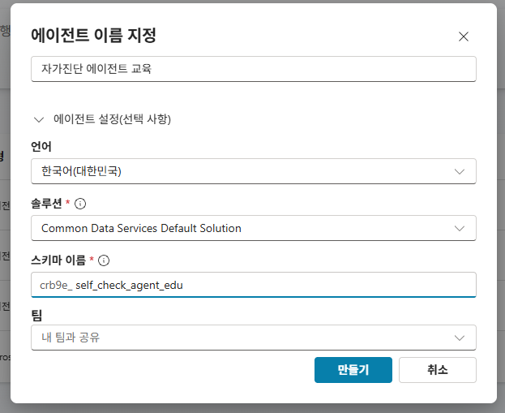

2. 에이전트 설정에서 **생성형 오케스트레이션(generative orchestration)**이 켜져 있는지 확인합니다. (MCP 도구를 쓰려면 반드시 켜져 있어야 합니다.)

    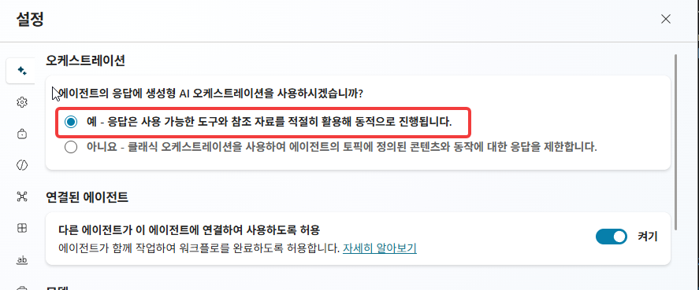

3. **Knowledge**에 강의 사이트를 추가합니다. 웹사이트 소스로 아래 URL을 입력하고, **이름**과 **설명**도 함께 채웁니다.

    - **URL**: `https://lepela.github.io/cs_lab_v2/`
    - **이름**: `실습 가이드 사이트`
    - **설명**:
      ```
      이 과정(Lab 1~7)의 공식 실습 가이드 웹사이트. 각 랩의 목표, 단계별 진행 방법,
      완성 시 정상 동작 기준이 랩 순서대로 정리돼 있다. 하위 에이전트(면접관 에이전트)의
      응답이 정상인지 판단할 때 1차 기준으로 참고한다.
      ```

    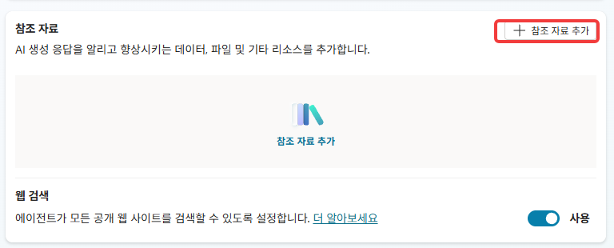
    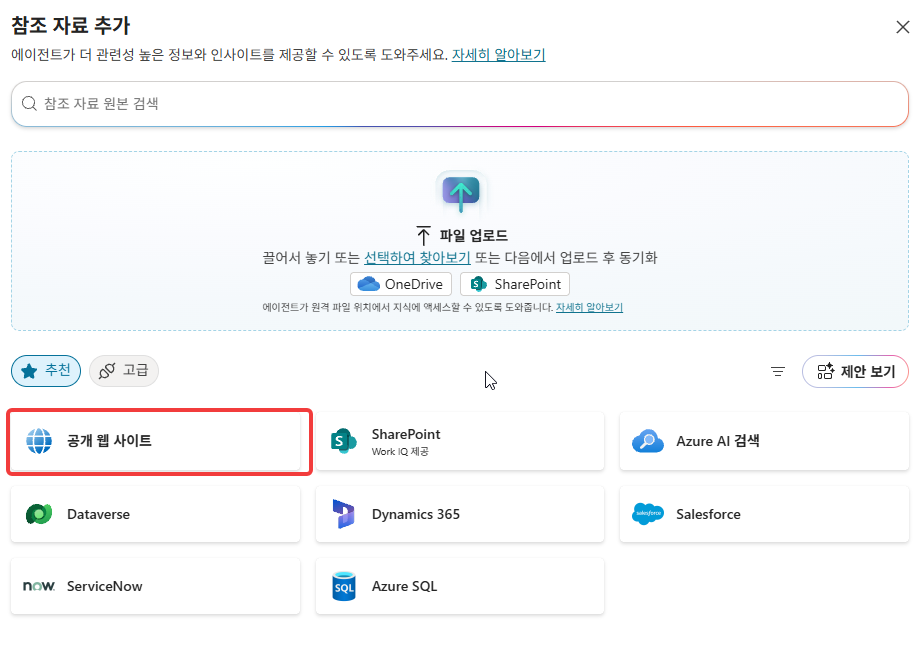
    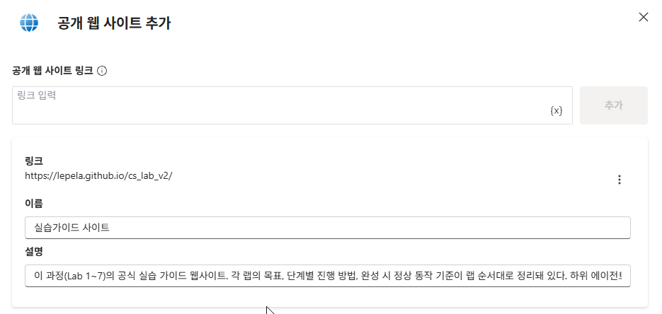

    {: .note }
    이 사이트가 "정답지" 역할을 합니다. 자가진단 에이전트는 여기 적힌 랩 지침과 실제 동작을 대조합니다. 설명에 "1차 기준으로 참고한다"를 넣어둔 건 에이전트가 지식·도구 중 무엇을 먼저 쓸지 판단할 때 라우팅 정확도를 높이기 위해서입니다.

4. **Tools** 탭 → **Add a tool** → **Model Context Protocol**을 선택합니다. 새 MCP 서버를 아래 정보로 추가합니다.

    - **서버 이름**: `MS Learn`
    - **서버 URL**: `https://learn.microsoft.com/api/mcp`
    - **서버 설명** (30자 이상 필수):
      ```
      Microsoft Learn 공식 문서를 검색·조회하는 MCP 서버. Copilot Studio, Power Automate,
      SharePoint 등 MS 제품의 정확한 스펙과 트러블슈팅 근거를 확인할 때 사용한다.
      ```
    - **인증**: 없음 (Unauthenticated) — MS가 공개·무료로 제공하는 공식 문서 검색 서버라 로그인이 필요 없습니다.

    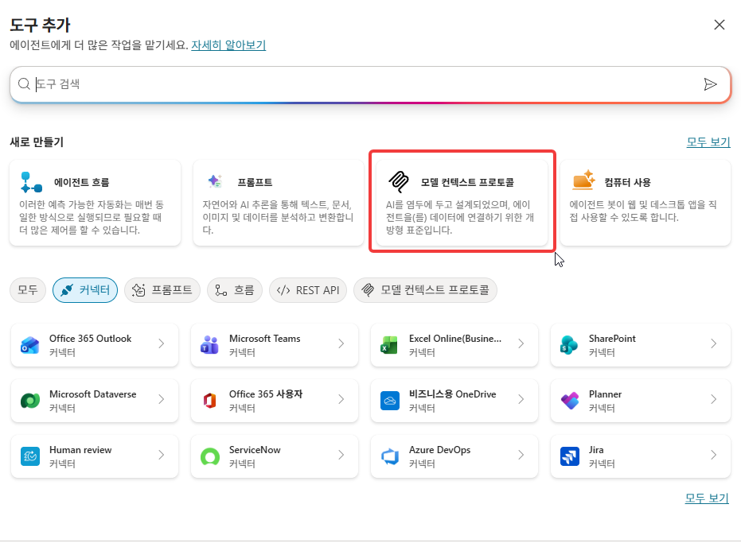
    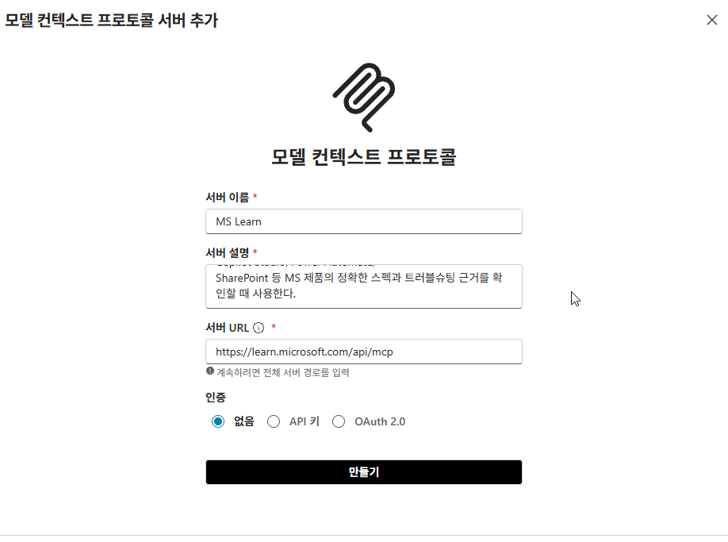
    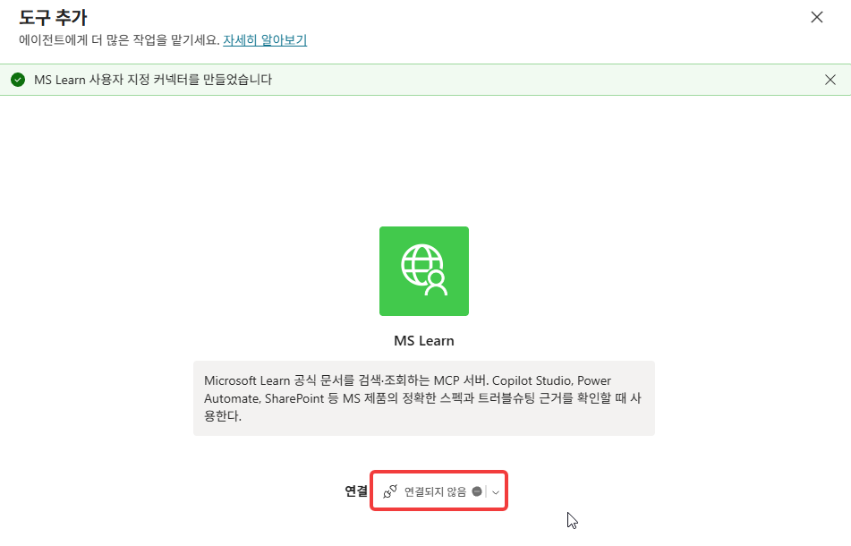
    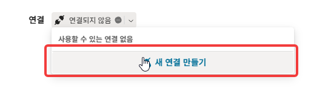
    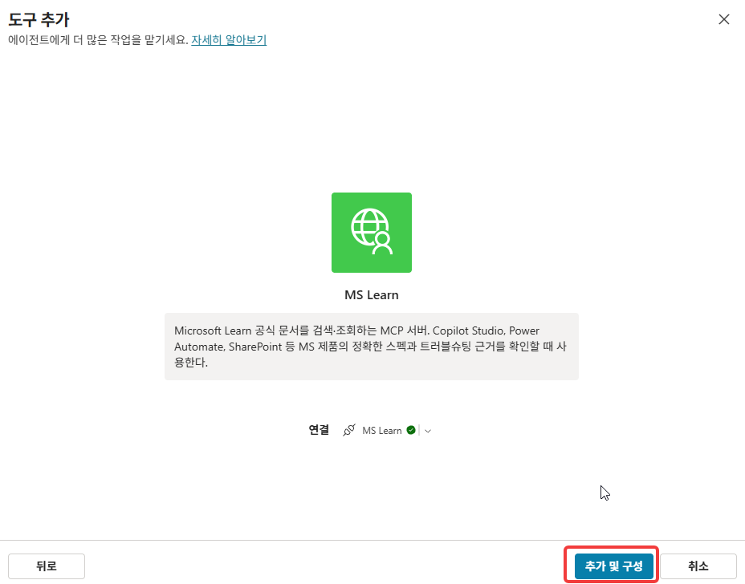
    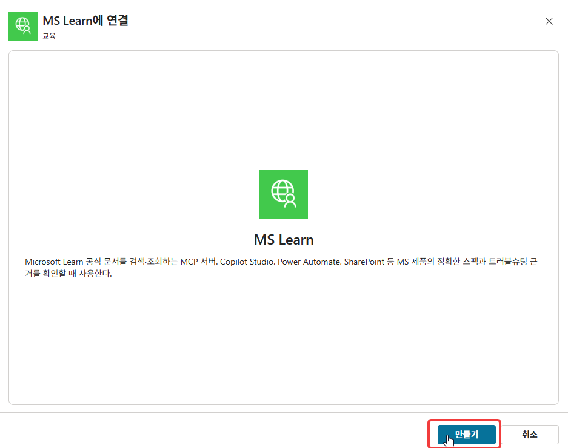

    {: .note }
    이 서버는 Microsoft가 직접 운영하는 공개 엔드포인트입니다. 별도 자격 증명 없이 누구나 붙일 수 있고, Copilot Studio 공식 문서에도 사용 사례로 나와 있습니다.

5. **Agents** 페이지 → **Add other agents** → **같은 환경의 Copilot Studio 에이전트에 연결**을 선택합니다.

    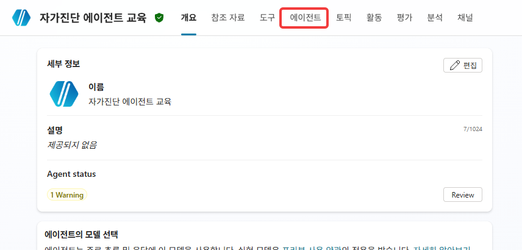
    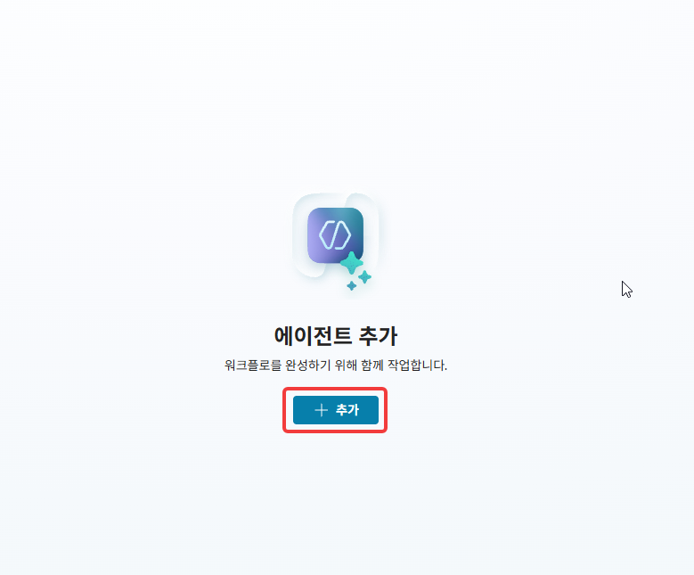
    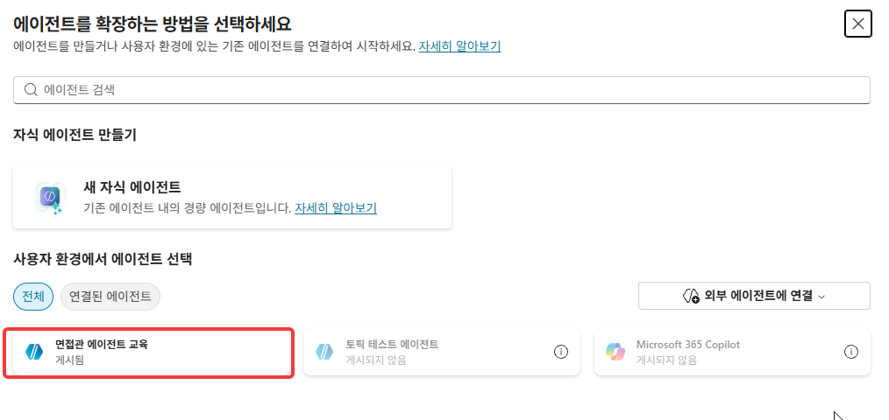
    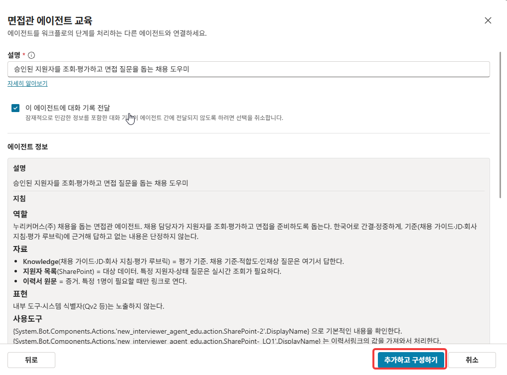

    {: .important }
    목록에 여러 사람의 에이전트가 뜰 수 있습니다. **반드시 본인이 만든 면접관 에이전트를 선택하세요.** (예시로 보이는 이름과 다르더라도, 본인이 Lab 2에서 이름 붙인 그 에이전트가 맞습니다.)
    대상 에이전트는 반드시 게시가 되어있어야합니다.

6. **Instructions(지침)**에 아래 내용을 붙여넣습니다.

    ```
    ### 역할
    당신은 실습생이 이 과정(Lab 1~7)에서 만드는 면접관 에이전트가 각 랩의 지침대로
    잘 동작하는지 스스로 점검하도록 돕는 자가진단 에이전트입니다. 하위 에이전트
    (면접관 에이전트)의 설정을 직접 고치지 않습니다 — 진단과 안내가 당신의 역할입니다.

    ### 점검 절차
    1. 사용자가 점검을 요청하면, 어느 랩까지 진행했는지 확인합니다.
       (예: "Lab 3까지 했어요" / "승인 흐름까지 만들었어요")
    2. 하위 에이전트에게 그 시점에 맞는 실제 질문을 대신 던져 응답을 관찰합니다.
       - Lab 3 이후: "승인된 지원자 목록 보여줘"(조회) / "김지훈 적합도 평가해줘"(평가)
         / "면접 질문 만들어줘"(질문)
       - Lab 5 이후: 승인 흐름이 도는지, 승인 후 상태가 바뀌는지
       - Lab 6 이후: AI 적합도가 실제로 반영되는지
       - Lab 7 이후: 전형단계 변경이 대화로 되는지
    3. 관찰한 응답을 강의 사이트(Knowledge)의 해당 랩 지침과 대조해 정상/비정상을
       판정합니다.
    4. 비정상이거나 원인이 Copilot Studio·커넥터·흐름 자체의 스펙 문제로 보이면,
       MS Learn을 검색해 공식 문서 근거를 확인합니다. 강의 사이트에서 답이 나오면
       MS Learn까지 갈 필요 없습니다 — 강의 사이트가 1차 기준입니다.

    ### 출력 형식
    - 관찰한 증상 요약
    - 강의 지침 기준 정상/비정상 판정
    - (비정상이면) 원인 추정 + 근거(강의 사이트 또는 MS Learn 문서 링크)
    - 다음 행동 제안

    ### 금지사항
    - 하위 에이전트나 SharePoint 데이터를 직접 수정하지 않습니다.
    - 확신 없는 진단을 단정하지 않습니다. 모르면 "원인 특정 어려움, OO 확인
      필요"라고 말합니다.
    ```

7. 오른쪽 위 **저장** → **게시**를 클릭합니다.

8. **테스트** 창에서 확인합니다. 예: `Lab 3까지 했는데 내 에이전트가 잘 만들어졌는지 점검해줘`

---

## 확인

- [ ] Knowledge에 강의 사이트(`https://lepela.github.io/cs_lab_v2/`)가 추가됐다
- [ ] MS Learn MCP 서버가 Tools에 추가됐다 (인증 없이 연결)
- [ ] 본인의 면접관 에이전트가 하위 에이전트로 연결됐다
- [ ] 지침을 붙여넣고 게시했다
- [ ] 테스트 질문을 던졌을 때 하위 에이전트를 호출해 관찰하고, 🟢 통과 🟡 개선 권장 🔴 수정 필요 판정등을 돌려줬다

{: .note }
이후 Lab 4~7을 하나씩 마칠 때마다 자가진단 에이전트에게 "지금까지 한 거 점검해줘"라고 다시 물어보세요. 학습자 스스로 진행 상황을 확인할 수 있습니다.
