# Lab 1. 환경 받기 📦

> **이번 랩 완성물**: 내 환경에 `HR 채용 자동화` 솔루션이 배포되고, 흐름 2개를 실행해 **내 지원자 리스트 + 시드 42명**이 준비된다
> **예상 시간**: 10분 · **완성 신호**: SharePoint **지원자** 리스트에 지원자 42명이 채워져 있음

<!-- 저작 메모(학생 비노출):
     ★ O1 확정 = 수동 인스턴트 흐름(에이전트 호출 버전 폐기). 2026-06-23 Chrome MCP로 박종민 환경 Prev2/Prev3 노드 검증 후 재작성.
     ★ 솔루션 내용물 = SP 자동화 흐름 2개만. 면접관 에이전트·Knowledge는 Lab 2에서 학생이 직접(솔루션에 없음).
     ★ 흐름 2개 = ① Prev2(SP List 자동생성: 빈 리스트+8컬럼+콘텐츠승인, 롤백 포함) ② Prev3(SP List 데이터 채우기[옵션]: 엑셀 시드 42명, 멱등성=항목 가져오기→삭제 후 적재).
       - Prev3 조건식 = 본인 소유 리스트 검증(Author.LoginName vs Office365 프로필 mail) → 수강생 셀프서비스 전제.
       - Prev3 "옵션" = SP 리스트만 필요하면 skip(데이터 없이 오후 적재로 채움). 우리 오전 실습(조회·평가)은 데이터 필요 → 기본 경로는 둘 다 실행.
     ★ 흐름 실제 표시명(Prev2/Prev3)은 강사 환경 dev 네이밍 → 수강생 배포본에서 친화적 이름으로 변경 후 본문 라벨 동기화.
     ★ 실행 UI(테스트→수동→실행) 라벨은 촬영 시 최종 확인.
     ★ 확정(2026-06-23) = Prev3가 이력서 원본 PDF도 doclib에 적재 → ResumeLink 라이브. 시드 42명도 원문 평가 가능 → Lab 3 원문 데모를 오전부터 할 수 있음(서사 조정 완료). -->

{: .time }
오전 **Lab 1~3은 50분 통합 타이머**로 진행합니다(스텝마다 끊지 않음). 이 랩 예상 **10분** — 동작 사이사이 "왜 이걸 하는지"를 듣고 넘어가세요.

---

## 준비

오늘 쓸 **SharePoint 자동화 흐름**이 담긴 **솔루션 파일**(`.zip`)을 제공받습니다. 이 솔루션에는 ① **내 지원자 리스트를 만드는 흐름**과 ② **그 리스트를 샘플 데이터로 채우는 흐름** 두 개가 들어 있습니다. 파일을 바탕화면 등 찾기 쉬운 곳에 저장해 두세요.

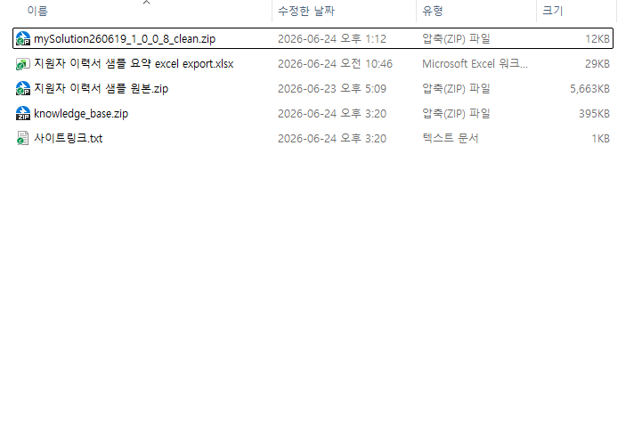

{: .note }
**면접관 에이전트는 이 솔루션에 없습니다.** Lab 2에서 여러분이 직접 만듭니다. Lab 1은 그 에이전트가 다룰 **데이터(지원자 리스트)** 를 자동으로 깔아 두는 단계입니다.

---

## 단계

1. 브라우저에서 `https://make.powerautomate.com/` 으로 이동합니다. 우측 상단 **환경 선택기**를 클릭해 **교육용 환경**을 선택합니다.

    

2. 왼쪽 메뉴에서 **솔루션**을 클릭합니다.

    

3. 상단 명령 모음에서 **가져오기 → 솔루션 가져오기**를 클릭합니다.

    

    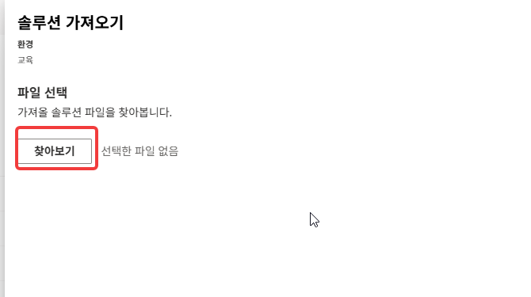

4. **찾아보기**를 클릭해 준비해 둔 `.zip` 파일을 선택하고 **다음**을 누릅니다.

    

5. 솔루션 정보(이름·버전)가 표시됩니다. 내용을 확인하고 **다음**을 누릅니다.

    

6. **연결** 단계에서 흐름이 쓰는 연결을 내 계정으로 지정합니다 — **SharePoint**, **Excel(Online)**, **Office 365 사용자**. 목록에 없는 연결은 **+ 새 연결**로 새 탭에서 로그인한 뒤, 이 화면으로 돌아와 **새로 고침** 아이콘을 누르고 다시 선택합니다.

    

    {: .note }
    연결은 "이 흐름이 어떤 계정으로 SharePoint·Excel에 접근할지"를 정하는 단계입니다. 한 번 만들어 두면 오늘 나머지 랩에서 재사용됩니다.
    **SPSiteUrl** 환경변수는 제시된 값으로 입력합니다.

7. **가져오기**를 클릭합니다. 상단에 진행 표시줄이 나타나며 완료까지 잠시(1~2분) 걸립니다. **"솔루션을 성공적으로 가져왔습니다"** 메시지를 확인합니다.

    

    

8. 목록에서 방금 들어온 **`HR 채용 자동화`** 솔루션을 클릭해 엽니다. 안에 **흐름 2개**가 보이는지 확인합니다.

    

9. **리스트 생성 흐름**(`Prev2. SP List 자동생성`)을 클릭해 엽니다. 그리고 **편집**을 클릭하여 디자이너 화면에 진입합니다.

    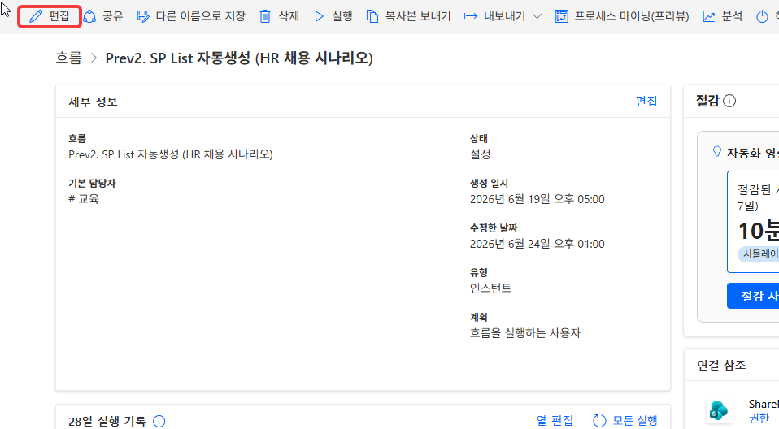

10. 우측 상단 **테스트**를 클릭하고 → **실행**을 눌러 흐름을 실행합니다. (이 흐름은 버튼으로 직접 실행하는 **수동 트리거**입니다.)

    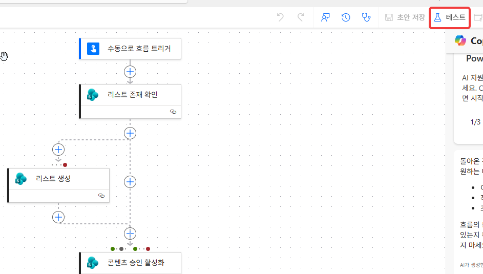

11. **수동** 클릭클릭

    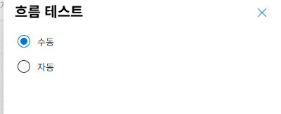

12. 흐림 실행 파라미터 입력 **SP 리스트명** 에 타인과 겹치지 않을 이름을 입력하세요. ex) 지원자 마스터 목록 (김철수)

    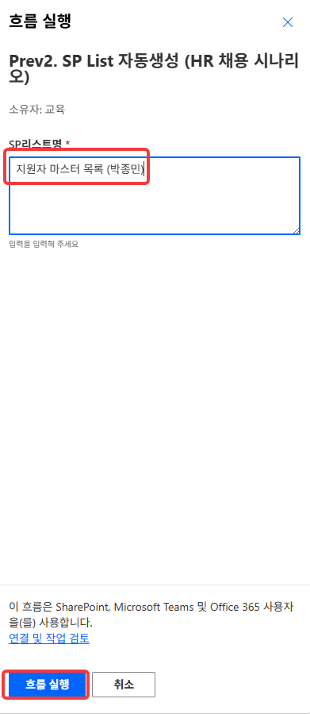

13. 실행이 **성공**으로 끝나는지 확인합니다(각 단계에 초록 체크). 내 **지원자** 리스트와 컬럼 8개가 만들어졌습니다(아직 비어 있음). 그리고 팀즈 메세지가 수신되는지 확인합니다.

    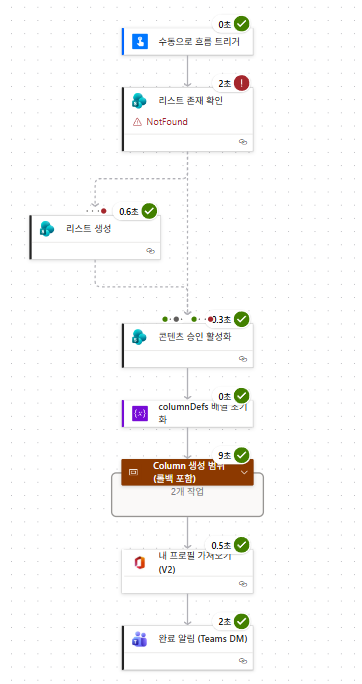

    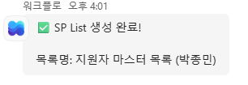

14. 솔루션으로 돌아가 **데이터 채우기 흐름**(`Prev3. SP List 데이터 채우기`)을 열고, 같은 방식(**테스트 → 수동 → 실행**)으로 실행합니다.

    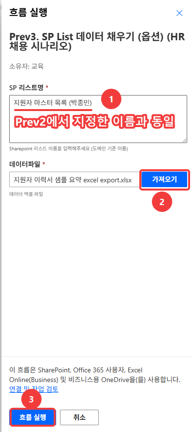

    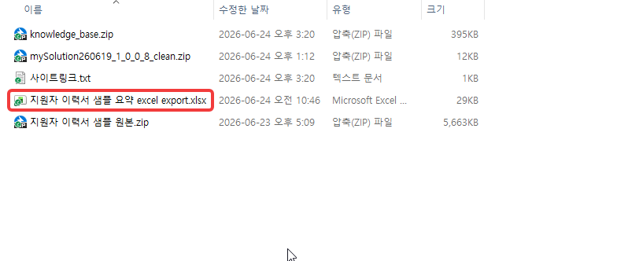

    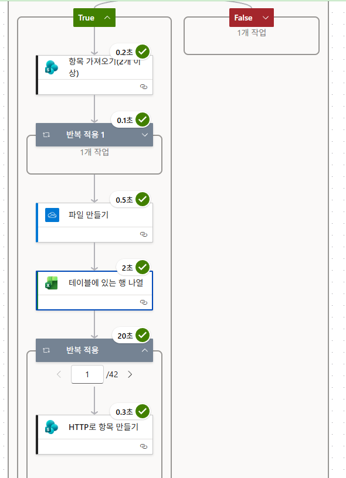

    {: .note }
    이 흐름은 **내가 소유한 리스트인지 먼저 확인**한 뒤 채웁니다(남의 리스트는 건드리지 않습니다). 또 채우기 전에 **기존 항목을 비우고** 넣으므로, 여러 번 실행해도 데이터가 **중복으로 쌓이지 않습니다.** 지원자 리스트의 데이터 가 추가됩니다.
    **이력서 원본이 사전에 PDF로 보관함에 적재** 되어 있습니다. 각 지원자의 **이력서링크가 실제로 동작** 하는지 테스트 해봅니다.(Lab 3에서 원문 평가에 사용).

15. 새 탭에서 교육용 **SharePoint 사이트**로 이동해 **지원자** 리스트를 엽니다. 행이 **42개** 채워져 있는지 확인합니다.

    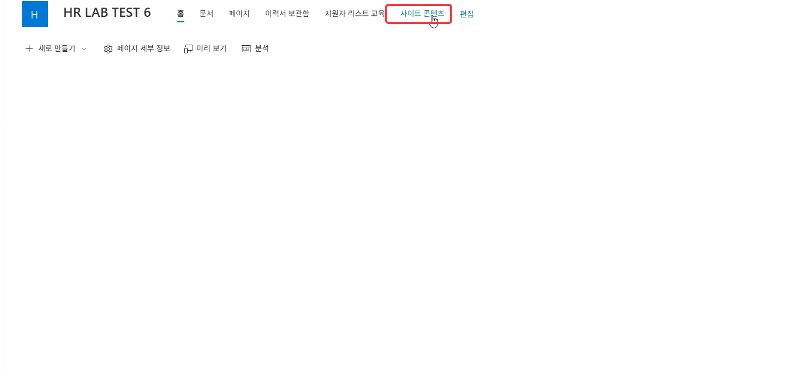

    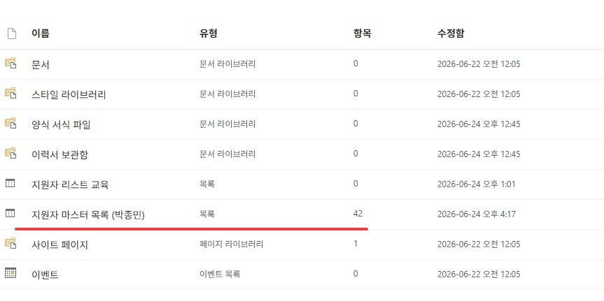

    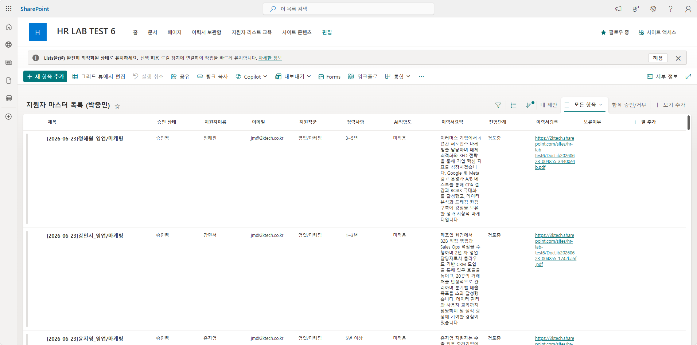

---

## 확인

- [ ] `HR 채용 자동화` 솔루션이 가져오기 완료되었다
- [ ] **리스트 생성 흐름** 실행이 성공해 빈 지원자 리스트 + 컬럼 8개가 생겼다
- [ ] **데이터 채우기 흐름** 실행이 성공해 지원자 42명이 채워졌다

{: .note }
**데이터 채우기는 선택입니다.** 빈 리스트만 있으면 되는 경우 이 흐름을 건너뛰고, 오후 **적재 흐름(Lab 4)** 으로 지원자를 직접 넣어도 됩니다. 다만 오전 조회·평가 실습에는 데이터가 필요하니 오늘은 둘 다 실행합니다.

{: .important }
방금 한 일 — **솔루션 하나로 SharePoint 환경을 자동으로 설치했다** — 이게 오늘 만들 자동화의 축소판입니다. 흐름은 사람이 반복하던 셋업을 버튼 한 번으로 끝냅니다. 오후 2부에서 이런 흐름을 직접 만듭니다.
