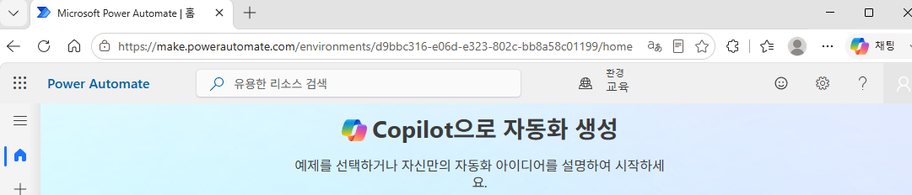
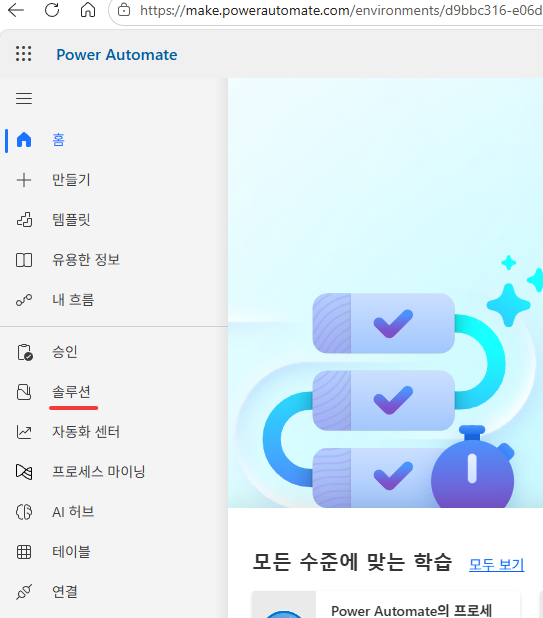
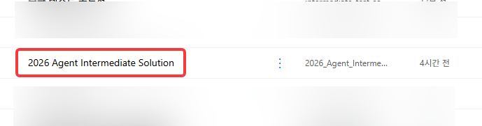
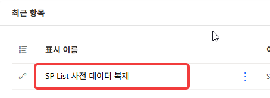
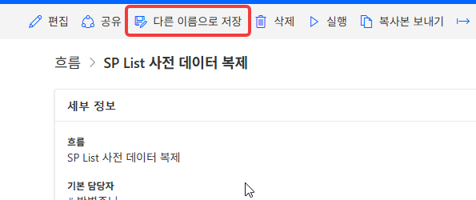
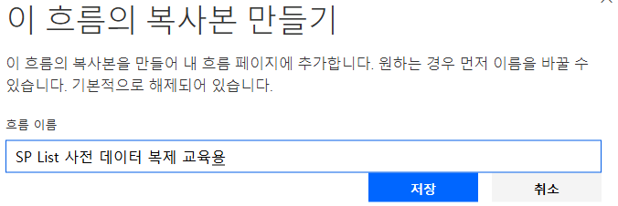
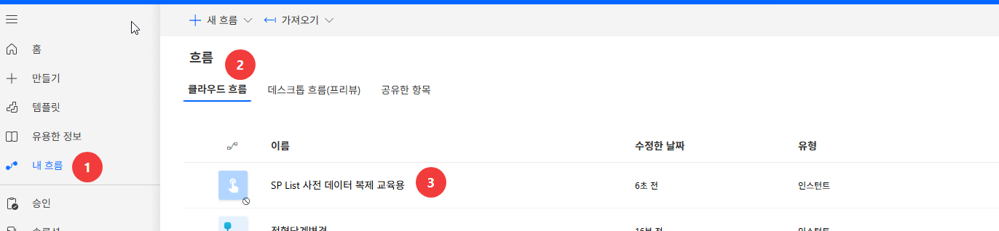
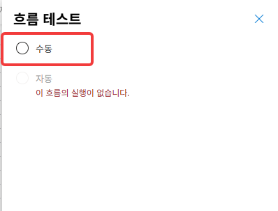
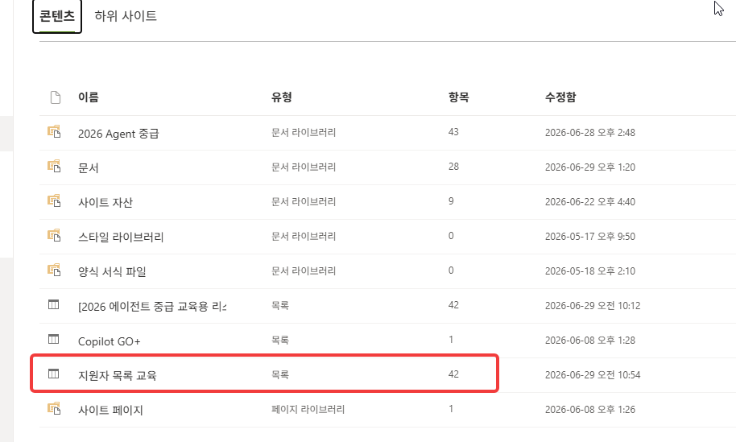

# Lab 1. 환경 초기화 📦

> **완성 신호**: SharePoint **지원자** 리스트에 지원자 42명이 채워져 있음

<!-- 저작 메모(학생 비노출):
     ★ 2026-06-29 전면 재작성. zip 배포 폐기 → 공용 솔루션에서 흐름 다른 이름으로 저장 방식으로 전환.
     ★ 솔루션명 = "2026 Agent Intermediate Solution" (사전 배포, 교육 환경에 고정).
     ★ 흐름 1개 = "SP List 사전 데이터 복제" (리스트 생성 + 데이터 42명 적재 + PDF 적재 통합).
     ★ 수강생은 해당 흐름을 "다른 이름으로 저장" → "SP List 사전 데이터 복제 (본인이름)" 으로 소유권 이전.
     ★ 환경변수(SPSiteUrl 등)는 사전 지정 완료 → 입력 불필요. 바로 실행.
     ★ 실행 UI 라벨(테스트→수동→실행)은 촬영 시 최종 확인. -->

{: .time }
**10분**

---

## 단계

1. 브라우저에서 `https://make.powerautomate.com/` 으로 이동합니다. 우측 상단 **환경 선택기**를 클릭해 **`2026 에이전트 교육 및 지원`**을 선택합니다.
    
    

2. 왼쪽 메뉴에서 **솔루션**을 클릭합니다.

    

3. **`2026 Agent Intermediate Solution`** 솔루션을 찾아 클릭해 엽니다.

    

4. 솔루션 안에서 **`SP List 사전 데이터 복제`** 흐름을 찾아 클릭합니다.. 

    

5. 흐름 관리 화면에서 다른이름으로 저장을 선택하고 **`SP List 사전 데이터 복제 (본인이름)`** 으로 입력하고 저장합니다. 이후 흐름의 

    

    

    {: .note }
    **다른 이름으로 저장**하면 이 흐름의 소유자가 내 계정이 됩니다. 원본 흐름은 그대로 남아 다른 수강생도 같은 방식으로 복사할 수 있습니다.

6. 내 흐름 > 클라우드 흐름 > 저장된 흐름 클릭 후 흐름이 열리면 **설정**을 클릭하여 흐름을 활성화 합니다. 이후 **편집**을 클릭해 디자이너 화면에 진입합니다. 우측 상단 **테스트 → 수동 → 실행**을 클릭합니다.

    
    

    

7. 테스트는 수동선택, 연결 확인 후 **`생성할 리스트 이름을 입력`**합니다. 생성 실행이 **성공**으로 끝나는지 확인합니다 (각 단계에 초록 체크).

    
    
    

    {: .important }
    이때 지정한 리스트 이름이 오늘 교육중 사용하게 될 리스트 이름입니다. 타인과 겹치지 않게 본인의 이름을 넣어서 생성하세요. 

8. 새 탭에서 교육용 **SharePoint 사이트**로 이동해 내 **지원자** 리스트를 엽니다. 행이 **42개** 채워져 있는지 확인합니다.

    [M365 Copilot Go+ 프로그램 쉐어포인트 사이트컨텐츠 링크](https://cjworld.sharepoint.com/teams/M365CopilotGOTeamsCJ/_layouts/15/viewlsts.aspx)

    

    {: .important }
    이곳에 생성한 리스트 이름과. 유형 `목록`을 확인하시고 사전데이터 42인이 잘 보이는지 테스트해주세요.

---

## 확인

- [ ] `SP List 사전 데이터 복제 (본인이름)` 흐름이 내 소유로 저장되었다
- [ ] 흐름 실행이 성공해 지원자 42명이 채워졌다

{: .important }
방금 한 일 — **기존 흐름을 복사해 내 환경에 데이터를 세팅했다** — 오늘 실습에 쓸 지원자 42명이 준비됐습니다. Lab 2부터 이 데이터를 가지고 에이전트를 만듭니다.
