# Lab 2. 에이전트 구성 🧱

> **이번 랩 완성물**: 채용 기준(지식 4종)과 행동 규칙(지침)을 갖춘 **면접관 에이전트**
>
> **완성 신호**: "마케팅 채용 기준?"엔 지식으로 답하고, "지원자 김지훈의 상태?" 질문에는 "데이터가 없다"고 스스로 설명한다.

<!-- 저작 메모(학생 비노출):
     - v1 u3-1~u3-4 회수 반영(2026-06-22 대조). 스펙·CLAUDE.md만으로 쓴 구버전의 누락 보강.
     - ★ 솔루션 배치 = Lab 1 전제(HR 채용 자동화 솔루션이 이미 들어와 있음) → 에이전트를 그 솔루션에 '생성'. (Default→이동 아님)
       → Lab 1 재마이닝 시 '솔루션 존재'를 명시적으로 드러낼 것.
     - ★ 근거 없는 응답 허용 ON 필수 — 끄면 마지막 '경계 스스로 설명' 시연이 폴백으로 깨짐.
     - 지침 3블록은 v1 u3-3 본문. 회사명 누리커머스(주). 최종은 `면접관 에이전트 지침` 파일과 동기화.
     - Knowledge 4종 PDF는 강사 제공. cs_lab_v2/assets/knowledge_base/에 넣으면 다운로드 링크화 가능.
     - ⚠️ 시간: 솔루션 선택·근거없는응답 토글·지침 3블록·5문항 시연 추가로 실제 12~15분 가능 → 오전 배분 재점검 필요(헤더 10분은 잠정). -->

{: .time }
**10분**

---

## 준비

{: .note }
지식 소스에 등장하는 회사명·수치·인물은 모두 **가상**입니다. 실제 기업과 무관합니다.

> [직무기술서 다운로드](../../assets/download/직무기술서(JD).pdf)
>
> [채용 가이드 문서 다운로드](../../assets/download/채용%20가이드%20문서.pdf)
>
> [평가 루브릭 다운로드](../../assets/download/평가%20루브릭.pdf)
>
> [회사 지침 문서 다운로드](../../assets/download/회사%20지침%20문서.pdf)


**지식 4종 PDF**를 내려받아 둡니다 — 채용 가이드 / 직무기술서(JD) / 회사 지침 / 평가 루브릭. Copilot Studio에 접속하고 우측 상단 환경이 **교육용 환경**인지 확인합니다(Lab 1에서 `HR 채용 자동화` 솔루션이 들어와 있는 그 환경).

---

## 단계

1. [https://copilotstudio.microsoft.com](https://copilotstudio.microsoft.com/)에 접속하여, 왼쪽 메뉴 **[에이전트](../glossary.html#term-agent)** → **빈 에이전트**를 클릭합니다.

    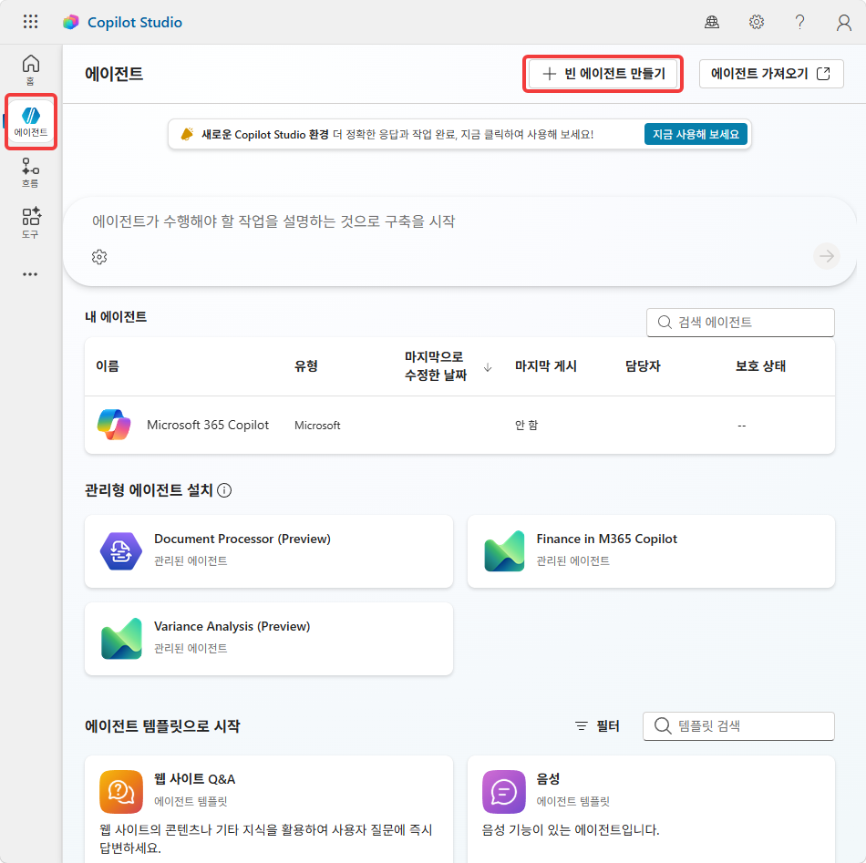

2. **이름**에 `면접관 에이전트`를 입력합니다. 솔루션이 Lab1에서 작업한 솔루션이 되도록 선택합니다. 에이전트 이름에 영문, 숫자가 없다면 스키마 이름이 공란이 됩니다. 직접 영문명을 입력해서 에이전트를 만듭니다.

    {: .important }
    에이전트를 **이 솔루션에 넣어야** Lab 3에서 도구의 사이트 주소를 **환경 변수(SPSiteUrl)칩 바인딩**할 수 있습니다. 다른 솔루션(기본 솔루션)에 있으면 입력값 선택의 **환경** 탭에 변수가 안 보여 바인딩이 안 됩니다.

    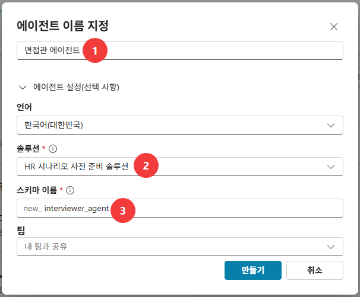

3. **설명**에 `승인된 지원자를 조회·평가하고 면접 질문을 돕는 채용 도우미`를 입력합니다.

    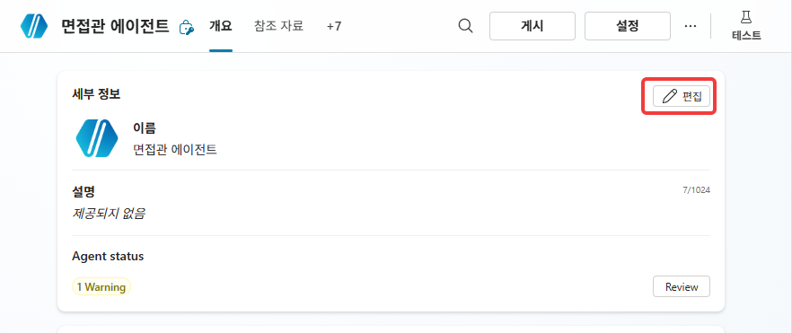

    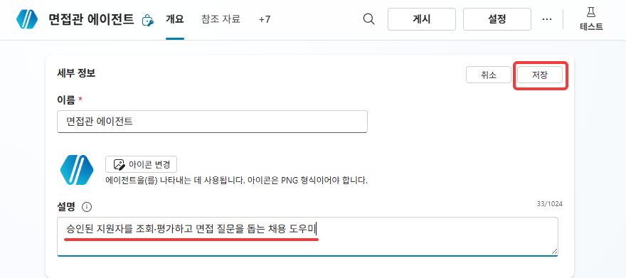


4. **설정 → 생성형 AI → 지식**에서 **근거 없는 응답 허용**이 **켜기(ON)** 인지 확인합니다(기본값 유지). 같은 화면의 **에이전트 메시지에 대한 사용자 반응 수집** 과 **웹의 정보 사용**은 끄기로 변경합니다.

    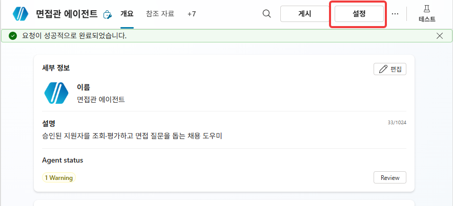

    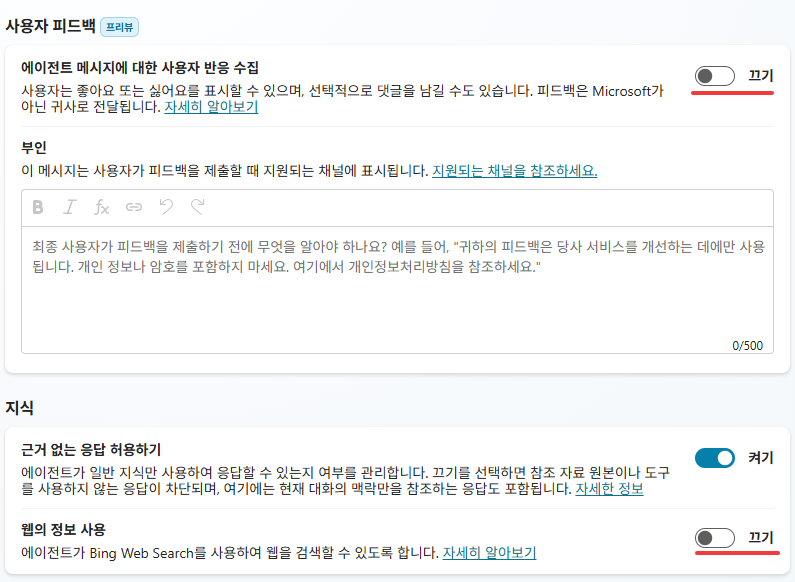

    {: .note }
    **근거 없는 응답 허용** 토글을 켜 둬야 도구가 없는 지금도 에이전트가 **"그건 실시간 데이터라 도구 없이 확인 못 한다"고 스스로 경계를 설명**합니다(아래 시연). 끄면 그런 응답이 폴백(오류 토픽)으로 차단됩니다.
    [Allow ungrounded responses — Microsoft Learn](https://learn.microsoft.com/microsoft-copilot-studio/knowledge-copilot-studio#allow-ungrounded-responses)

5. **[지식(Knowledge)](../glossary.html#term-knowledge)** 탭에서 **+ 추가 → 파일 업로드**를 선택합니다.

    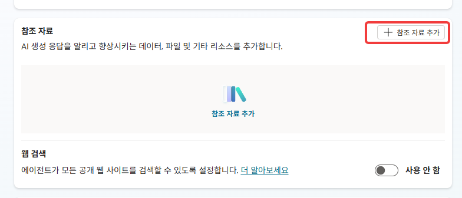

6. `지식 문서 4종`을 업로드 합니다.

    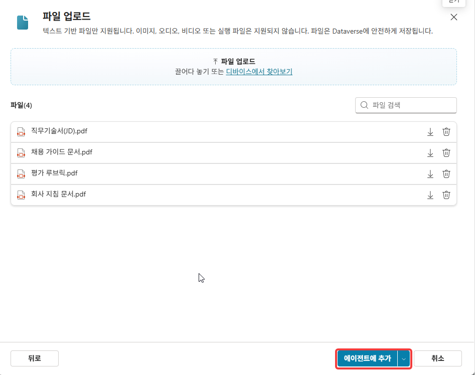

7. 업로드 동작 중 각 문서에 **설명**을 정의합니다.
    - `채용 가이드 문서.pdf` → `공통 평가기준과 경력 레벨 정의`
    - `직무기술서(JD).pdf` → `직군별 필수·우대 요건 목록`
    - `회사 지침 문서.pdf` → `인재상 4축 및 채용 원칙`
    - `평가 루브릭.pdf` → `지원자 적합도를 등급으로 매기는 채점 규칙`

    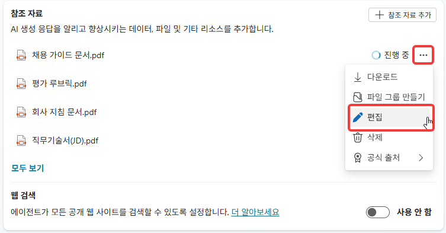

    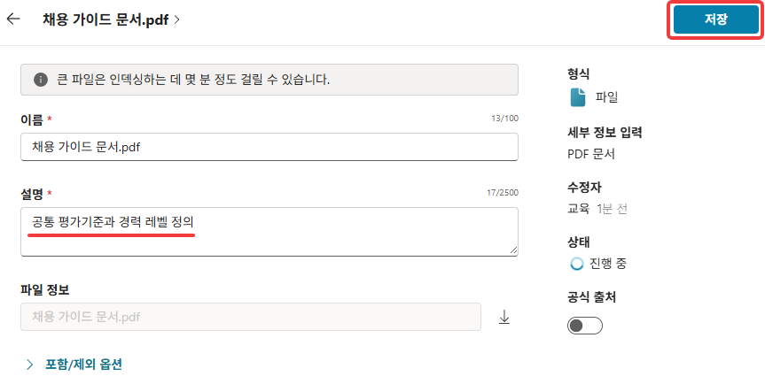

    {: .note }
    **이력서 원문은 지식에 넣지 않습니다.** 수백 개를 [RAG](../glossary.html#abbr-rag)에 올리면 검색이 [코퍼스](../glossary.html#term-corpus) 전체에서 일어나 **동명이인·교차 오염**이 생깁니다. 이력서는 대상 데이터라 목록에 두고, 원문은 필요할 때 1건만 링크로 가져옵니다(Lab 3). 평가의 일상 재료는 적재 흐름이 만든 **이력서요약**입니다 — "요약=기본 / 원문=필요할 때만".

8. 4종 상태가 모두 **Ready**가 될 때까지 기다립니다. 대기 중 아래 지침 작성을 진행하고 돌아와 확인합니다.**[지침](../glossary.html#term-instructions)** 영역에 아래를 그대로 붙여넣습니다. (지침은 **[Markdown](../glossary.html#term-markdown) 문법**으로 작성합니다 — 짧고 구조적으로.)

    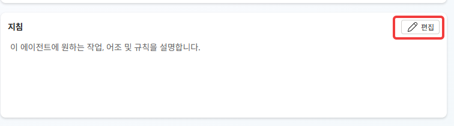

    ```
    ## 역할
    누리커머스(주) 채용을 돕는 면접관 에이전트. 채용 담당자가 지원자를 조회·평가하고 면접을 준비하도록 돕는다. 한국어로 간결·정중하게, 기준(채용 가이드·JD·회사 지침·평가 루브릭)에 근거해 답하고 없는 내용은 단정하지 않는다.

    ## 자료
    - **지식**(채용 가이드·JD·회사 지침·평가 루브릭) = 평가 기준. 채용 기준·적합도·인재상 질문은 여기서 답한다.
    - **지원자 목록**(SharePoint) = 대상 데이터. 특정 지원자·상태 질문은 실시간 조회가 필요하다.
    - **이력서 원문** = 증거. 특정 1명이 필요할 때만 링크로 연다.

    ## 표현
    내부 도구·시스템 식별자(Qv2 등)는 노출하지 않는다.
    ```

    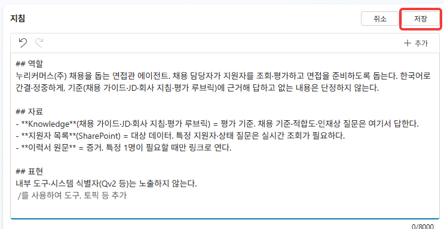

    지침의 **자료** 블록에서 [목록](../glossary.html#term-list)은 Lab 1에서 생성한 SharePoint 지원자 목록을 가리킵니다 — [지식](../glossary.html#term-knowledge)(기준 문서)와 목록(실시간 데이터)을 에이전트가 명확히 구분하도록 지침에서 명시합니다.

    {: .note }
    지침은 한 번 쓰고 끝이 아닙니다. 이후 **테스트 → 실패 관찰 → 블록 추가 → 재테스트**로 유닛마다 누적됩니다. 지금은 기초 3블록만.

9. 지침 저장 완료 후 저장 **게시(Publish)**합니다.

    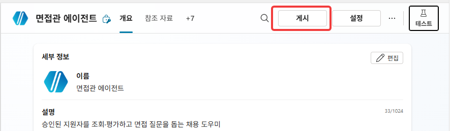

    {: .warning }
    지침을 바꿔도 동작이 그대로면 **게시 여부**를 먼저 확인하세요. 저장만 하고 게시 안 해 옛 동작이 유지되는 경우가 흔합니다. 또한 에이전트 설정 변경 후  테스트시 **새 테스트 세션 시작** 을 클릭해서 컨텍스트 초기화가 필요합니다.

10. 지식이 모두 **Ready**인지 확인하고, 테스트 패널에 `백엔드 채용 기준이 뭐야?`를 입력합니다 → JD 근거 답변.

    {: .note }
    지식 인덱싱이 아직 완료되지 않았다면 **아래 테스트는 건너뛰고 Lab 3을 먼저 진행**하세요. Lab 3에서 커넥터를 설정하는 동안 인덱싱이 완료되며, 이후 돌아와서 테스트해도 됩니다.

    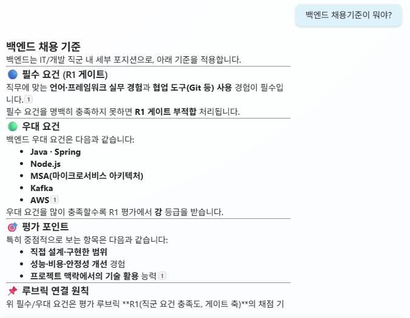

    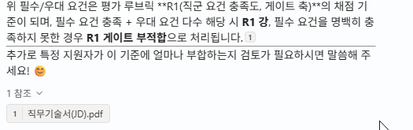

11. `지원자 적합도는 어떻게 평가해?` → 평가 루브릭 근거 답변.

    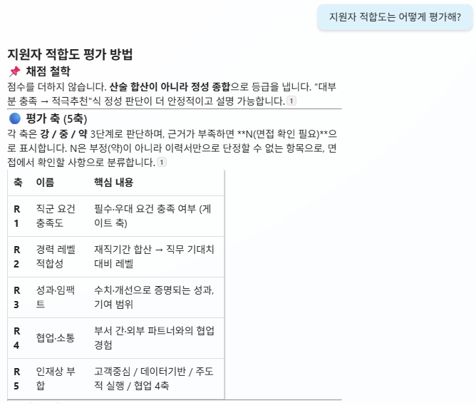

    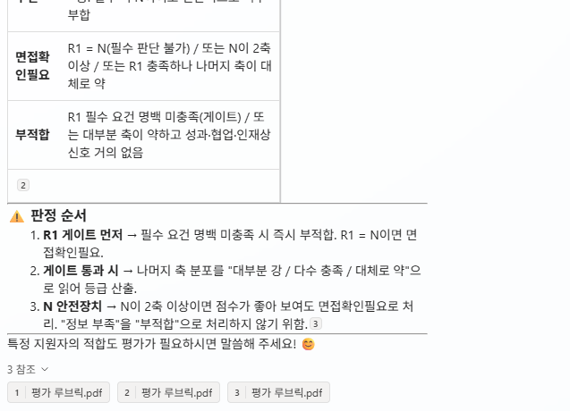

12. `우리 회사 인재상이 뭐야?` → 회사 지침 근거 답변.

    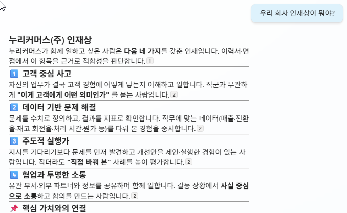

    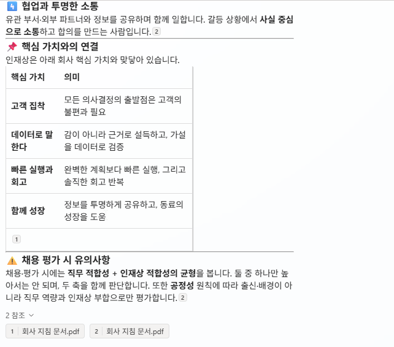

13. `이력서에서 무엇을 추출해야 해?` → 평가 루브릭의 추출 스키마 근거 답변.

    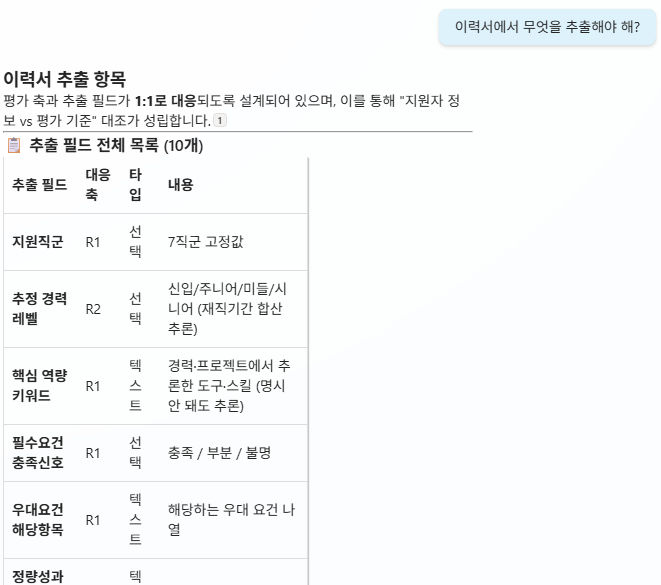

    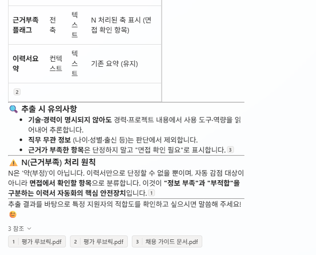

    {: .note }
    "무엇을 추출하느냐"는 곧 적재 흐름이 만든 데이터의 스키마인데, 그 정의가 **[루브릭](../glossary.html#term-rubric) 안에** 있습니다(평가 축 ↔ 추출 필드 1:1). 에이전트가 자기 적재 기준을 **메타적으로** 설명하는 셈입니다.

14. `김지훈 지원했어? 지금 상태가 어때?` 와 `승인된 지원자 목록 보여줘` 를 입력합니다. 에이전트가 **답하지 못하고**, 지침 덕분에 "실시간 데이터라 도구가 없어 확인 불가"라고 **경계를 스스로 설명**하는지 확인합니다.

    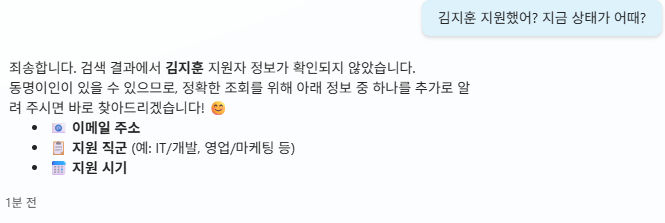

    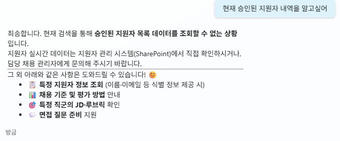

---

## 확인

- [ ] 면접관 에이전트가 **`HR 채용 자동화` 솔루션**에 생성됐다
- [ ] **근거 없는 응답 허용 = ON** 확인
- [ ] 지식 4종이 모두 **Ready**, 지침 3블록 저장·게시됨
- [ ] 기준 질문 4종에 지식으로 답한다
- [ ] 특정 지원자/목록은 **답 못 하고 경계를 스스로 설명**한다

{: .important }
에이전트는 **기준**(지식)은 알지만 **지금 누가 지원했는지**(데이터)는 모릅니다. 이 간극을 메우는 **SharePoint 조회 도구**를 다음 Lab 3에서 붙입니다.
