# Lab 3. 커넥터 구성 🔍

> **이번 랩 완성물**: 커넥터 도구 + 지침만으로 지원자 **조회·평가·면접질문**이 되는 면접관 에이전트
> **예상 시간**: 30분 · **완성 신호**: "지금 지원자 누구 있어?"에 목록이 나오고, "○○○ 적합도"에 등급+근거가 나온다

<!-- 저작 메모(학생 비노출):
     - v1 u4-1~u4-4 회수 + ★ 지침 대대적 다이어트(2700자→최종~1000, Lab3 마무리 ~500-600자, md 문법).
     - 컷: 0·1·2 코드 매핑 / 승인상태≠검토상태 / 0명 처리 / u3 줄 되돌려수정 / 적합도 블록 추가후교체 2단.
       유지: 등급 어휘 고정(적극추천/추천/면접확인필요/부적합·미적용 — 모델 즉흥 등급명 방지).
     - 게이트 효과(거부·보류 거름)·C3 원문 재평가 = 시드가 전부 승인됨/PDF없음이라 Lab3선 못 봄 → 오후(적재·승인 후) 유도.
     - 권한 경계(연결신원+SP권한=하드, 지침=소프트) note 유지. -->

{: .time }
이 랩 예상 **30분**. 빌드는 적고 **테스트가 많은** 랩 — 프롬프트를 바꿔 가며 관찰하세요.

---

## 준비

Lab 2에서 만든 **면접관 에이전트**를 엽니다. 지금은 기준(Knowledge)은 알지만 "누가 지원했는지"는 모릅니다. 그 데이터를 읽는 **도구**를 붙입니다.

---

## 단계

1. 상단 **도구** 탭에서 **+ 도구 추가**를 클릭합니다.

    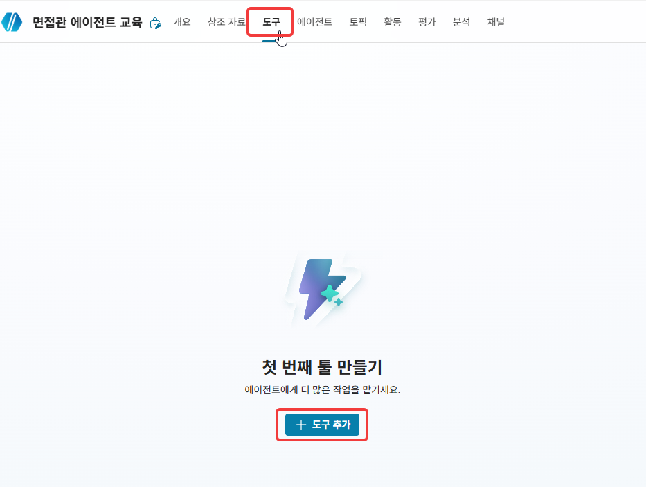

2. **커넥터**를 고르고 검색창에 `SharePoint`를 입력합니다.

    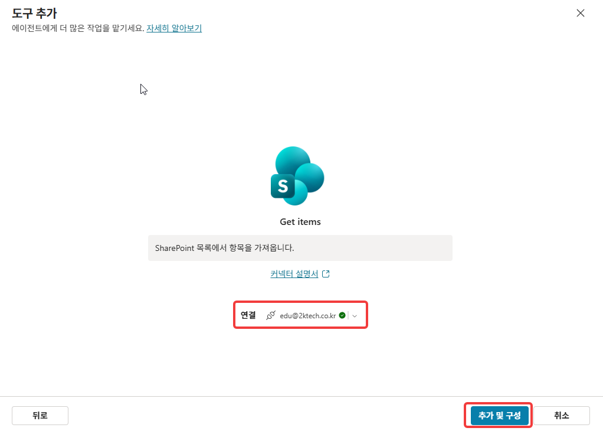

3. **항목 가져오기(2개 이상)**(Get items)를 선택합니다. ("1개"는 단건 조회용이라 목록 조회엔 맞지 않습니다.)

    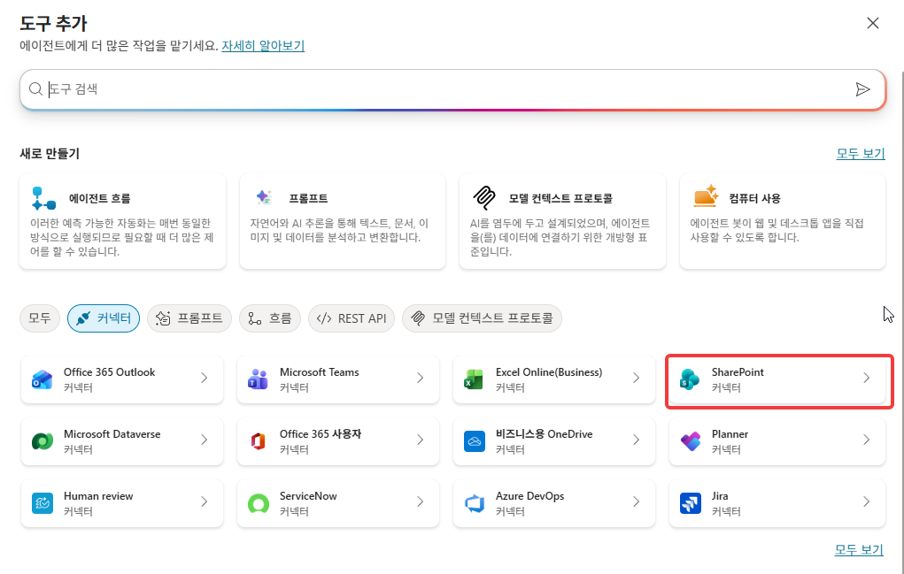

4. 연결을 본인 계정으로 잡고, **사이트 주소** = HR 사이트, **목록 이름** = **본인 지원자 목록**을 지정한 뒤 **추가 및 구성**합니다.

    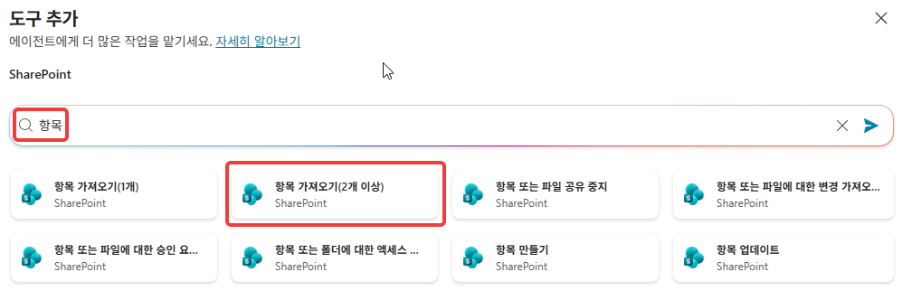

5. 도구 **설명**에 라우팅 힌트를 입력합니다. (오케스트레이터가 이 설명을 보고 도구를 부릅니다.)

    ```
    지원자 목록에서 지원자 항목을 가져온다. 조회·적합도 평가·면접 질문 등 지원자 정보가 필요할 때 사용한다.
    ```

    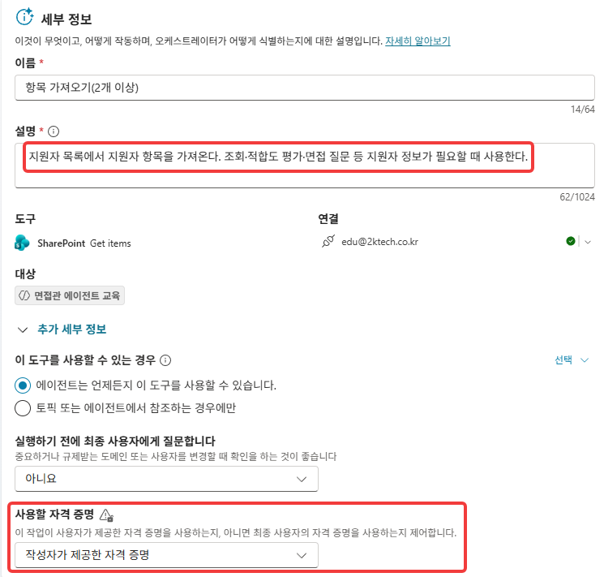

    {: .note }
    도구가 돌려준 항목은 오케스트레이터가 **자동으로 답변 근거**로 씁니다 — 출력을 근거 자리에 따로 배선할 필요가 없습니다(흐름 디자이너와 다른 점).

    {: .important }
    사용할 자격 증명 옵션을 `작성자가 제공한 자격 증명`으로 변경시 개발 단계, 테스트시에 용이합니다. 실제 운영시에는 `최종 사용자 자격 증명`으로 변경 후 배포합니다.
6. 입력에서 Site Address에 `환경변수`를 정의합니다.
    ```
    SPSiteURL
    ```
    환경변수가 변수 검색에 보이지 않을경우 아래 이미지 처럼 직접 값을 지정해 줍니다. 이어서 리스트 이름도 Lab1에서 정의한 본인의 리스트를 사용합니다. 
    
    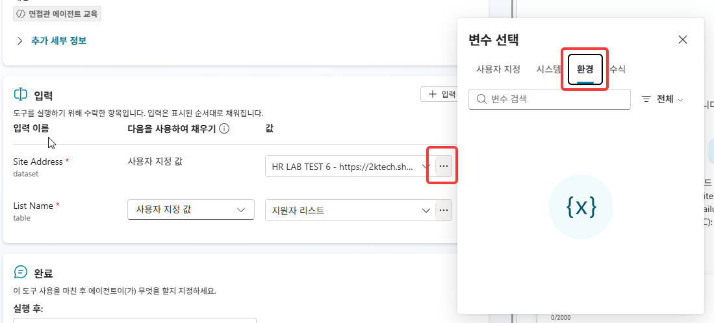

    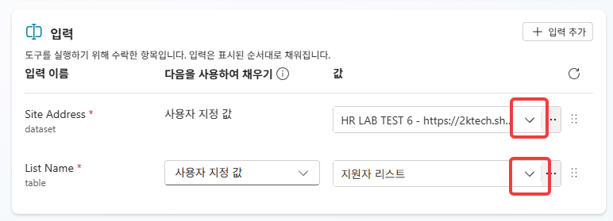


7. 저장 후 우측 테스트를 수행합니다. 변경 내용이 즉시 반영 되도록 새 테스트 세션 시작 버튼 후 `지원자가 몇명이야?` 라는 질문을 통해 커넥터의 연결 여부를 확인합니다.

    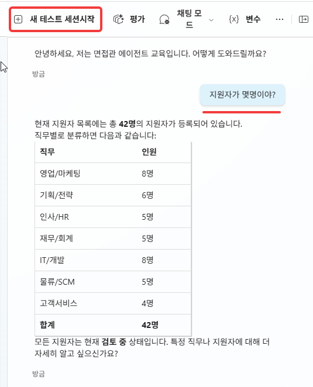

    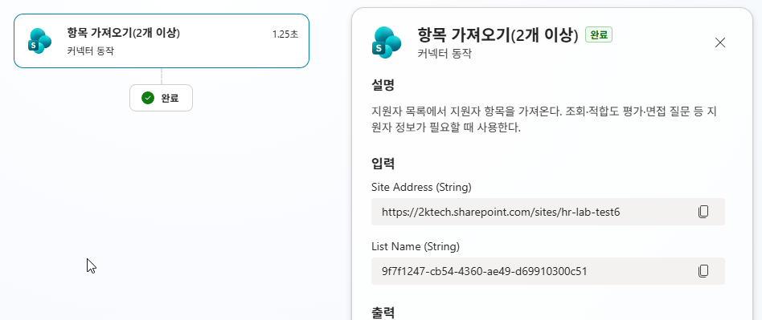

8. 조회가 잘 이루어진다고 하더라도 프롬프트 인식의 정확도 향상을 위해 지침에 다음내용을 추가합니다. 에이전트의 개요 > **지침**에 아래 `## 조회` 섹션을 이어 붙입니다(Markdown). /로 시작하는 `항목 가져오기(2개 이상)` 부분은 chip으로 지정해줍니다.

    ```
    ## 조회
    지원자 정보는 /항목 가져오기(2개 이상) 도구로 가져온다. 기본 조회는 승인된 지원자만 보여주고, 거부·보류는 노출하지 않는다.
    
    ```

    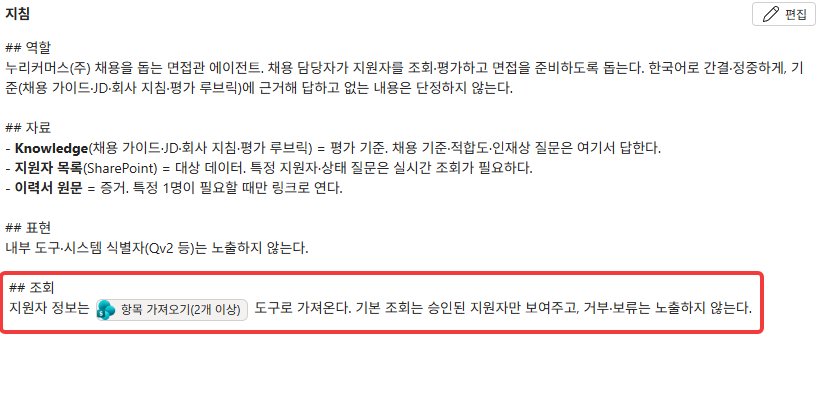

    {: .note }
    커넥터는 조건을 안 걸면 **사실상 전부** 가져옵니다. "승인된 사람만"은 도구가 아니라 **지침**이 표시 단계에서 거릅니다 — 견고함은 도구가 아니라 지침에서 나옵니다(가드레일). 단, 표시 단계 차단이라 데이터가 아주 많아지면 엣지케이스에 취약할 수 있습니다(일상엔 충분 / 더 견고한 방어는, 흐름을 통한 강제필터 혹은 토픽으로 처리합니다).

9. 테스트 패널에서 `지금 지원자 누구 있어?`를 입력해 지원자 목록이 나오는지 확인합니다.

    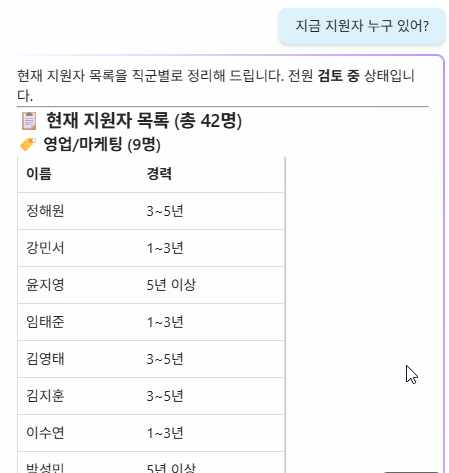

    {: .note }
    지금 시드 지원자는 모두 승인됨이라 전원 나옵니다. **거부·보류가 가려지는 게이트 효과는** 오후에 적재(Lab 4)로 보류 지원자를 만들고 승인(Lab 5)을 거친 뒤 다시 물어보면 또렷이 보입니다.

10. `정재혁 상태 알려줘`처럼 특정 지원자를 물어 상태·요약이 나오는지 확인합니다.

    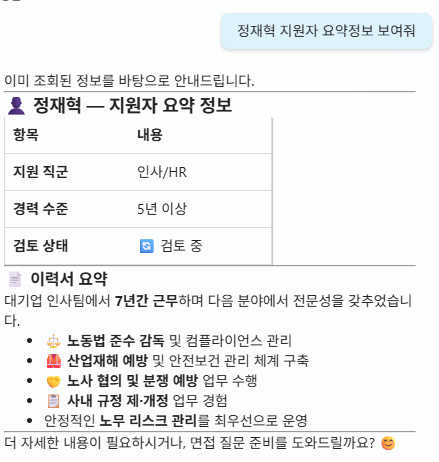


11. **+ 도구 추가 → 커넥터 → SharePoint**에서 **경로로 파일 콘텐츠 가져오기**(Get file content using path)를 선택합니다.

    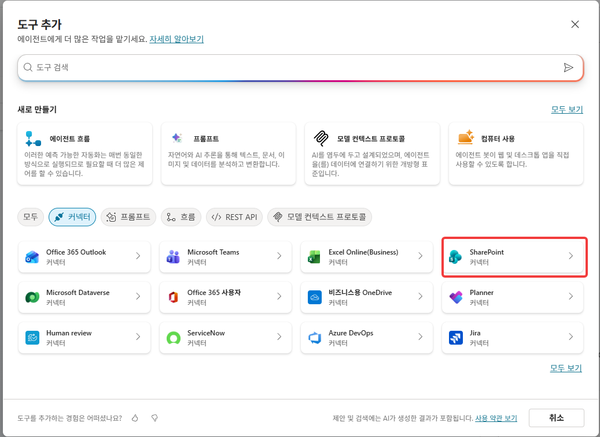

    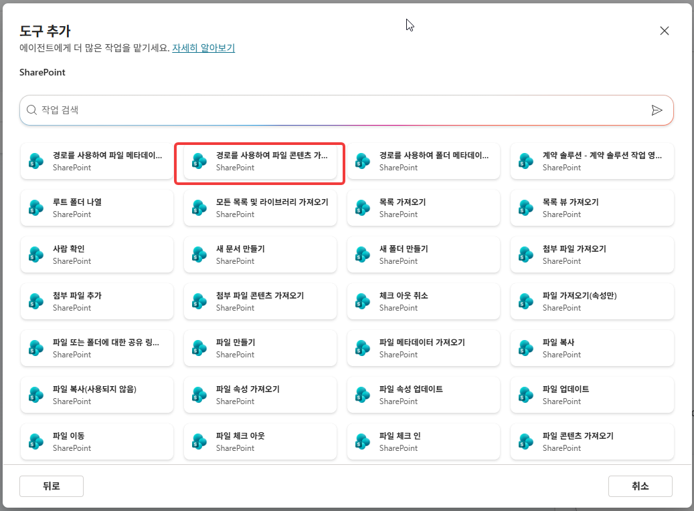


12. **사이트 주소**는 이전 Sharepoint 사이트로 지정하고, **파일 경로**는 `AI로 동적으로 채우기 상태`를 유지합니다. 도구 **설명**에 `이력서 원문을 경로로 가져온다. 면접 질문·정밀 분석에 원문이 필요할 때 사용한다.`를 입력하고 저장합니다.

    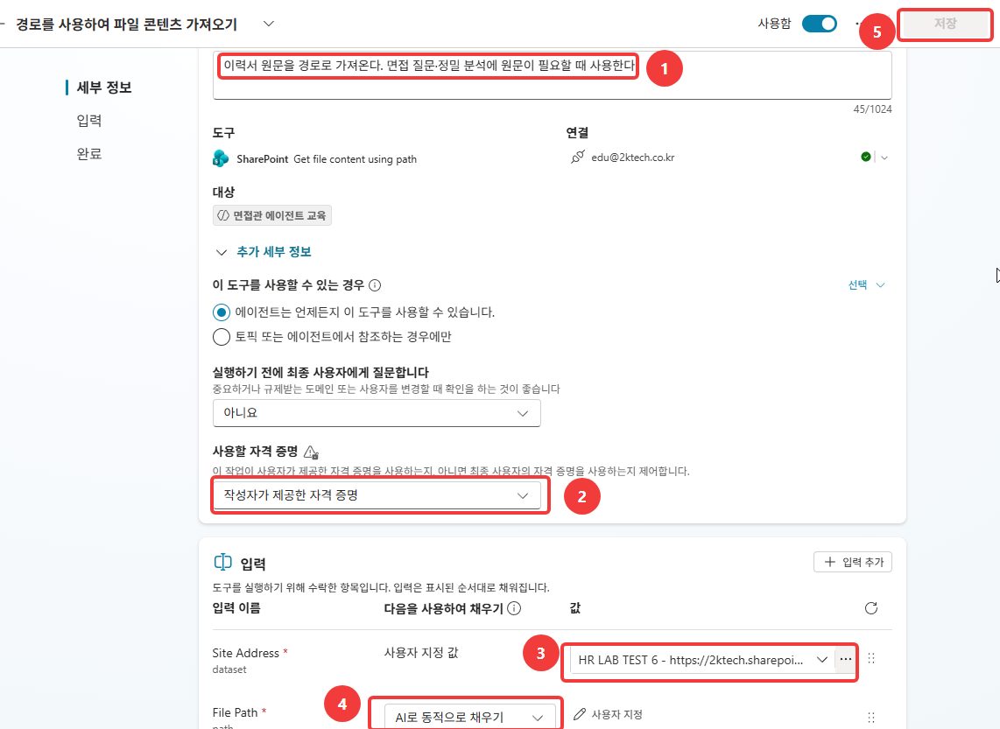

    {: .warning }
    원문 가져오기는 **로딩이 깁니다.** 그래서 매번이 아니라 요청·심층 시에만 부릅니다(2단 구조: 요약=기본·빠름 / 원문=필요할 때·느림).

13. **지침**에 아래 `## 평가·질문` 섹션을 이어 붙이고 **저장 + 게시**합니다.

    ```
    ## 평가·질문
    적합도는 이력서요약을 평가 루브릭(R1~R5)에 대조해 등급(적극추천/추천/면접확인필요/부적합, 기본 미적용)으로 낸다. 면접 질문·정밀 분석 등 원문이 필요할 때만 /경로로 파일 콘텐츠 가져오기 로 1건 가져온다.
    ```

    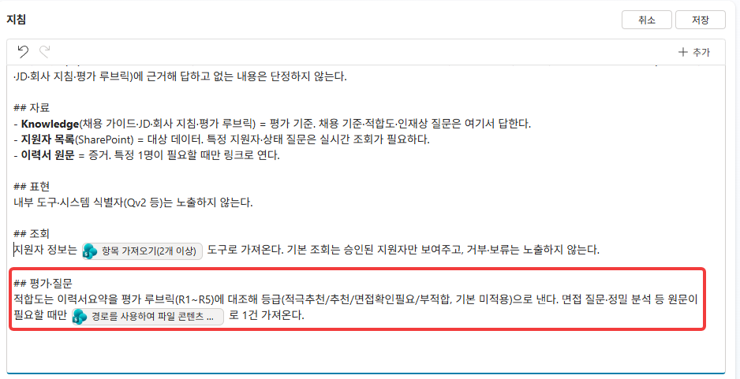

    {: .note }
    등급 어휘(적극추천/추천/면접확인필요/부적합)를 못박는 이유 — 안 적으면 모델이 "중위 등급 / 상위 등급"처럼 지정된 지식에 없는 등급명을 즉흥으로 만들 가능성이 있습니다.

14. 적합도를 물어 등급 + 평가 축별 근거가 나오는지 확인합니다.

    ```
    정재혁 적합도 평가해줘
    ```

    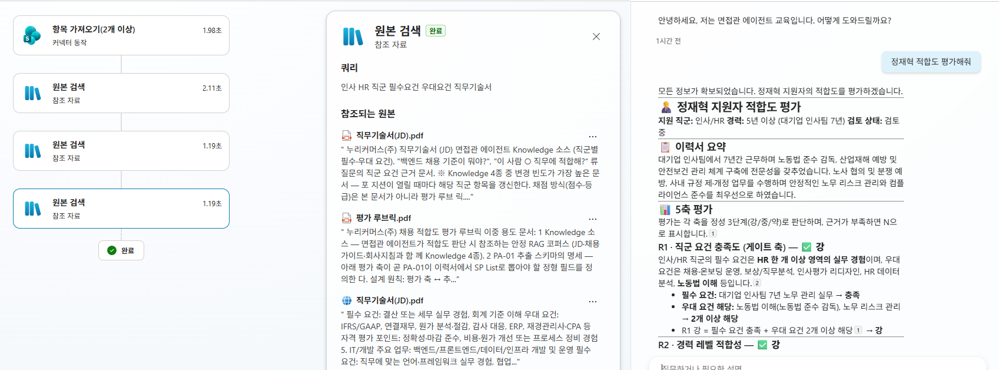

    {: .important }
    **등급은 지원자 실력이 아니라 "요약에 수치·사례가 살아남았는지"를 추적합니다.** 요약에 수치가 빠지면 평가기준 R3~R5가 약해지고 등급이 내려가는데, 등급만 보면 그 차이가 안 보입니다. **Lab 5의 승인 HITL이 바로 이 순간을 막는 사전 방어**입니다 — 평가 재료가 곧 그 요약이니까요.

15. 면접 질문을 요청해 요약 기반 질문이 나오는지 확인합니다.

    ```
    정재혁 면접 질문 만들어줘
    ```

    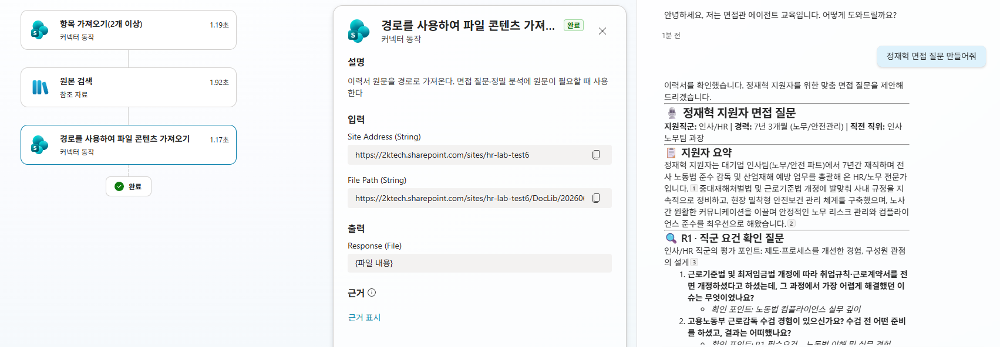

    {: .note }
    시드 지원자도 **원문(이력서 PDF)이 함께 적재**돼 있어 지금 바로 "원문까지 보고 더 깊게"를 시험할 수 있습니다 — 예: `정재혁 이력서 원문까지 보고 면접 질문 만들어줘`. 요약 기반과 견줘 보면 수치·사례가 더 살아납니다(원문 가져오기는 로딩이 길다는 점만 감안). 오후엔 여러분이 직접 **적재(Lab 4)·승인(Lab 5)** 한 신규 지원자로 같은 걸 해봅니다.

---

## 확인

- [ ] **항목 가져오기(2개 이상)** 도구가 붙어 있고, 지원자 목록이 조회된다
- [ ] 지침에 `## 조회`·`## 평가·질문` 섹션이 추가·게시됐다
- [ ] 적합도 등급이 근거와 함께 나온다
- [ ] 면접 질문이 생성된다(시드도 원문 적재돼 원문 기반 정밀 질문까지 가능)

{: .important }
흐름을 하나도 안 만들었는데 조회·평가·질문이 됩니다 — **"조회와 추론은 커넥터+지침이 흡수한다."** 단, **원문 접근 권한을 막는 건 지침이 아닙니다** — 연결 신원(작성자/최종사용자)과 SharePoint 권한이 하드 경계이고, 지침은 소프트(우회 가능)입니다. 그렇다면 흐름은 왜 필요할까요? 오후 2부에서 답합니다.
