# Lab 4-대안. 적재 흐름 (Outlook 미사용) 📥

> **이번 랩 완성물**: Outlook 계정 없이(또는 Outlook 접근이 막힌 환경에서), 흐름을 **수동 실행**해 이력서를 AI가 요약·구조화하여 SharePoint에 적재하는 흐름
> **예상 시간**: 40분 · **완성 신호**: 흐름을 수동 실행하면 **본인 목록**에 새 항목이 생긴다

<!-- 저작 메모(학생 비노출):
     - 근거: 업로드 솔루션 `HR_LAB4_Trigger_Alternate_1_0_0_1.zip` 리버스 엔지니어링(2026-07-01).
     - 목적: Outlook을 쓸 수 없는 수강생(CJ 환경 등)을 위한 Lab 4 대안. 원본 Lab 4(메일 트리거)와 결과물은 동일 — SP 지원자 목록에 항목 1건 적재.
     - 트리거 차이: Request/Button kind, 입력 2개(file=이력서원본, email=이메일) — Power Automate "수동으로 흐름 트리거"에 커스텀 입력 추가한 형태.
     - 구조 차이: 원본은 메일 첨부파일 배열 → For each 자동 생성. 대안은 트리거가 파일 1개만 주므로 **For each 없이 프롬프트_실행 → 파일_만들기 → 항목_만들기 직결**.
     - 이메일 필드: 원본은 "시작"(발신자) 칩을 억지로 씀(경고 문구 있음). 대안은 트리거 입력값을 그대로 써서 더 정확함 — 별도 경고 불필요.
     - AI Builder 프롬프트(recordId 75ea93a2-...)와 파일명 규칙·ResumeLink 식은 원본과 동일 재사용.
     - 요약승인상태(ApproveStatus)="승인대기", AIFitLevel="미적용", ReviewStatus="검토중" 모두 명시적으로 값 세팅(원본은 일부 컬럼 기본값에 위임 — 결과는 동일).
     - ⚠️ 스크린샷 없음(2026-07-01 기준) — 본문만 우선 작성. capture-watcher로 촬영 후 `assets/lab4-alt/NN.png`에 넣고 각 단계 바로 아래 삽입할 것(NN=step 번호 규칙 준수). -->

{: .important }
**이 랩은 [Lab 4. 적재 흐름](./lab4.md)의 대안입니다.** Outlook 계정이 없거나 사용할 수 없는 경우에만 이 랩을 진행하세요. Outlook을 쓸 수 있다면 원본 Lab 4를 진행하는 것이 원칙입니다. 두 랩 모두 결과물은 동일합니다 — **본인 지원자 목록에 새 항목 1건**. Lab 5 이후는 어느 쪽으로 진행했든 동일하게 이어집니다.

{: .time }
**50분 타이머.** Outlook 폴더·규칙 설정이 빠지는 대신, 트리거 자체를 직접 설계합니다.

---

## 준비

> [박도윤 지원자 이력서 샘플](../../assets/download/추가이력서샘플/박도윤.pdf)
>
> [송지훈 지원자 이력서 샘플](../../assets/download/추가이력서샘플/송지훈.pdf)
>
> [이진우 지원자 이력서 샘플](../../assets/download/추가이력서샘플/이진우.pdf)
>
> [이하나 지원자 이력서 샘플](../../assets/download/추가이력서샘플/이하나.pdf)

- 테스트용 **신규 지원자 이력서 PDF**(강사 제공, 시드 42명과 다른 인물)를 내려받아 둡니다.
- 흐름 실행 시 직접 입력할 **본인 이메일 주소**를 준비합니다. (알림 수신용 — 원본 Lab 4는 메일 발신자에서 자동으로 가져오지만, 이 대안은 메일이 없으므로 직접 입력합니다.)

---

## 단계

1. Copilot Studio 왼쪽 메뉴 **흐름**에서 **+ 새 에이전트 흐름**을 클릭합니다.

    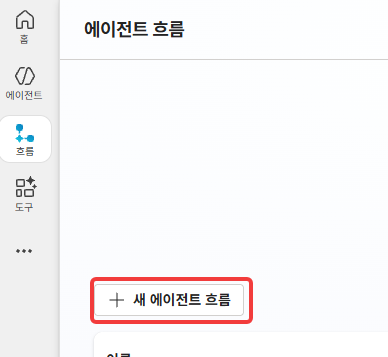

2. 트리거 검색창에 `수동으로 흐름 트리거`(Manually trigger a flow)를 입력하고 선택합니다.

    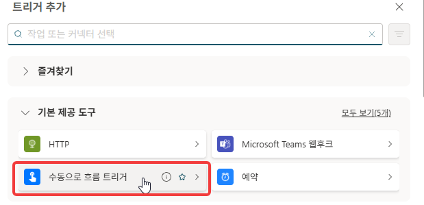

    {: .note }
    Lab 4 원본에서 `새 메일이`를 검색했던 것과 같은 화면입니다. 검색어만 다릅니다 — 이 디자이너는 메일뿐 아니라 임의의 트리거를 지원합니다.

3. 트리거에서 **+ 새 매개변수 추가**(Add an input)를 눌러 입력을 2개 만듭니다.

    - **파일** 형식 입력 → 제목 `이력서원본`, 설명 `이력서 원본 파일을 지정해주세요`
    - **이메일** 형식 입력 → 제목 `이메일`, 설명 `이력서 승인 거부시 수신할 이메일 주소를 입력하세요`

    두 입력 모두 **필수**로 표시합니다.

    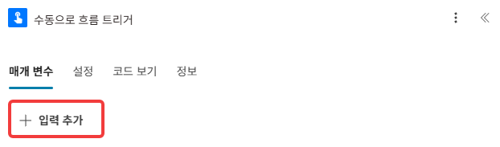
    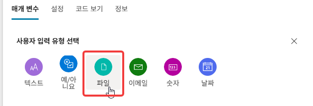
    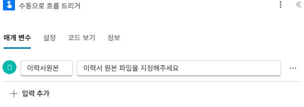
    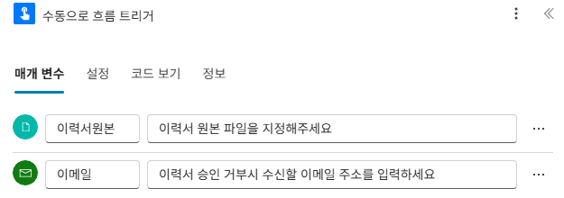

    {: .important }
    이 2개 입력이 원본 Lab 4의 "메일 첨부파일"과 "메일 발신자"를 대신합니다. 흐름을 실행하는 사람이 파일과 이메일을 직접 채워 넣는 구조입니다.

4. 오른쪽 위 **저장**을 클릭하고, 이름 입력 창에 `적재 흐름(수동 트리거)`를 입력합니다.

    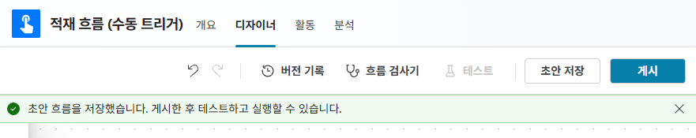

5. 트리거 아래 **+ 작업 추가** → AI Builder **프롬프트 실행**을 추가합니다.

    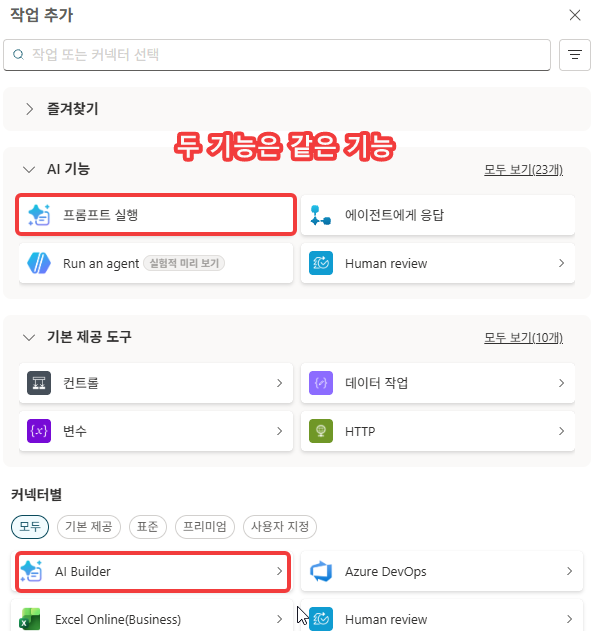

6. AI Builder **연결**을 본인 계정으로 연결합니다.

    

7. **프롬프트** 드롭다운에서 **새 사용자 지정 프롬프트**를 선택합니다. 이후 지침에 아래 내용을 넣습니다. (이 프롬프트의 내용은 아래 참조)

    

    {: .note }
    **제공 프롬프트 내용 (참조)** — 비정형 이력서 → 정형 필드로 변환하는 추출기입니다.
    ```
    당신은 이력서 분석 전문가입니다.
    첨부된 이력서 문서를 분석하여 아래 JSON 형식으로만 출력하세요.

    ### 추출 규칙:
    - 지원자명: 이력서에서 이름 추출
    - 지원직군: [영업/마케팅, 기획/전략, 인사/HR, 재무/회계, IT/개발, 물류/SCM, 고객서비스, 기타] 중 하나
    - 경력사항: [신입, 1~3년, 3~5년, 5년 이상] 중 하나
    - 이력서요약: 핵심 경력·강점을 200자 내외로. 정량 수치(%, 금액, 건수)는 일반화 말고 그대로 보존
    ### 출력 형식:
    { "지원자명":"", "지원직군":"", "경력사항":"", "이력서요약":"" }
    ```
    경력사항·지원직군이 **고정된 선택지로만 출력**되므로, 뒤에서 선택형 컬럼(CareerLevel)에 그대로 매핑해도 값이 일치합니다. 모델은 **GPT-4.1 mini**.

    이후 프롬프트의 이름을 입력합니다.

    

8. 지침 아래쪽에 커서를 위치하고 `이력서 원본 :` 을 타이핑 합니다. 이후  `/`를 입력해 이력서 원본 컨텐츠를 추가합니다. 

    
    

    이후 출력을 JSON으로 변경 후 저장해서 디자이너로 돌아옵니다.

    

    

9. 프롬프트의 **Resume** 입력 칸에 트리거의 **이력서원본 콘텐츠**(파일 콘텐츠) 칩을 넣습니다.

    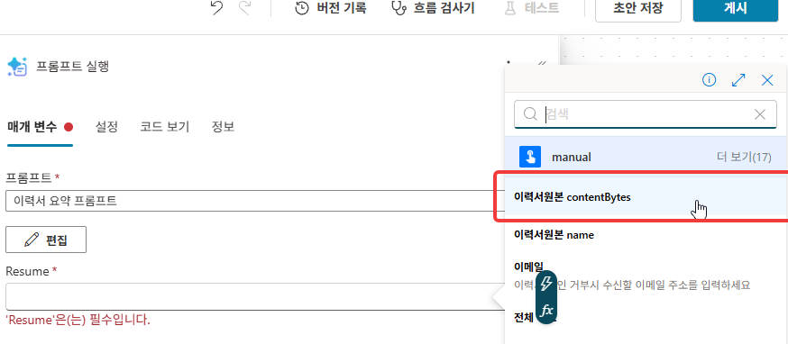

    {: .warning }
    **여기서 For each가 생기지 않습니다.** 원본 Lab 4는 메일 첨부파일이 배열이라 자동으로 반복이 생겼지만, 이 트리거의 `이력서원본`은 파일 1개짜리 단일 값입니다. 반복 없이 다음 작업으로 바로 이어집니다.

10. `Sharepoint` > `파일 만들기`를 클릭합니다
    사이트 주소에 환경 변수 **`SpSiteUrl`** 을 선택합니다.
    

11. 폴더 경로는 `DocLib` > `이력서 샘플` 을 지정합니다.

    

12. **파일 이름** 칸의 **fx**를 열고 아래 식을 붙여넣은 뒤 **추가**합니다.

    ```
    concat(formatDateTime(utcNow(),'yyyyMMdd_HHmmss'), '_', substring(guid(),0,8), slice(triggerBody()?['file']?['name'], lastIndexOf(triggerBody()?['file']?['name'], '.')))
    ```

    

    {: .important }
    **원본 파일명을 쓰지 않습니다.** 원본 파일명의 공백이나 한글이 있으면 링크가 잘 작동하지 않을 확률이 있습니다. `{수신시각}_{GUID8}{확장자}`로 공백 없는 고유명을 만듭니다. 중복된 파일명이 없도록 Guid를 사용합니다.

13. **파일 콘텐츠** 칸에 `/`를 입력하고 트리거의 **이력서원본 콘텐츠**를 넣습니다.

    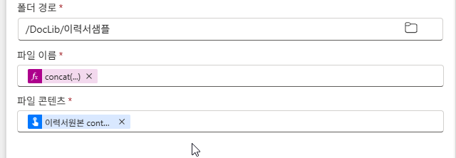

    


14. **+ 작업 추가** → SharePoint **항목 만들기**를 추가합니다.

    

15. **사이트 주소** = **`SPSiteUrl`** 환경 변수 칩, **목록 이름** = **본인 지원자 목록**을 선택합니다.

    

16. **제목(Title)** 칸의 **fx**를 열고 아래를 입력합니다. `지원자명`·`지원직군`은 식 안에서 **동적 콘텐츠 칩**으로 삽입합니다(키보드 텍스트 아님). `지원자명`, `지원직군`은 `프롬프트 실행` 결과로 나온 값입니다. 칩을 추가하면 인코딩 처리가된 테스트가 나오므로 이하 fx함수의 정확한 위치에 잘 배치해야합니다.

    ```
    concat('[', formatDateTime(utcNow(),'yyyy-MM-dd'), ']', «지원자명», '_', «지원직군»)
    ```

    

17. 고급 매개변수를 확장하여 필요한 데이터를 편집합니다. 제목, 지원자이름, 이메일, 지원직군, 경력사항, AI적합도, 이력서요약, 이력서링크를 체크합니다.

    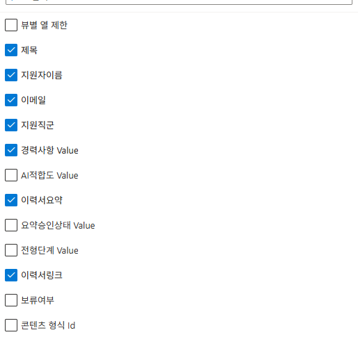

18. **지원자이름** 칸에 `/` → `지원자명` 칩을 넣습니다.

    

19. **이메일** 칸에 `/` → `이메일` 칩을 넣습니다.

    {: .note }
    **이메일 필드가 원본 Lab 4와 다릅니다.** 원본은 메일 발신자("시작" 칩)를 억지로 끌어다 썼지만(그마저 "시작"이란 이름 자체가 from 오역), 이 대안은 트리거에서 받은 **이메일 입력값을 그대로** 씁니다 — 별도 경고가 필요 없는, 더 정확한 구조입니다.

    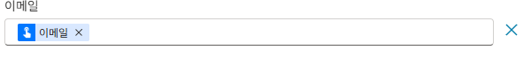

20. **지원직군** 칸에 `/` → `지원직군` 칩을 넣습니다.

    

21. **경력사항** 칸에 `/` → `경력사항` 칩을 넣습니다. (프롬프트가 신입/1~3년/3~5년/5년이상 중 하나로 고정 출력 → 선택 컬럼과 일치)

    

22. **이력서요약** 칸에 `/` → `이력서요약` 칩을 넣습니다.

    

23. **이력서링크** 칸의 **fx**를 열고 아래 식을 입력합니다. (환경 변수 사이트 URL + 파일 만들기가 반환한 경로)

    ```
    concat(parameters('SPSiteUrl (new_SPSiteUrl)'), outputs('파일_만들기')?['body/Path'])
    ```

    

24. 채워진 칩을 확인합니다.

    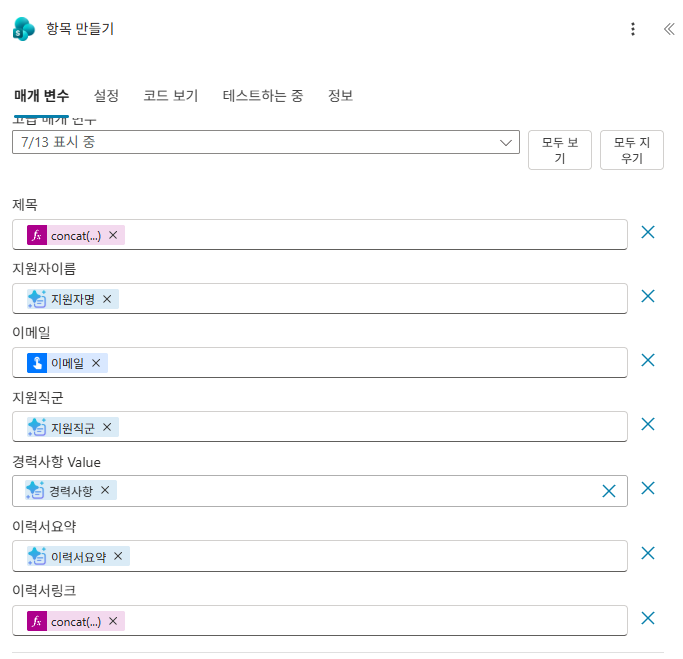


25. 오른쪽 위 **저장**을 클릭합니다. 이후 **게시**를 클릭합니다

    


26. 흐름 세부 정보 화면에서 **테스트**(또는 **흐름 실행**)를 클릭하고 **수동**을 선택합니다. 준비한 이력서 PDF를 **이력서원본**에 업로드하고, **이메일**에 본인 주소를 입력한 뒤 실행합니다.

    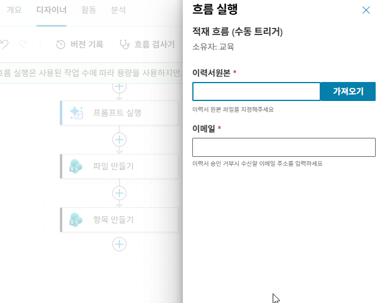

27. 흐름의 **실행 기록**에서 성공으로 수행했는지 확인합니다.

    

28. **본인 지원자 목록**을 열어 **새 항목**이 생겼는지 확인합니다(요약·링크 채워짐, 상태 **보류 중**).

    


---

## 확인

- [ ] 수동 트리거 입력 2개(이력서원본=파일, 이메일=이메일)가 필수로 설정됐다
- [ ] 흐름이 게시됐다(트리거 → AI 프롬프트 → 파일 만들기 → 항목 만들기, **For each 없음**)
- [ ] 파일 업로드 + 이메일 입력으로 수동 실행했고 성공했다
- [ ] 본인 목록에 새 항목이 생겼다(요약·링크 채워짐, 요약승인상태 **승인대기**)

{: .important }
결과물은 원본 Lab 4와 동일합니다 — **이력서요약**이 이후 적합도 평가의 근거이고, 다음 Lab 5에서 사람이 이 요약을 검토·승인합니다. 트리거만 바뀌었을 뿐, 이후 랩(5~7)은 원본 Lab 4를 진행했든 이 대안을 진행했든 완전히 동일하게 진행됩니다.
