# Lab 4. 적재 흐름 📥

> **이번 랩 완성물**: 이력서 메일이 오면 AI가 요약·구조화해 SharePoint에 자동 적재하는 흐름
> **예상 시간**: 50분 · **완성 신호**: `[이력서샘플]` 제목 메일을 보내면 **본인 목록**에 새 항목이 생긴다

<!-- 저작 메모(학생 비노출):
     - 근거: v1 u1-1/u1-2/u1-3 + `Unit1 적재흐름 코스본 빌드 사양서`. 빌드 위치 = CS 에이전트 흐름.
     - 자격증명: 전부 학생 본인. 환경 = 1사이트 / 보관함 공유 / 리스트 개별.
     - AI 프롬프트: 환경 제공본 선택(현재 안) + 전문 reference로 노출. v1은 '새 사용자 지정 프롬프트' 직접 생성(u1-2 2~5단계)이므로
       직접 생성으로 살리려면 그 5단계를 12번에 삽입. 시간 압박으로 select로 압축.
     - 자동 Apply-to-each: 첨부 배열을 프롬프트 Resume에 연결하면 반복이 자동 생성됨(수동 추가 X). v1 검증.
     - 사이트 참조 = 환경 변수 SPSiteUrl 칩. ResumeLink = concat(SPSiteUrl, 파일만들기 Path).
     - 컬럼: ReviewStatus(전형단계)·AIFitLevel(미적용)·OnHold(false)는 매핑 안 함 → 컬럼 기본값.
     - ⏱ 내부 실측 70분(나이브 진행) → 요령·버퍼로 60 목표. 오후 최대 오버런 리스크 랩. -->

{: .time }
**50분 타이머.** 오늘 처음으로 **흐름을 처음부터 짓습니다.**

---

## 준비

테스트용 **신규 지원자 이력서 PDF**(강사 제공, 시드 42명과 다른 인물)를 내려받아 둡니다.

---

## 단계

1. 브라우저에서 Outlook(`https://outlook.office.com`)을 엽니다.

    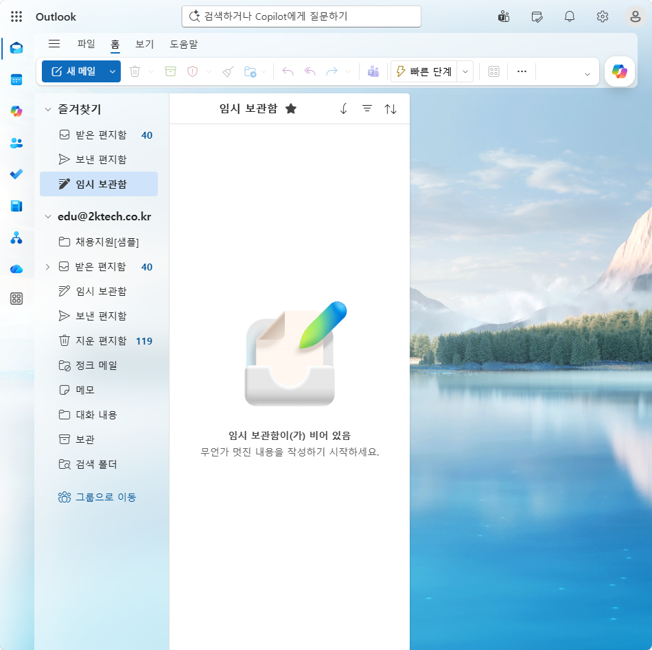

2. 왼쪽 폴더 영역에서 **새 폴더**를 만들고 이름을 `채용지원[샘플]`로 지정합니다.

    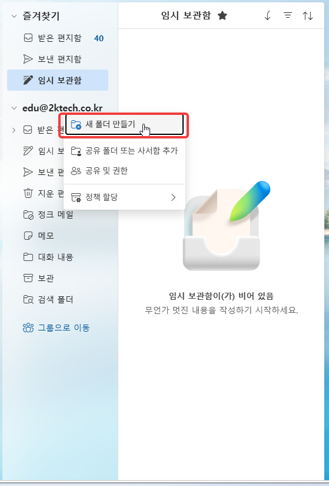

    ![채용지원[샘플] 폴더 완성](../../assets/lab4/02b.png)

3. 오른쪽 위 **설정(톱니)** → **메일** → **규칙** → **+ 새 규칙 추가**를 클릭합니다.

    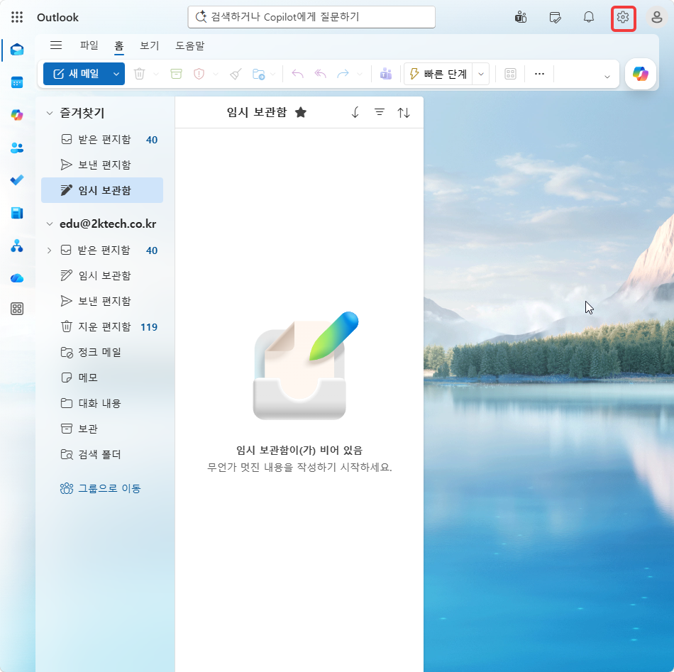

    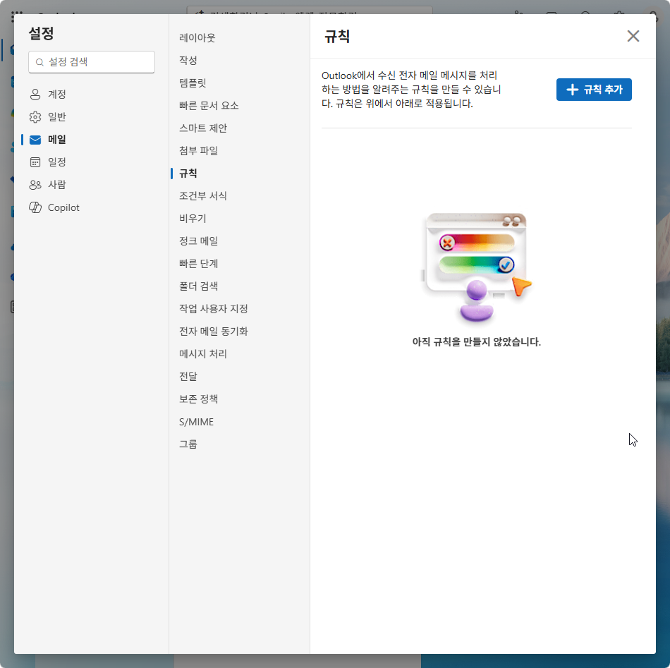
4. 규칙을 아래처럼 설정하고 **저장**합니다. (`[이력서샘플]` 제목 메일이 자동으로 폴더로 들어가 흐름이 발화합니다.)

    - **이름**: `이력서 샘플 분리 규칙`
    - **조건**: 제목에 다음 포함 → `[이력서샘플]`
    - **동작**: 다음 폴더로 이동 → `채용지원[샘플]`

    

    ![폴더 선택 — 채용지원[샘플]](../../assets/lab4/04.png)
    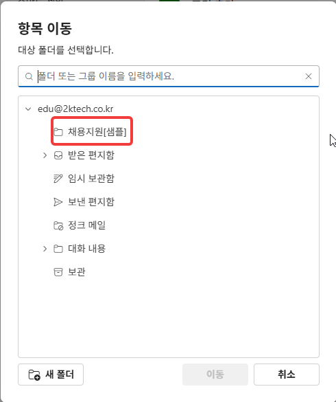
    {: .note }
    "이 메일이 지원 메일인가?"를 흐름이 판단하지 않습니다. **분류는 Outlook 규칙(상류)**이 하고, 폴더에 들어온 것은 이미 지원 메일이라고 신뢰합니다 — 그래서 흐름이 단순해집니다.

5. Copilot Studio 왼쪽 메뉴 **흐름**에서 **+ 새 에이전트 흐름**을 클릭합니다. (이름은 저장할 때 붙입니다.)

    
    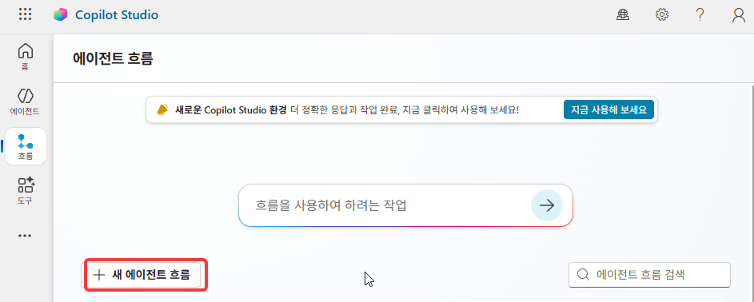

6. 트리거 검색창에 `새 메일이`를 입력하고 Office 365 Outlook **새 메일이 도착하면 (V3)**을 선택합니다.


    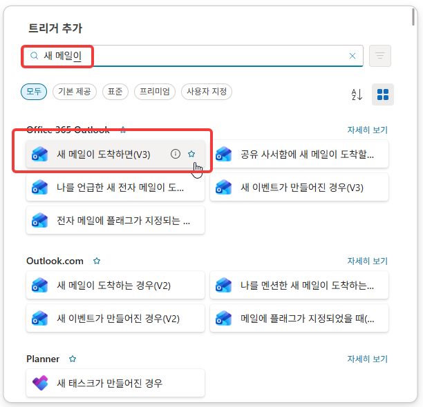

7. **연결**을 본인 계정(본인 메일)으로 연결합니다.

    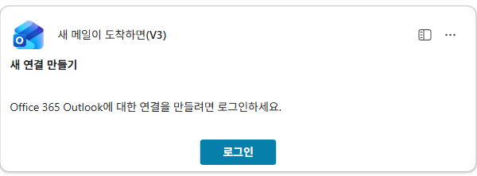

8. 트리거 고급 매개변수를 펼쳐 설정합니다. **폴더** = `채용지원[샘플]`, **첨부 파일 포함** = 예, **첨부 파일이 있는 항목만** = 예.

    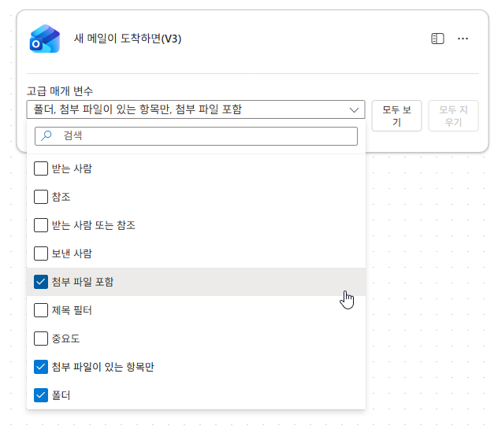
    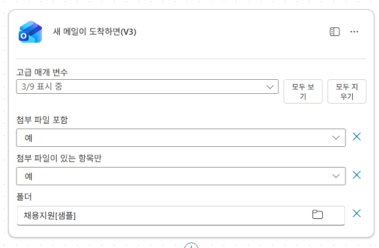

    {: .important }
    **폴더 = 채용 전용 폴더**여야 일반 업무 메일이 흐름을 깨우지 않습니다. **첨부 파일 포함 = 예**여야 다음 단계에서 PDF 내용을 읽습니다.

9. 오른쪽 위 **저장**을 클릭하고, 이름 입력 창에 `적재 흐름`을 입력합니다.

    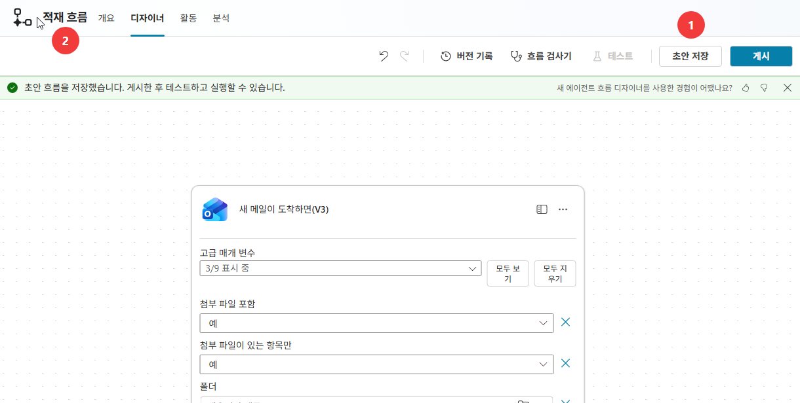

10. 트리거 아래 **+ 작업 추가** → AI Builder **프롬프트 실행**을 추가합니다.

    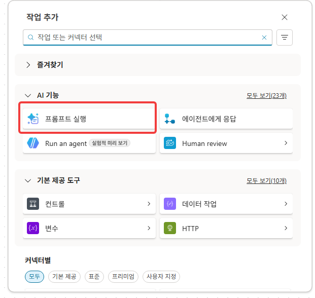

11. AI Builder **연결**을 본인 계정으로 연결합니다.

    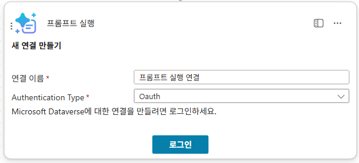

12. **프롬프트** 드롭다운에서 **새 사용자 지정 프롬프트**를 선택합니다. 이후 지침에 아래 내용을 넣습니다. (이 프롬프트의 내용은 아래 참조)

    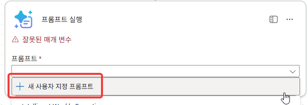

    {: .note }
    **제공 프롬프트 내용 (참조)** — 비정형 이력서 → 정형 필드로 변환하는 추출기입니다.
    ```
    당신은 이력서 분석 전문가입니다.
    첨부된 이력서 문서를 분석하여 아래 JSON 형식으로만 출력하세요.

    ### 추출 규칙:
    - 지원자명: 이력서에서 이름 추출
    - 지원직군: [영업/마케팅, 기획/전략, 인사/HR, 재무/회계, IT/개발, 물류/SCM, 고객서비스, 기타] 중 하나
    - 경력사항: [신입, 1~3년, 3~5년, 5년 이상] 중 하나
    - 이력서요약: 핵심 경력·강점을 200자 내외로. 정량 수치(%, 금액, 건수)는 일반화 말고 그대로 보존
    ### 출력 형식:
    { "지원자명":"", "지원직군":"", "경력사항":"", "이력서요약":"" }
    ```
    경력사항·지원직군이 **고정된 선택지로만 출력**되므로, 뒤에서 선택형 컬럼(CareerLevel)에 그대로 매핑해도 값이 일치합니다. 모델은 **GPT-4.1 mini**.

    이후 프롬프트의 이름을 입력합니다.

    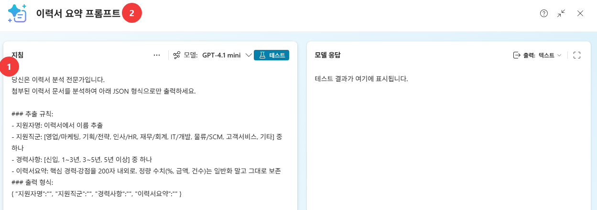

13. 지침 아래쪽에 커서를 위치하고 `이력서 원본 :` 을 타이핑 합니다. 이후  `/`를 입력해 이력서 원본 컨텐츠를 추가합니다. 

    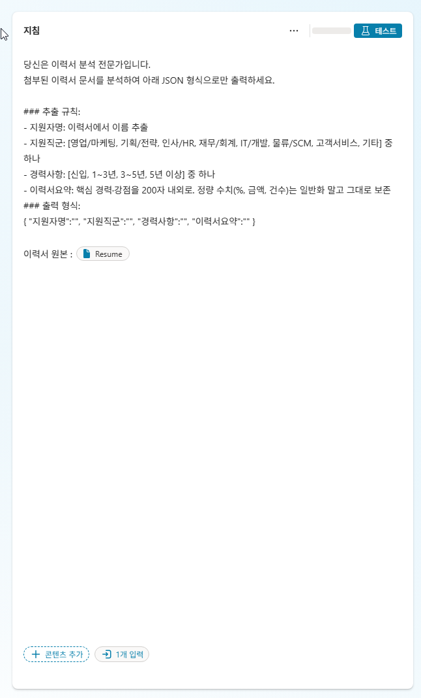
    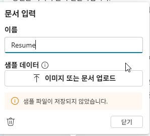

    이후 출력을 JSON으로 변경 후 저장해서 디자이너로 돌아옵니다.

    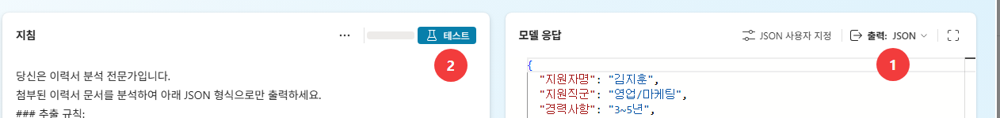

    

14. 디자이너 화면에서 `Resume`라는 필수 입력필드가 추가되었습니다. 여기에 첨부파일을 입력해야합니다. `새 메일이 도착하면 (V3)`의 `첨부파일 콘텐츠`를 지정합니다.
    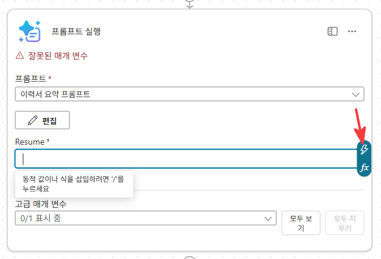
    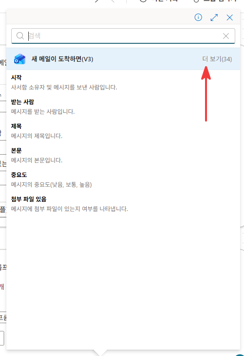
    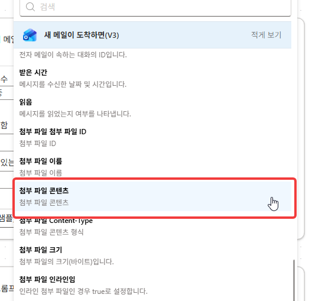

15. 첨부파일은 이메일에 여러개가 있을수 있기때문에 콘텐츠 칩 추가 후 For each가 추가된 걸 확인할 수 있습니다.
    For each 내부의 노드 추가를 통해 앞으로 두 가지의 작업을 수행합니다 `파일 만들기` `항목 만들기`
    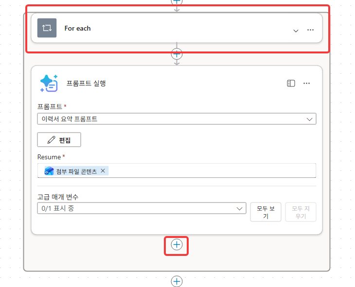

16. `Sharepoint` > `파일 만들기`를 클릭합니다
    사이트 주소에 환경 변수 **`SpSiteUrl`** 을 선택합니다.
    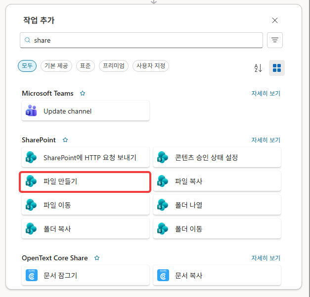

    {: .note }
    혹시 환경변수가 보이지 않는다면 현재 흐름이 솔루션 내부에 포함되었는지 확인하세요.

17. 폴더 경로는 `DocLib` > `이력서 샘플` 을 지정합니다.

    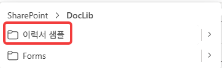

18. **파일 이름** 칸의 **fx**를 열고 아래 식을 붙여넣은 뒤 **추가**합니다.

    ```
    concat(formatDateTime(utcNow(),'yyyyMMdd_HHmmss'), '_', substring(guid(),0,8), slice(item()?['name'], lastIndexOf(item()?['name'], '.')))
    ```

    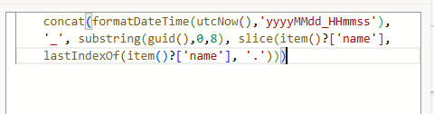

    {: .important }
    **원본 파일명을 쓰지 않습니다.** 원본 파일명의 공백이나 한글이 있으면 링크가 잘 작동하지 않을 확률이 있습니다. `{수신시각}_{GUID8}{확장자}`로 공백 없는 고유명을 만듭니다. 중복된 파일명이 없도록 Guid를 사용합니다.

19. **파일 콘텐츠** 칸에 `/`를 입력하고 트리거의 **첨부 파일 콘텐츠**를 넣습니다. (동적 콘텐츠에서 트리거 항목 **더 보기**를 눌러야 보입니다.)

    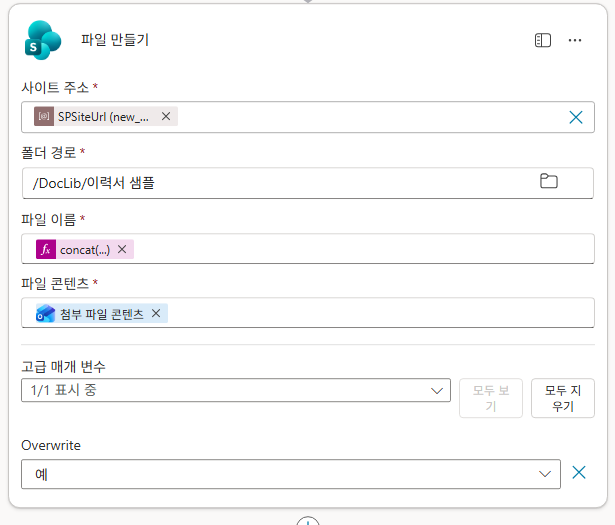


20. 반복 안에 **+ 작업 추가** → SharePoint **항목 만들기**를 추가합니다.

    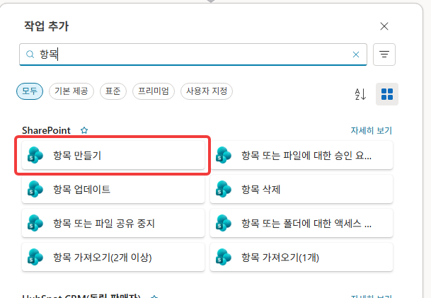

21. **사이트 주소** = **`SPSiteUrl`** 환경 변수 칩, **목록 이름** = **본인 지원자 목록**을 선택합니다.

    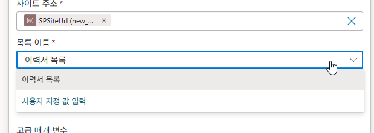

22. **제목(Title)** 칸의 **fx**를 열고 아래를 입력합니다. `지원자명`·`지원직군`은 식 안에서 **동적 콘텐츠 칩**으로 삽입합니다(키보드 텍스트 아님). `지원자명`, `지원직군`은 `프롬프트 실행` 결과로 나온 값입니다. 칩을 추가하면 인코딩 처리가된 테스트가 나오므로 이하 fx함수의 정확한 위치에 잘 배치해야합니다.

    ```
    concat('[', formatDateTime(utcNow(),'yyyy-MM-dd'), ']', «지원자명», '_', «지원직군»)
    ```

    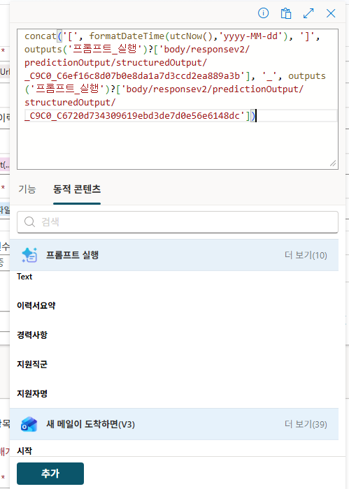

23. 고급 매개변수를 확장하여 필요한 데이터를 편집합니다. 지원자이름, 이메일, 지원직군, 경력사항, AI적합도, 이력서요약, 요약승인상태, 전형단계, 이력서링크를 체크합니다.

    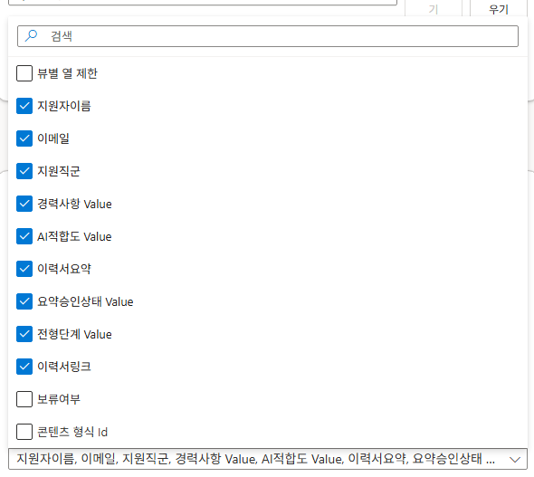

24. **지원자이름** 칸에 `/` → `지원자명` 칩을 넣습니다.

    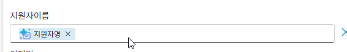

25. **이메일** 칸에 `/` → `시작` 칩을 넣습니다.

    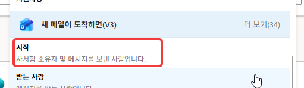

    {: .warning }
    Email 칸에 입력하는 이메일은 AI 요약결과의 이메일이 원칙이지만 현재 승인 거절 이메일 발송 테스트로 작업하기때문에 메일 발송자로 지정합니다.
    또한 시작이라는 이름은 메일 발송자의 from 오역입니다.


26. **지원직군** 칸에 `/` → `지원직군` 칩을 넣습니다.

    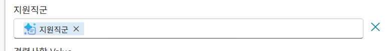

27. **경력사항** 칸에 `/` → `경력사항` 칩을 넣습니다. (프롬프트가 신입/1~3년/3~5년/5년이상 중 하나로 고정 출력 → 선택 컬럼과 일치)

    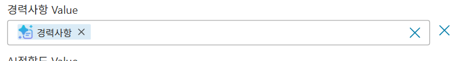

28. **이력서요약** 칸에 `/` → `이력서요약` 칩을 넣습니다.

    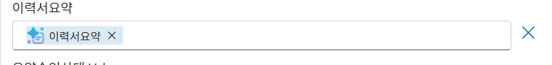

29. **이력서링크** 칸의 **fx**를 열고 아래 식을 입력합니다. (환경 변수 사이트 URL + 파일 만들기가 반환한 경로)

    ```
    concat(parameters('SPSiteUrl (new_SPSiteUrl)'), outputs('파일_만들기')?['body/Path'])

    ```

    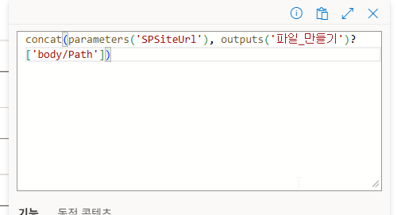

    {: .note }
    **ReviewStatus(전형단계)·AIFitLevel·OnHold(보류)는 매핑하지 않습니다** — 각각 컬럼 기본값(검토중 / 미적용 / false)으로 시작하고, 이후 단계가 채웁니다.
30. AI적합도, 요약승인상태, 전형단계 등은 기본값을 사용합니다. 
    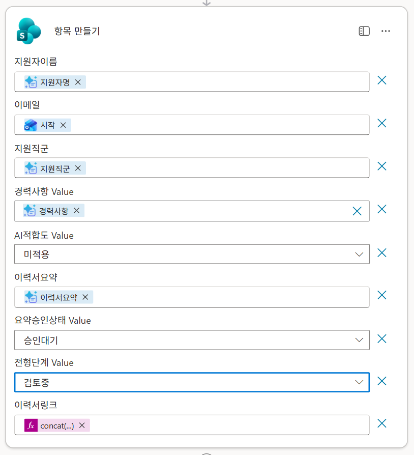


31. 오른쪽 위 **저장**을 클릭합니다. 이후 **게시**를 클릭합니다

    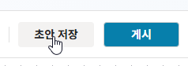


32. 이후 메일을 발송합니다. 준비한 **이력서 PDF**를 첨부하고 제목을 `[이력서샘플] 홍길동`처럼 해서 **내 메일로 보냅니다.**

    ![촬영: [이력서샘플] 제목 + PDF 첨부 메일 발송](../../assets/lab4/32.png)

    {: .note }
    규칙이 적용되지 않아 트리거 발화가 안되면 받은 편지함에서 그 메일을 `채용지원[샘플]` 폴더로 직접 끌어다 넣으세요.

33. 흐름의 **실행 기록**에서 성공으로 수행했는지 확인합니다.

    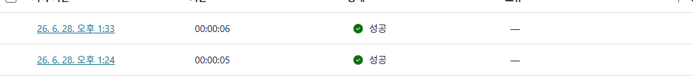

34. **본인 지원자 목록**을 열어 **새 항목**이 생겼는지 확인합니다(요약·링크 채워짐, 상태 **보류 중**).

    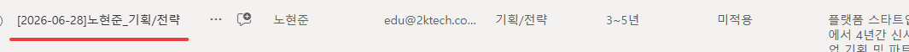

---

## 확인

- [ ] `채용지원[샘플]` 폴더 + 규칙이 설정됐다
- [ ] 흐름이 게시됐다(트리거 → AI 프롬프트(자동 반복) → 파일 만들기 → 항목 만들기)
- [ ] 테스트 메일 후 흐름이 성공 실행됐다
- [ ] 본인 목록에 새 항목이 생겼다(요약·링크 채워짐, 상태 **보류 중**)

{: .important }
방금 만든 지원자는 **보류 중**이라 아직 에이전트 기본 조회에 안 보입니다. 그리고 이 **이력서요약**이 이후 적합도 평가의 **유일한 근거**가 됩니다 — 그래서 다음 Lab 5에서 사람이 이 요약을 **검토·승인**합니다.

