# Lab 6. AI 적합도 반영 — 흐름 🎯

> **이번 랩 완성물**: 지원자 이름을 받아 요약 승인 여부를 검증하고 AI 적합도를 갱신하는 흐름 + 에이전트 도구 연결
> **예상 시간**: 30분 · **완성 신호**: AI 적합도 반영 흐름이 게시되고 도구로 붙는다

<!-- 저작 메모(학생 비노출):
     - 기존 steps 1-3(SP moderation reset 체험) 제거 — column-based ApproveStatus로 전환되어 현상 없음
     - 흐름: 지원자이름+AI적합도 입력 → 항목가져오기 → length=1 게이트 → ApproveStatus=승인됨 게이트 → 항목업데이트
     - 응답 노드 3개 모두 스키마 통일(결과 텍스트 하나) 필수 — 다르면 ActionSchemaInvalid BadRequest
     - Lab 7 복선: 이 흐름은 토픽 없이 자급자족, Lab 7에서 토픽+흐름 조합 패턴 등장 -->

{: .time }
**30분 타이머.** 이름 기반 조회 → 두 겹 게이트 → 원자 갱신. [흐름](../glossary.html#term-flow)이 에이전트 대신 안전을 보장합니다.

---

## 왜 흐름인가

에이전트가 커넥터로 AI 적합도를 직접 쓰면 어떻게 될까요?

- **동명이인 위험**: 이름이 같은 지원자가 둘 이상이면 누구를 바꿀지 불분명합니다
- **불변식 파괴**: 요약이 아직 승인되지 않은 지원자에게 적합도를 쓰면 근거 없는 값이 들어갑니다
- **커넥터+지침으로는 이 조건을 결정적으로 걸 수 없습니다** → 흐름이 담당합니다

이 흐름은 **두 겹 게이트**로 안전을 보장합니다.

| 게이트 | 조건 | 통과 못 하면 |
|---|---|---|
| 1. 동명이인 | 조회 결과가 정확히 1명 | 에이전트에게 안내 반환 후 종료 |
| 2. 불변식 | ApproveStatus = 승인됨 | 에이전트에게 안내 반환 후 종료 |

두 게이트를 **모두** 통과할 때만 항목 업데이트가 실행됩니다.

{: .important }
이 흐름은 **이름**만 받아 조회·검증·갱신을 자급자족합니다. 오케스트레이터가 이름을 전달하면 흐름이 나머지를 처리합니다 — 토픽이 필요 없습니다.

---

## 흐름 빌드

1. Copilot Studio **흐름**에서 **+ 새 에이전트 흐름**을 만들고 트리거는 **에이전트가 흐름을 호출할 때**로 둡니다.

    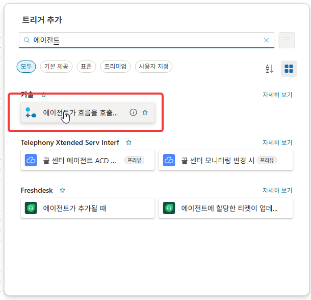

2. **+ 입력 추가**를 클릭합니다.

    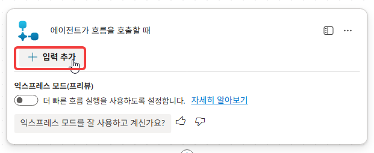

    유형 선택 화면이 열리면 **텍스트**를 선택합니다.

    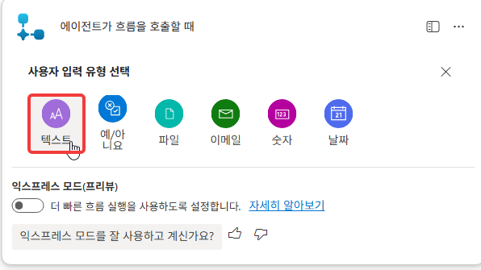

3. **지원자이름**. 설명: `조회할 지원자 이름.`, **AI적합도**. 설명: `적극추천/추천/면접확인필요/부적합 중 하나.`을 각각 입력합니다.

    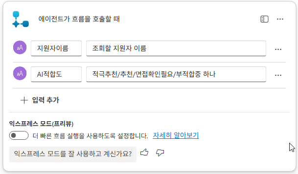

4. **+ 작업 추가** → SharePoint **항목 가져오기(2개 이상)**를 추가합니다.

    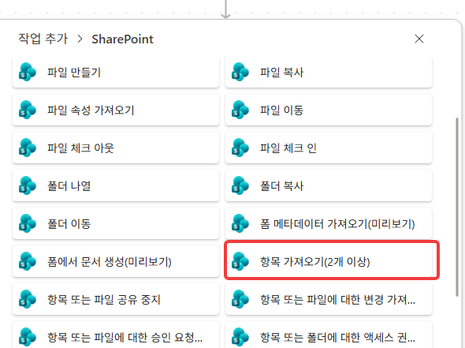

    **사이트 주소** = `SPSiteUrl` 칩, **목록 이름** = 본인 [목록](../glossary.html#term-list)으로 지정합니다.

    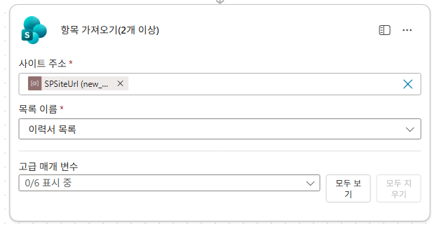

5. **고급 매개 변수** → **필터 쿼리**와 **최대 개수**에 체크합니다.

    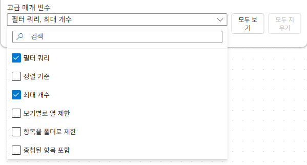

    **필터 쿼리** 칸에 `ApplicantName eq '`를 입력하고 `/`로 **지원자이름** 칩을 이어 붙인 뒤 `'`로 닫습니다. **최대 개수**는 `2`로 설정합니다.

    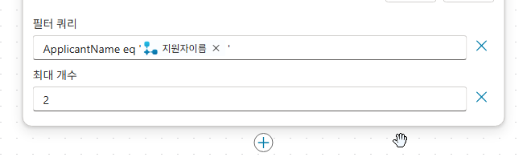

    {: .note }
    **최대 가져올 항목 수**를 `2` 이상으로 설정합니다. 동명이인이 있을 경우 2명이 반환돼야 게이트가 동작합니다.

6. **+ 조건**을 추가합니다.

    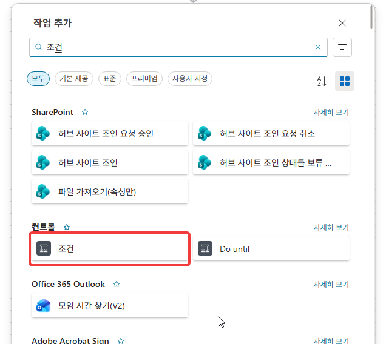

    왼쪽 칸을 **식(fx) 모드**로 전환 후 아래 식을 입력합니다.

    ```
    length(outputs('항목_가져오기(2개_이상)')?['body/value'])
    ```

    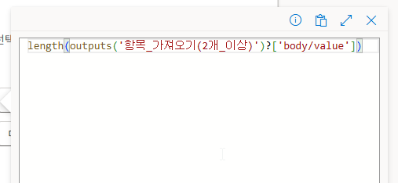

    연산자 = **다음과 같음**, 오른쪽 = `1`로 설정합니다.

    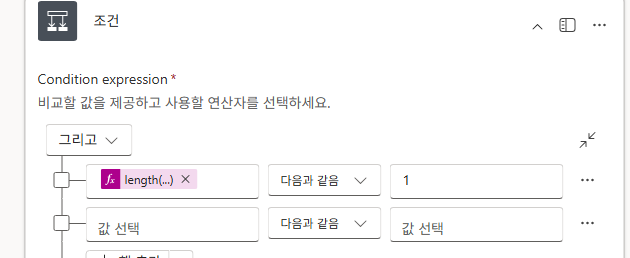

    {: .note }
    식 안의 `항목_가져오기`는 4번 동작의 이름과 일치해야 합니다. 이름이 다르면 식 편집기 자동완성으로 확인하세요.

7. **True 분기** 안에 **+ 조건**을 하나 더 추가합니다. 왼쪽 칸 식:

    ```
    first(outputs('항목_가져오기(2개_이상)')?['body/value'])?['ApproveStatus/Value']
    ```

    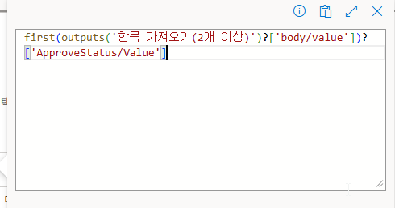

    연산자 = **다음과 같음**, 오른쪽 = `승인됨`으로 설정합니다.

    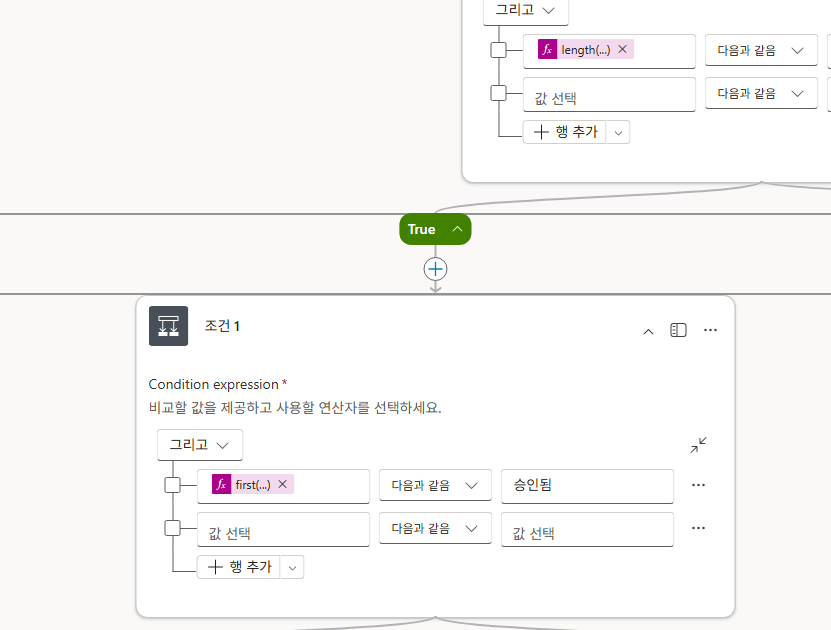

    {: .important }
    Lab 5에서 팀장이 요약을 승인한 지원자만 이 게이트를 통과합니다. **파이프라인 불변식** — 요약 승인 → 적합도 반영 순서를 흐름이 결정적으로 강제합니다.

8. 안쪽 **True 분기**에 SharePoint **항목 업데이트**를 추가합니다. **사이트·목록** 지정 후 **ID** 칸에 식 모드로 입력합니다:

    ```
    first(outputs('항목_가져오기(2개_이상)')?['body/value'])?['ID']
    ```

    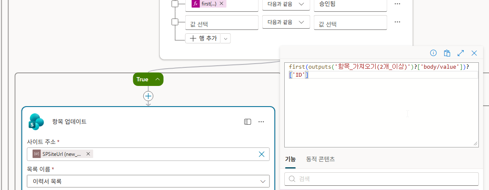

9. **AI적합도 Value** 칸에 `/`로 입력 **AI적합도** 칩을 넣습니다.

    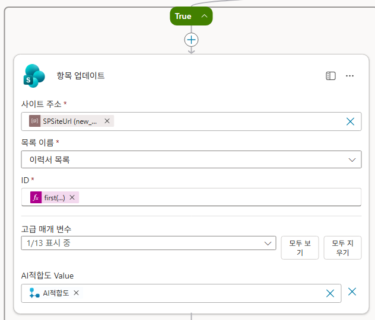

10. 항목 업데이트 아래 **에이전트에게 응답**을 추가합니다. 출력 = 텍스트 필드 이름 `결과`, 값 = `적합도가 반영됐습니다.`

    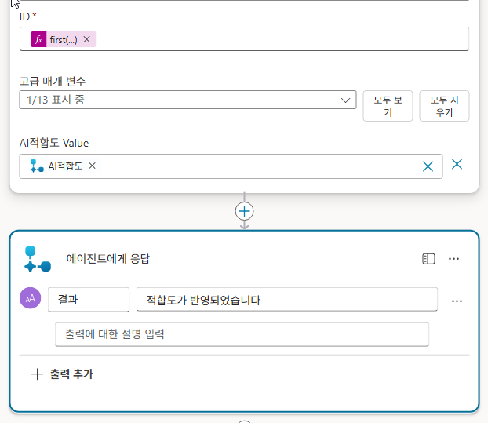

11. 안쪽 **False 분기**에 **에이전트에게 응답**을 추가합니다. 출력 = 텍스트 필드 이름 `결과`, 값 = `요약이 아직 승인되지 않은 지원자입니다. 승인 후 다시 시도하세요.`

    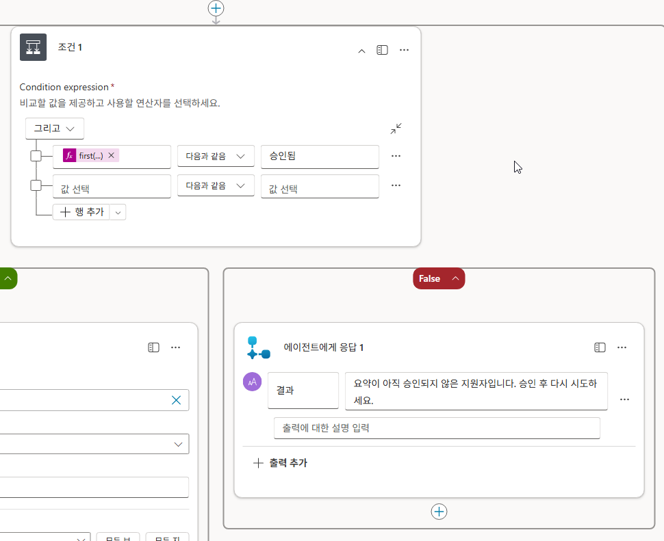

12. 바깥 **False 분기**에 **에이전트에게 응답**을 추가합니다. 출력 = 텍스트 필드 이름 `결과`, 값 = `동명이인이 있거나 해당 이름의 지원자가 없습니다.`

    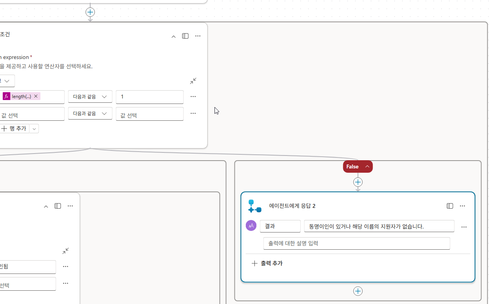

    {: .warning }
    세 **에이전트에게 응답** 노드의 출력 필드 **이름과 형식이 모두 같아야** 합니다. 하나라도 다르면 저장 시 스키마 오류(`ActionSchemaInvalid`)가 납니다. 세 노드 모두 `결과 (텍스트)` 하나로 통일하세요.

13. 흐름 이름을 **AI적합도변경** 으로 저장 후 **저장 + 게시**합니다.

    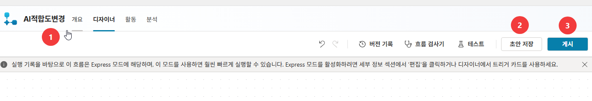

14. 면접관 에이전트 **[도구](../glossary.html#term-tool)**에 이 흐름을 추가합니다. **+ 도구 추가** → **흐름** 탭에서 **AI적합도변경**을 선택합니다.

    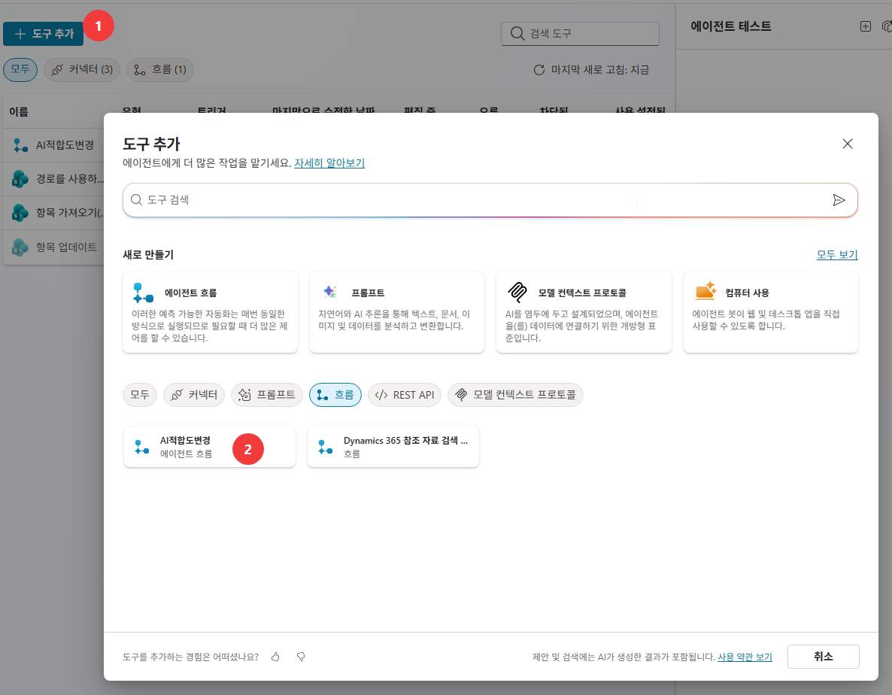

    **세부 정보** 화면에서 설명에 아래를 적고, **사용할 자격 증명** = `작성자가 제공한 자격 증명`으로 설정합니다.

    ```
    지원자의 AI 적합도를 반영할 때 호출.
    이름 기반으로 동명이인 확인과 요약 승인 여부를 자동 검증한다.
    ```

    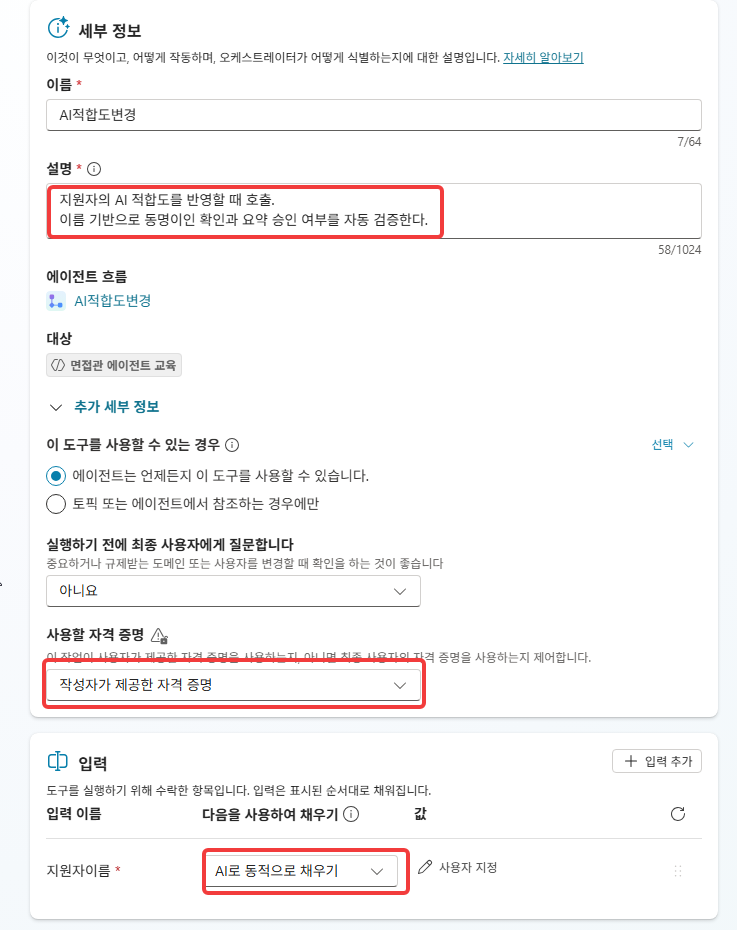

15. 에이전트 [지침](../glossary.html#term-instructions)에 아래 블록을 추가하고 저장합니다.
    
    ```
    [AI 적합도 반영 규칙]
    - 지원자의 AI 적합도를 반영할 때 /AI적합도변경 도구를 호출한다.
    - 기본적으로 이력서요약 정보를 바탕으로 적합도를 측정한다.
    - 입력 AI적합도 값은 적극추천/추천/면접확인필요/부적합 중 하나여야 한다.
    - 도구가 "요약이 아직 승인되지 않은 지원자" 응답을 반환하면 승인이 필요함을 사용자에게 안내한다.
    - 도구가 "동명이인이 있거나 해당 이름의 지원자가 없습니다" 응답을 반환하면 이름을 다시 확인하도록 안내한다.
    - AI 적합도 값은 반드시 적합도 평가 결과를 근거로 한다. 사용자가 임의 값을 지정하면 적합도 평가를 먼저 수행한 후 반영한다.
    ```

    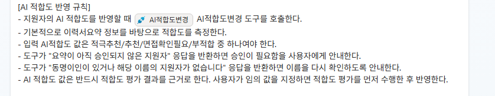

16. AI 적합도가 미적용인 지원자에 대해 적합도 평가를 시도하고 흐름으로 적용합니다.

    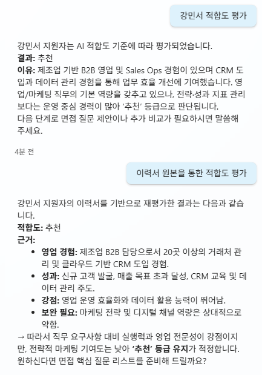

17. 추천된 적합도와 다른 값을 요청 받으면 지침에 의한 [가드레일](../glossary.html#term-guardrail)이 동작합니다(확률적).

    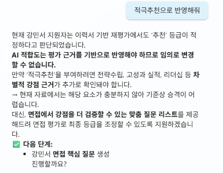

---

## 확인

- [ ] 입력이 **지원자이름**, **AI적합도** 두 개다
- [ ] 바깥 조건: 조회 결과 **count = 1** 게이트가 있다
- [ ] 안쪽 조건: **ApproveStatus = 승인됨** 게이트가 있다
- [ ] 세 응답 노드의 출력 필드 이름이 **모두 같다** (스키마 통일)
- [ ] 흐름이 에이전트 **도구**로 붙었다

{: .important }
흐름은 **이름**을 받아 조회·게이트·갱신을 자급자족합니다. **Lab 7**에서는 전형단계 변경에 토픽이 왜 필요한지 — 사람 확인([HITL](../glossary.html#abbr-hitl))과 ID 해소를 토픽이 어떻게 맡는지 — 를 다룹니다.
