# Lab 7. 전형단계 변경 — 토픽 (대화형 HITL) 💬

> **이번 랩 완성물**: 지원자 조회 → 두 겹 게이트 → 확인 카드로 전형단계를 변경하는 토픽 + 전용 흐름
> **예상 시간**: 60분 · **완성 신호**: "○○○ 서류합격 처리해줘" → 확인 카드 → 전형단계 변경

<!-- 저작 메모(학생 비노출):
     - 전형단계 유효 값: 검토중/서류합격/불합격 (최종합격/면접합격은 Choice에 없음 — 지침 블록 필수)
     - ApproveStatus = 커스텀 컬럼(Choice), Value = "승인됨" (CJ 환경. SP moderation 아님)
     - 카드: TextBlock 단일 타입 수식 카드(FactSet 혼용 시 null bleeding → AdaptiveCardInvalid)
     - ID 조건부 필터: 세부정보→입력에서 AI적합도+ID 모두 추가. 동명이인은 오케스트레이터 front + 토픽 count=1 back 이중 방어
     - 모든 토픽 종료 필수 — 없으면 재귀 호출 발생
     - 흐름 먼저 빌드 → 토픽에서 바로 연결 (순서 바꾸면 흐름 호출 노드에서 선택 불가) -->

{: .time }
**60분 타이머.** 흐름(단건 갱신)을 먼저 만들고, 토픽(게이트·카드·HITL)을 짓습니다.

---

## 왜 토픽인가

Lab 6의 AI적합도 흐름은 이름만 받아 조회·검증·갱신을 **자급자족**했습니다. 전형단계 변경은 왜 토픽이 필요할까요?

| | Lab 6 AI적합도 흐름 | Lab 7 전형단계 토픽 |
|---|---|---|
| 입력 | 이름 + 적합도 값 | 이름만 (전형단계는 대화로 결정) |
| 확인 단계 | 없음 (결정적 실행) | **카드로 사람 확인 필수** |
| 전형단계 선택 | 해당 없음 | 챗봇과 대화로 결정 |

{: .note }
**3층 분담** — 오케스트레이터(조회·되묻기·AI적합도 전달) / **토픽**(게이트·카드·HITL) / 흐름(ID 단건 갱신).

---

## 흐름 빌드 — 전형단계변경

토픽에서 흐름을 연결하려면 흐름이 먼저 존재해야 합니다. 흐름을 먼저 만듭니다.

2. 왼쪽 사이드바 **흐름** → **+ 새 에이전트 흐름**을 클릭합니다. 트리거 **에이전트가 흐름을 호출할 때**가 표시되는지 확인합니다.

    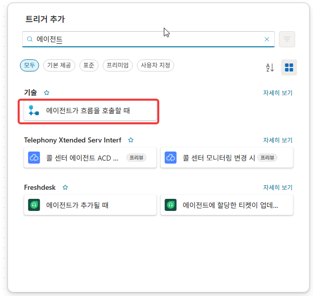


3. 트리거 노드 안 **+ 입력 추가**를 클릭합니다. 입력변수를 아래와 같이 입력합니다.

    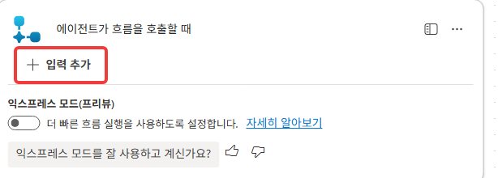

4. **숫자**를 선택하고 이름 칸에 `ID`, 설명 칸에 `변경할 SP 항목 ID.`를 입력합니다.

    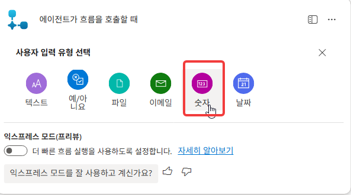

    ID 입력 변수가 완성됩니다.

    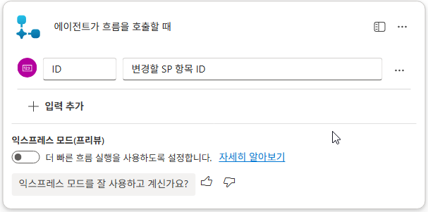

5. **텍스트**를 선택하고 이름: `전형단계`, 설명: `변경할 전형단계 값(검토중/서류합격/불합격).`을 입력합니다.

    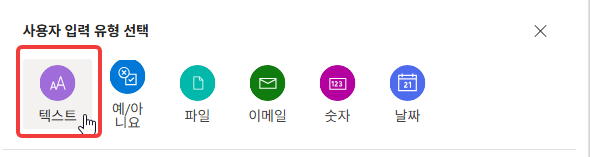

    트리거 입력 변수 2개가 완성됩니다.

    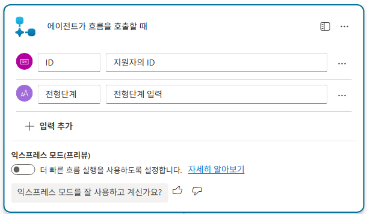

6. **작업 추가 → SharePoint → 항목 업데이트**를 선택합니다.

    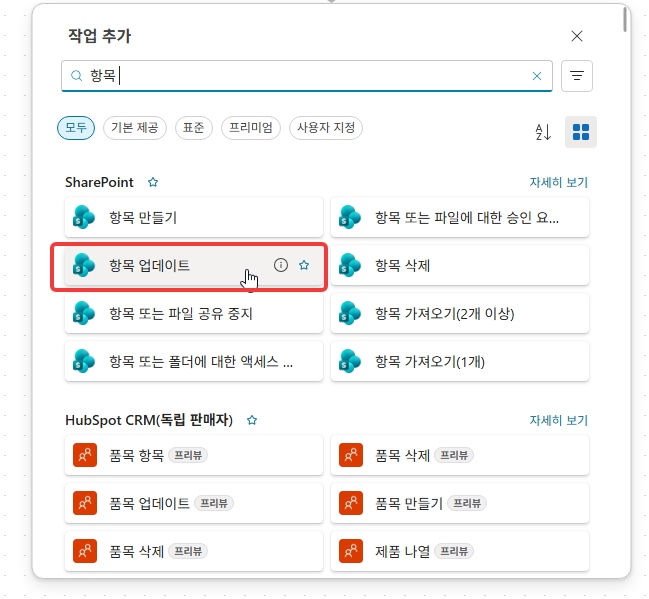

7. **사이트 주소** 칸에 `SPSiteUrl` 환경변수 칩을 선택합니다. **목록 이름** 칸에 본인 목록을 선택합니다.

    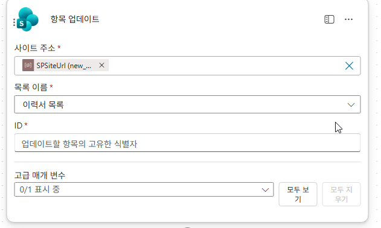

8. **ID** 칸에 트리거의 **ID** 칩을 넣습니다.

    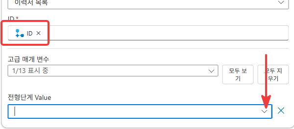

9. **ReviewStatus Value** 칸에 트리거의 **전형단계** 칩을 넣습니다.

    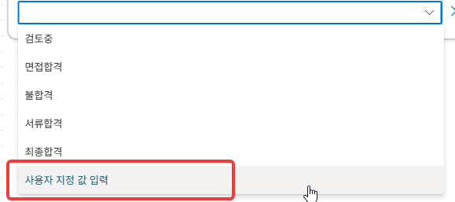

    매핑이 완성됩니다.

    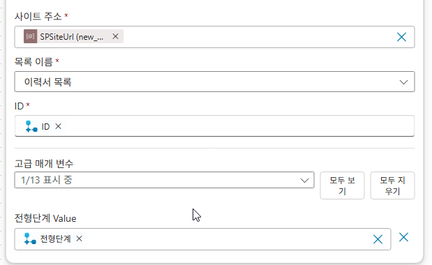

    {: .note }
    ID를 직접 받아 **1건만 정확히 갱신**합니다. 조회·동명이인 확인은 토픽이 이미 완료했기 때문에 흐름은 단건 갱신만 합니다.

10. 항목 업데이트 아래 **에이전트에게 응답** 노드를 선택합니다.

    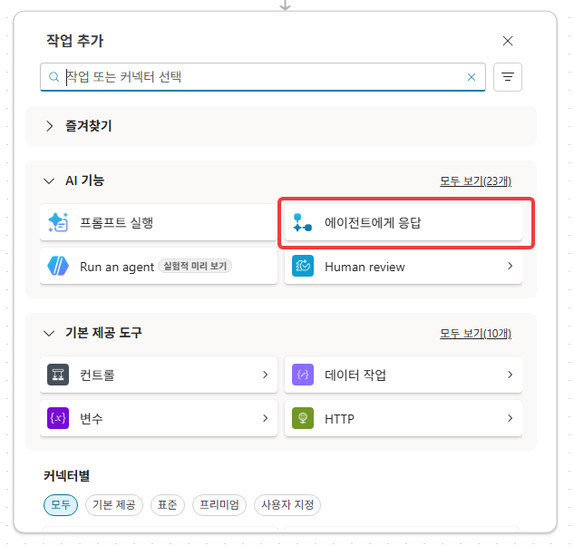

11. **+ 출력 추가** → **텍스트**. 이름: `결과`, 값: `전형단계가 변경됐습니다.`를 입력합니다.

    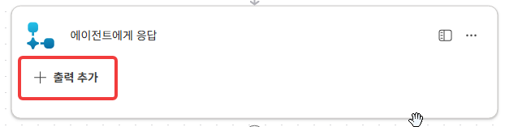

    출력 설정이 완성됩니다.

    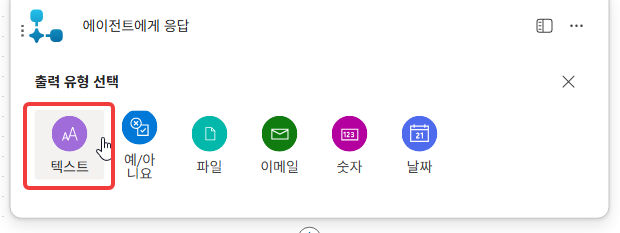

12. 상단 흐름 이름을 **전형단계변경**으로 변경하고 **저장 → 게시**합니다.

    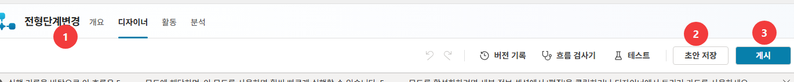

---

## 토픽 빌드 — 전형단계변경

{: note}
토픽의 내부 노드 구조는 다소 복잡합니다. 아래 순서도를 보고 어떤 흐름인지 개요를 파악하세요.

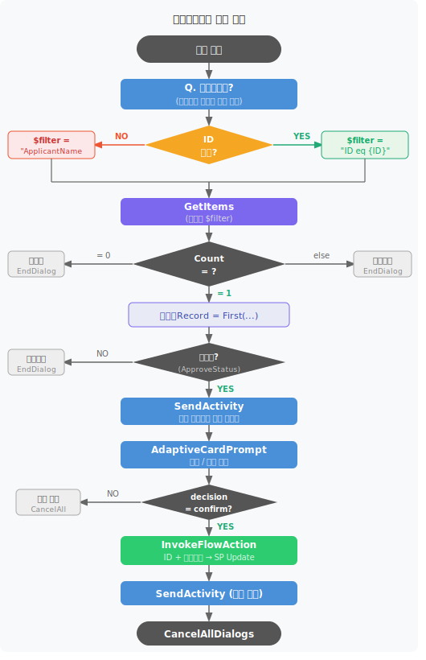

### 토픽 생성 + 입력 변수

13. 상단메뉴 **토픽** → **+ 새 토픽 → 빈 항목**을 클릭합니다.

    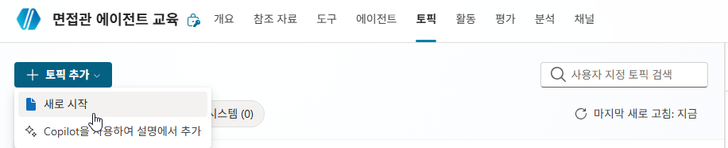

14. 토픽 이름을 **전형단계변경**으로 입력합니다. **이 에이전트 선택** 노드 → **토픽이 수행하느 작업설명**을 클릭해 트리거 설명을 입력합니다

    ```
    사용자가 특정 지원자의 전형단계(검토중/서류합격/불합격) 변경을 요청할 때 호출합니다.
    ```

    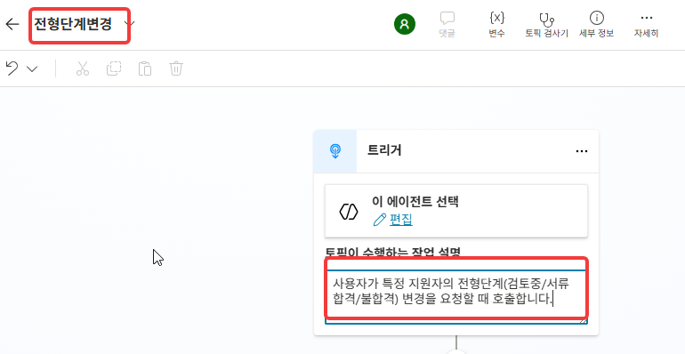

15. 상단 툴바 **세부 정보**를 클릭합니다.

    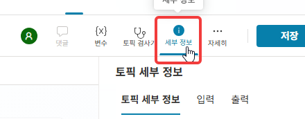

16. **입력** 탭을 선택합니다. **+ 새 변수 만들기**를 클릭합니다.

    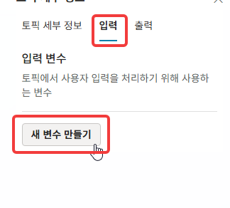

17. 이름: `AI적합도`, 형식: **텍스트**, 설명: `오케스트레이터가 전달하는 AI적합도 값.`을 입력합니다. 이후 **+ 새 변수 만들기**를 다시 클릭합니다

    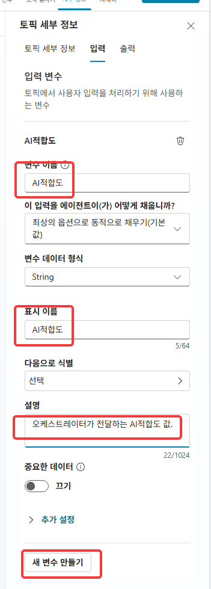

18. 이름: `ID`, 형식: **숫자**, 설명: `동명이인 해소 시 오케스트레이터가 전달하는 SP 항목 ID.`를 입력합니다.

    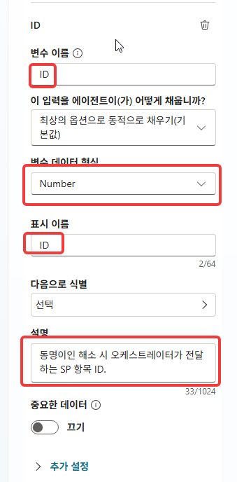

    {: .note }
    Question 노드 없이 오케스트레이터가 직접 채워주는 값은 여기서 선언합니다. Question 노드를 통해 사용자에게 묻는 변수(지원자이름·전형단계)는 뒤에서 추가합니다.

---

### 질문 — 지원자이름

19. **+ 추가 → 질문**을 선택합니다.

    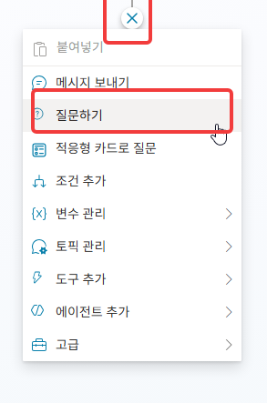

20. 질문 텍스트에 `어느 지원자인가요?`를 입력합니다.

    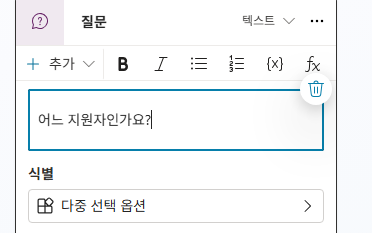

21. **식별** → **사용자의 전체 응답**을 선택합니다.

    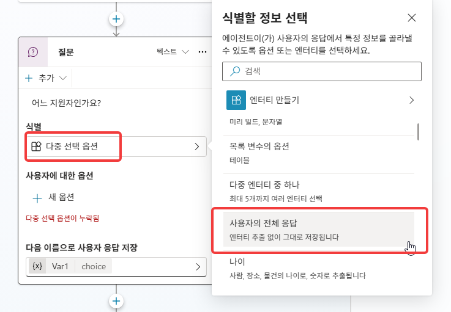

22. **다음 이름으로 사용자 응답 저장** 변수 옆 **(x)**를 클릭해 변수 이름을 **지원자이름**으로 변경합니다. 변수 속성 패널에서 **다른 토픽에서 값 받기**를 체크합니다.

    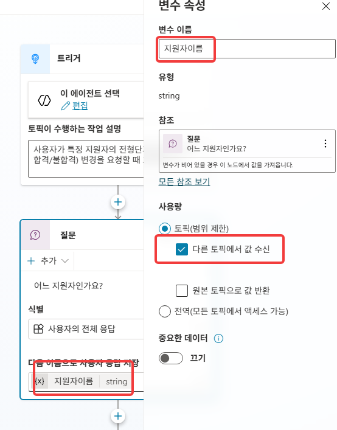

---

### 항목 가져오기 (GetItems)

23. **+ 추가 → 작업 추가 → 커넥터에서 호출 → SharePoint → 항목 가져오기**를 선택합니다.

    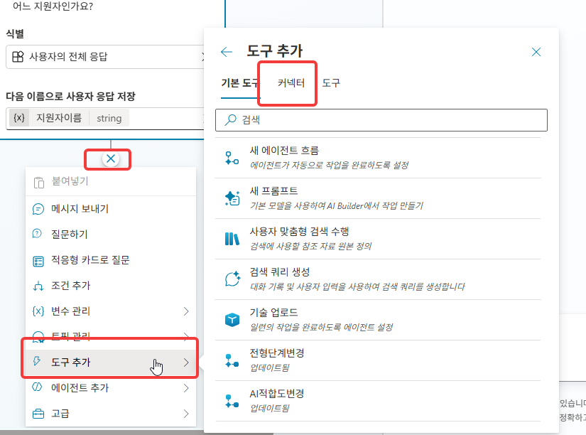

    항목 가져오기 노드가 추가됩니다.

    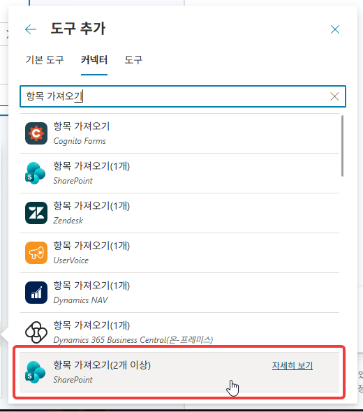

24. **개시** 메뉴에서 제작자의 자격증명, **입력** 메뉴에서 **사이트 주소** 칸에 `SPSiteUrl` 환경변수 칩을 선택합니다. **목록 이름** 칸에 본인 목록을 선택합니다. 이때 목록 이름이 잘 나오지 않으면 사이트 이름을 환경 변수 대신 지정된 값을 직접 입력합니다.

    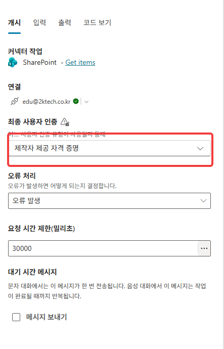

    사이트·목록 설정이 완성됩니다.

    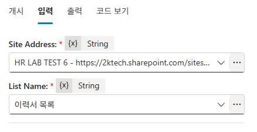

25. **필터 쿼리** 칸 오른쪽 **수식(fx)** 버튼을 클릭해 수식 모드로 전환후 아래 수식을 입력합니다.

    ```powerfx
    If(IsBlank(Topic.ID), "ApplicantName eq '" & Topic.지원자이름 & "'", "ID eq " & Text(Topic.ID))
    ```

    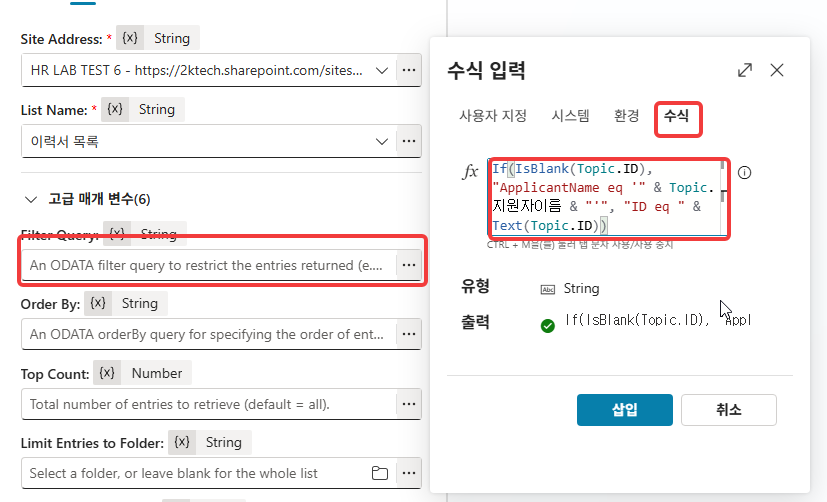

26. **최대 가져올 항목 수**에 `2`를 입력합니다.

    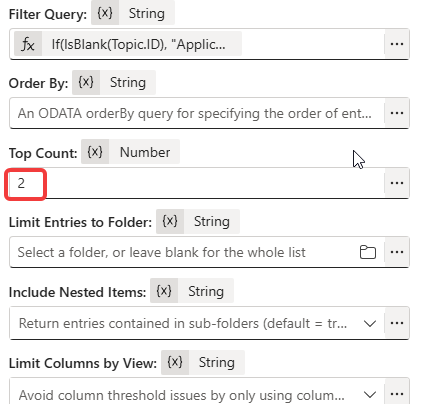

    {: .note }
    ID가 있으면 ID로 1건, 없으면 이름으로 조회합니다. 최대 2로 동명이인 여부를 감지합니다.

---

### 변수 설정 — 행 갯수

27. **+ 추가 → 변수 값 설정**을 선택합니다.

    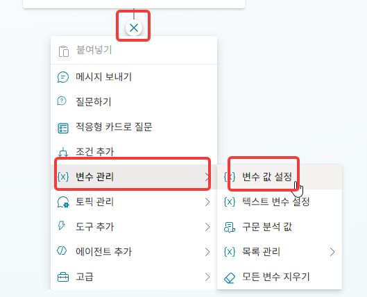

28. **변수 설정** 칸 → **+ 새 변수 만들기** → 이름: `Rownumber`, **받는 사람 값** 칸을 수식 모드로 전환 후 아래를 붙여넣습니다.

    ```powerfx
    CountRows(Topic.GetItems.value)
    ```

    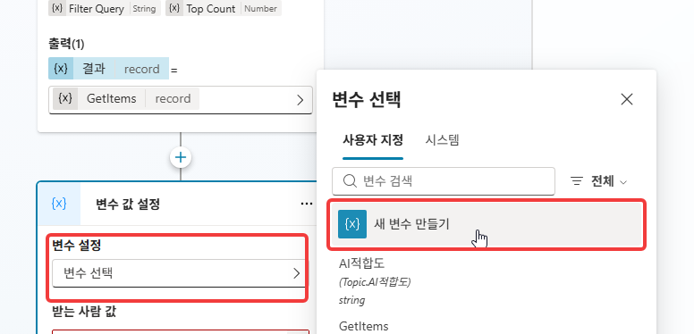

    Rownumber 변수 설정이 완성됩니다.

    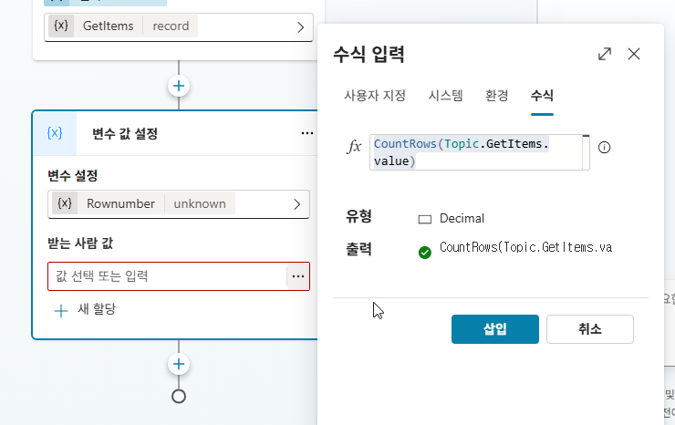

---

### 조건 — 행 갯수 분기

29. **+ 추가 → 조건**을 선택합니다.

    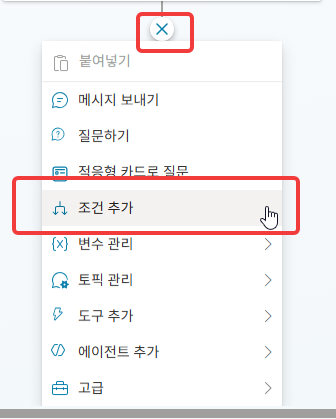

30. 왼쪽 칸에 `Topic.Rownumber`를 선택합니다.

    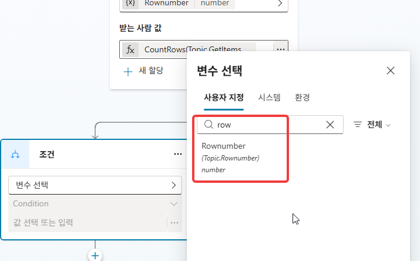

31. 연산자: **같음**, 오른쪽 값: `0`.

    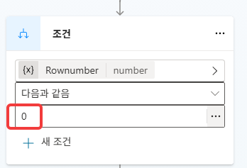

32. **True** 분기 안에 **메시지 보내기**를 추가합니다. 텍스트: `해당 이름의 지원자를 찾을 수 없습니다.`

    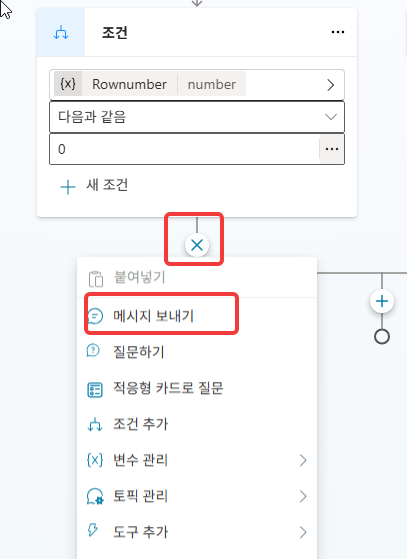

    True 분기 구성이 완성됩니다.

    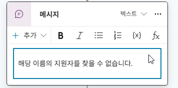

33. **True** 분기 안에 **현재 토픽 종료**를 추가합니다.

    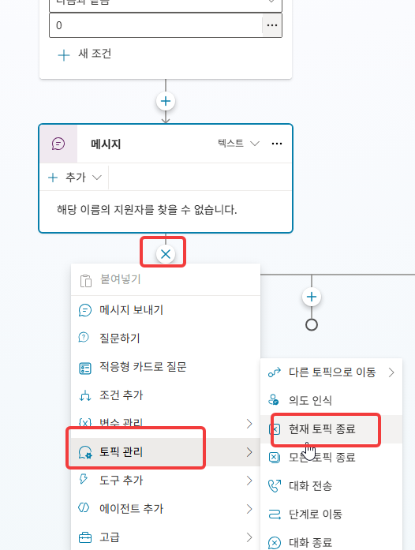

34. 조건 노드에서 **+ 새 조건 추가**를 클릭합니다.

    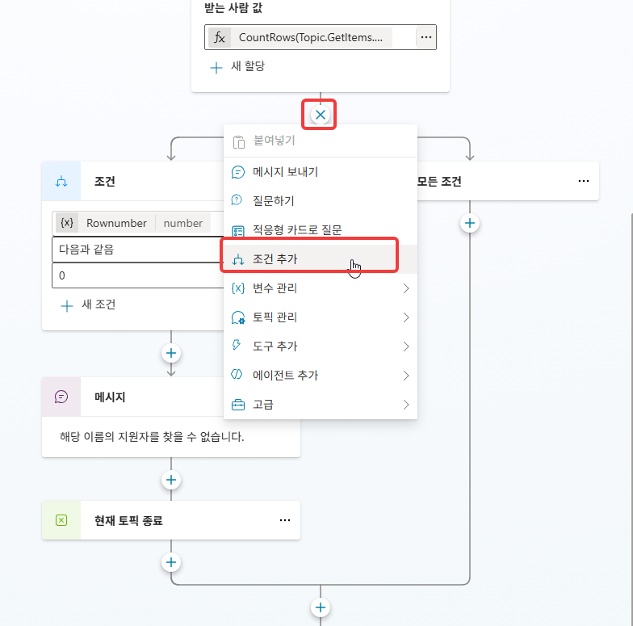

35. 새 분기 조건: `Topic.Rownumber` **보다 큼** `1`.

    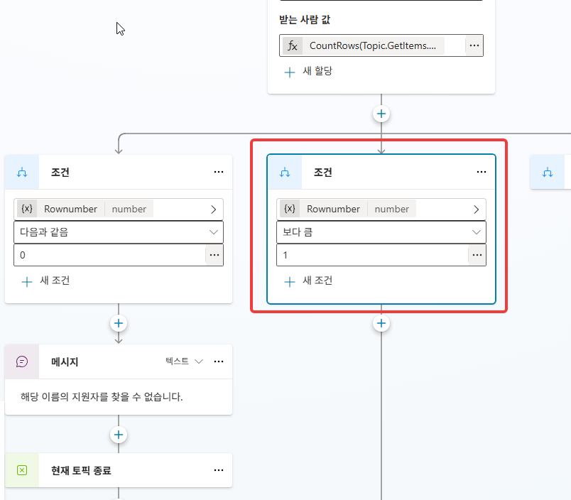

36. 새 분기 안에 **메시지 보내기**: `동명이인이 있습니다. 이메일이나 ID로 특정해 주세요.`. 그리고 아래에 현재 토픽 종료를 추가합니다.

    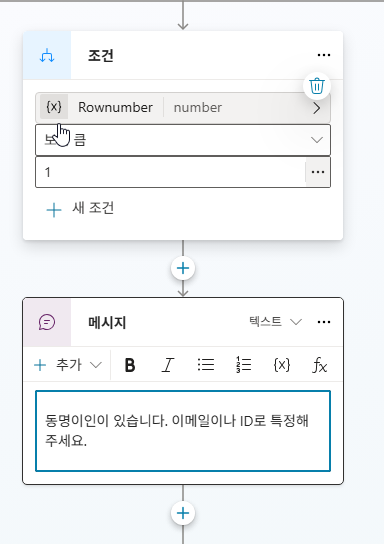

    동명이인 분기가 완성됩니다.

    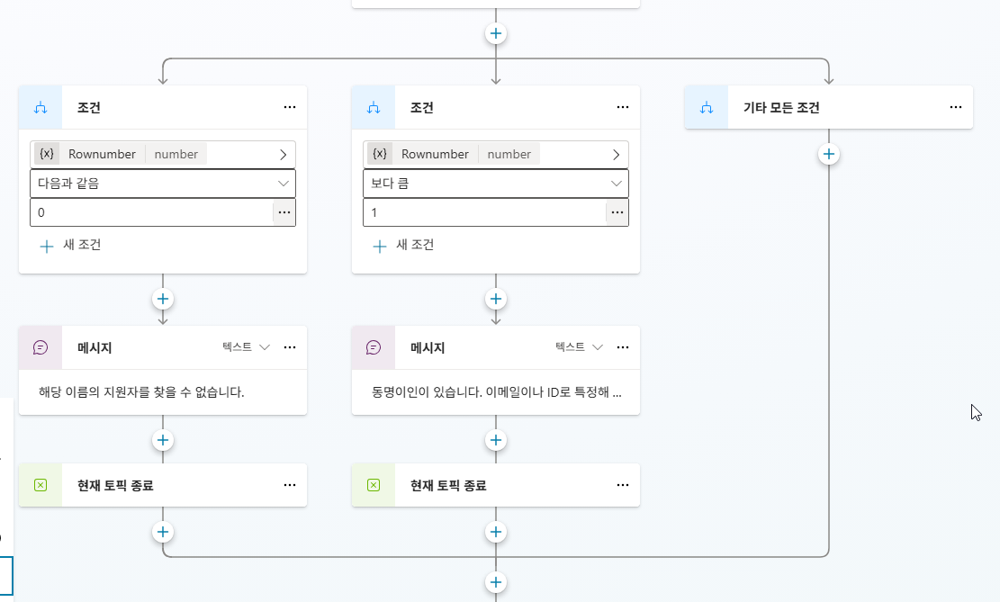

    {: .note }
    나머지 분기(count=1)는 추가 액션 없이 아래 노드로 이어집니다.

---

### 변수 설정 — 단일 레코드

37. **+ 추가 → 변수 값 설정**을 선택합니다.

    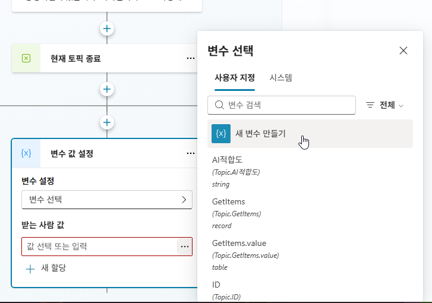

38. **변수 설정** 칸 → **+ 새 변수 만들기** → 이름: `지원자Record`, 형식: **레코드**. **받는 사람 값** 칸을 수식 모드로 전환 후 아래를 붙여넣습니다.

    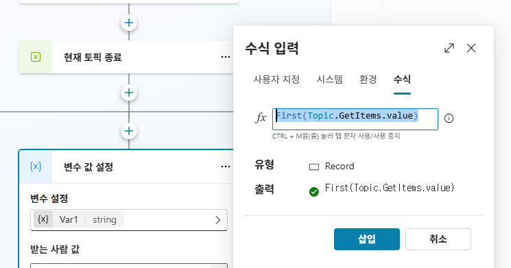

    ```powerfx
    First(Topic.항목_가져오기.value)
    ```

    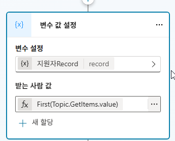

---

### 조건 — AI적합도 게이트

39. **+ 추가 → 조건**을 선택합니다.

    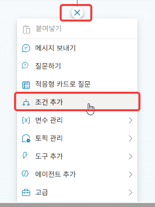

40. 왼쪽 칸: `Topic.AI적합도`, 연산자: **같음**, 오른쪽: `미적용`.

    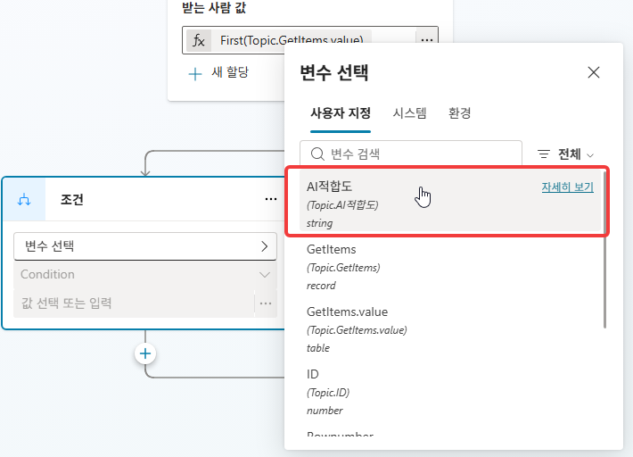

    조건 설정이 완성됩니다.

    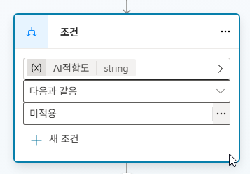

42. **True** 분기 → **메시지 보내기**: `AI 적합도 평가가 완료되지 않은 지원자입니다. 평가 후 다시 요청하세요.`

    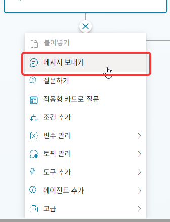

    True 분기 메시지가 완성됩니다.

    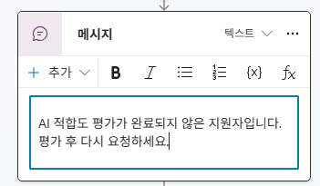

43. **True** 분기 → **현재 토픽 종료**.

    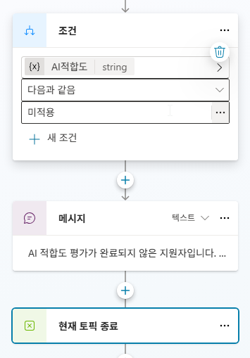

    {: .note }
    AI적합도 평가와 반영은 오케스트레이터의 몫입니다. 이 토픽은 "미적용이면 차단"만 합니다.

---

### 조건 — 승인됨 게이트

44. **+ 추가 → 조건**을 선택합니다.

45. 왼쪽 칸: `Topic.지원자Record.ApproveStatus.Value`, 연산자: **같지 않음**, 오른쪽: `승인됨`.

    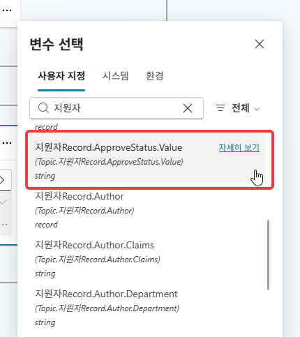

    조건 설정이 완성됩니다.

    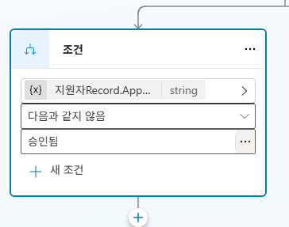

46. **True** 분기 → **메시지 보내기**: `AI 요약 승인이 완료되지 않은 지원자입니다.`

    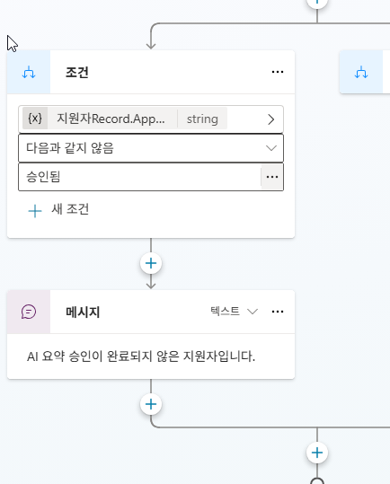

47. **True** 분기 → **토픽 종료**.

    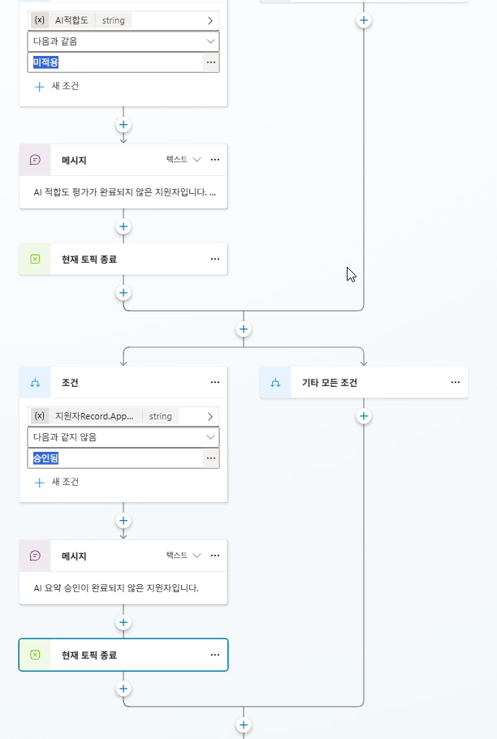

    {: .important }
    **파이프라인 불변식** — 요약 승인 → 전형단계 변경 순서를 토픽이 결정적으로 강제합니다.

---

### 질문 — 전형단계

48. **+ 추가 → 질문**을 선택합니다.

    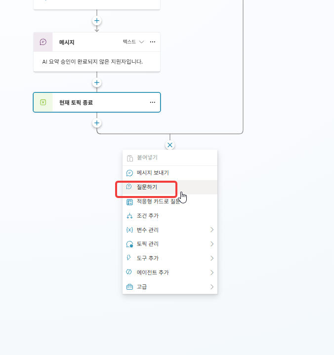

49. 질문 텍스트: `어떤 전형단계로 변경할까요?`

    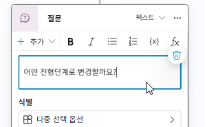

50. **식별** → **다중 선택 옵션**을 선택합니다. **+ 새 옵션**을 클릭해 `검토중`, `서류합격`, `불합격`을 추가합니다.

    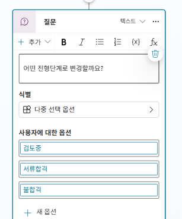

    3개 옵션이 완성됩니다.

    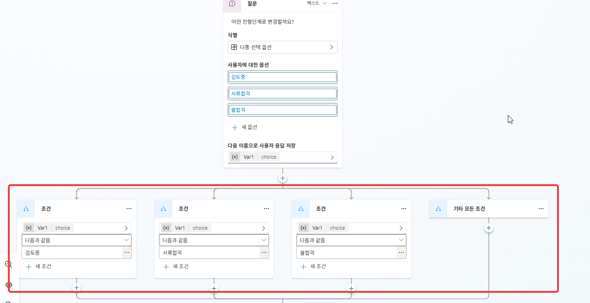

    {: .note }
    다중 선택 옵션의 선택은 이후 자동으로 조건이 붙습니다. 현재는 불필요하기 때문에 자동으로 생성된 조건은 삭제합니다.

51. 변수 이름을 **전형단계**로 변경하고 다른 토픽에서 값 수신을 체크합니다.

    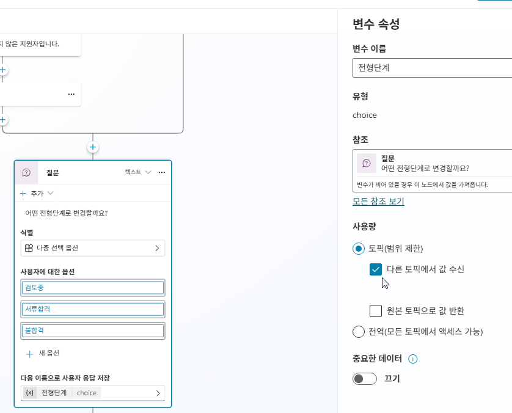

    {: .warning }
    옵션 값은 SP 목록 Choice 값과 **정확히** 일치해야 합니다. 오탈자가 있으면 변경 시 null이 저장됩니다.

---

    {: .note }
    질문 노드는 오케스트레이터가 해당 값을 인식하고 있는가 아닌가에 따라 질문이 나올수도 아닐수도 있습니다.
    오케스트레이터가 판단해서 이 값을 지정해 주는것을 slot filling이라고 하며, 이 값이 지정되지 않고 토픽을 수행하면 토픽 수행 중 질문지가 표시됩니다.

### 적응형 카드 질문

52. **+ 추가 → 적응형 카드 질문**을 선택합니다.

    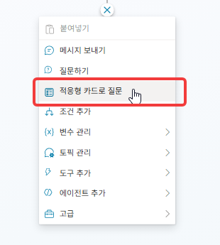

53. 카드 편집 창에서 **수식(fx)** 모드로 전환합니다.

    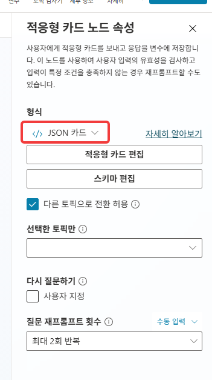

54. 아래 수식을 붙여넣습니다.

    ```
    {
      type: "AdaptiveCard",
      '$schema': "https://adaptivecards.io/schemas/adaptive-card.json",
      version: "1.5",
      body: [
        { type: "TextBlock", text: "전형단계 변경 확인", weight: "Bolder", size: "Medium", wrap: true },
        { type: "TextBlock", text: "지원자: " & Topic.지원자이름, wrap: true, spacing: "Medium" },
        { type: "TextBlock", text: "현재 전형단계: " & Topic.지원자Record.ReviewStatus.Value, wrap: true },
        { type: "TextBlock", text: "변경 후: " & Topic.전형단계, wrap: true, weight: "Bolder" },
        { type: "TextBlock", text: "위 내용으로 변경할까요?", wrap: true, spacing: "Large" }
      ],
      actions: [
        { type: "Action.Submit", title: "확정", style: "positive",
          data: { actionSubmitId: "review_confirm_v1", decision: "confirm" } },
        { type: "Action.Submit", title: "취소", style: "destructive",
          data: { actionSubmitId: "review_confirm_v1", decision: "cancel" } }
      ]
    }
    ```

    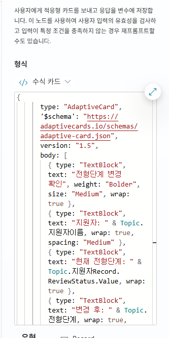


    {: .note }
    출력이 보이지 않는 다면. `스키마 편집`의 값을 아래로 덮어 씁니다.

    ```
    kind: Record
    properties:
        actionSubmitId: String
        decision: String
  ```

    {: .note }
    적응형 카드의 기본 디자인 편집은 json모드로 수행할 수 있습니다. 다만 이때는 레이아웃 편집만 가능하고 변수를 지정하거나 가변적인 수식의 값은 정의가 되지 않습니다. 수식 카드 일때 이 작업이 가능하지만 다시 json모드로 복귀가 되지 않습니다. 레이아웃의 고민이 필요하면 json모드로 먼저 배치를 해보고 수식 모드로 확정하시는걸 추천합니다.

    {: .warning }
    카드 body에 **TextBlock과 FactSet을 섞으면** Power Fx가 스키마를 병합해 `"facts": null` 오류가 발생합니다. TextBlock 단일 타입만 사용하세요.

55. **다음 이름으로 사용자 응답 저장** 변수 이름을 **decision**으로 설정합니다.

    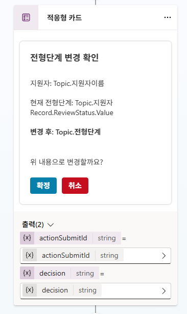

---

### 조건 — 확정 / 취소

56. **+ 추가 → 조건**을 선택합니다. 왼쪽 칸: `Topic.decision`, 연산자: **같음**, 오른쪽: `confirm`.

    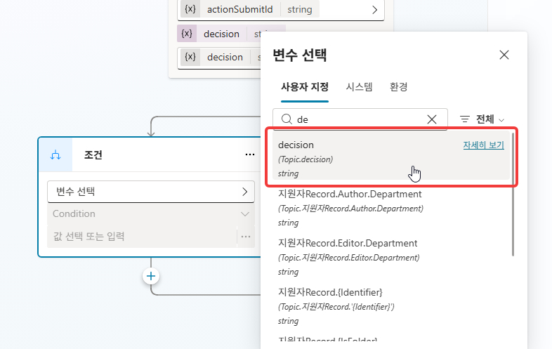

    조건 노드가 완성됩니다.

    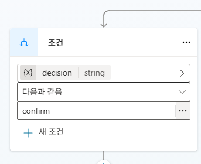

---

### 확정 분기

57. **True** 분기 → **+ 추가 → 작업 추가 → **전형단계변경** 흐름을 선택합니다.

    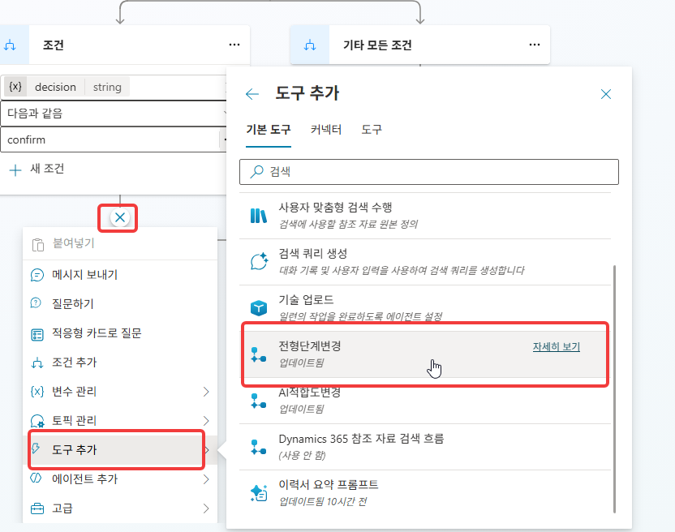

58. 입력 **ID** 칸에 `Topic.지원자Record.ID`를 수식으로 입력합니다.

    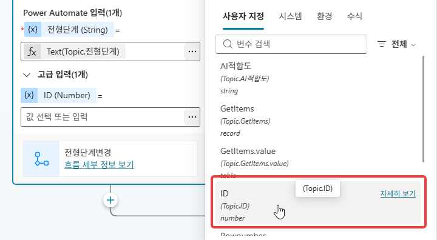

59. 입력 **전형단계** 칸에 `Topic.전형단계`를 수식으로 입력합니다.
    ```
    Text(Topic.전형단계)
    ```
    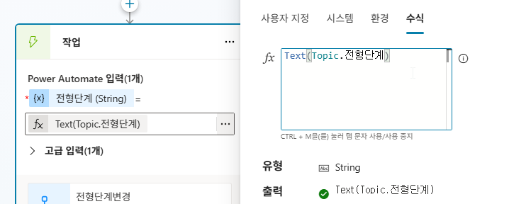

60. **True** 분기 → **메시지 보내기**. **False** 분기 → **메시지 보내기**: `변경을 취소했습니다.`

    ```
    {Topic.지원자이름}의 전형단계를 {Text(Topic.전형단계)}(으)로 변경했습니다.
    ```

    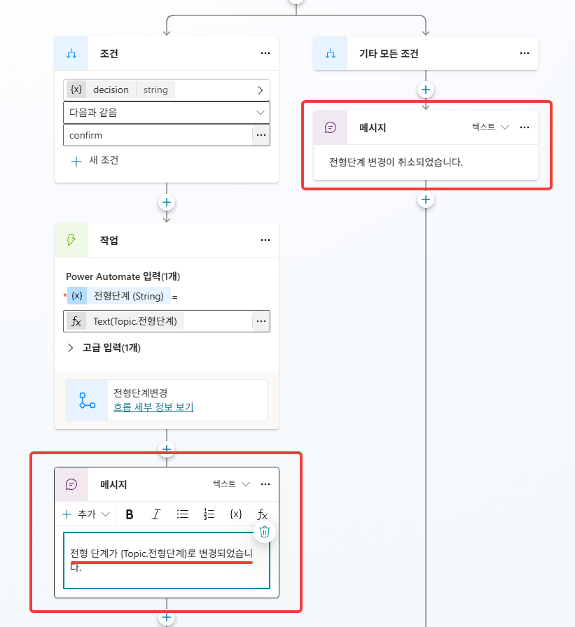

61. 최하단 노드에 **모든 토픽 종료** 를 추가합니다.

    **모든 토픽 종료**가 없으면 토픽이 자신을 다시 부르는 **재귀 호출**이 발생합니다. 확정·취소 **양쪽 모두** 반드시 넣으세요.

    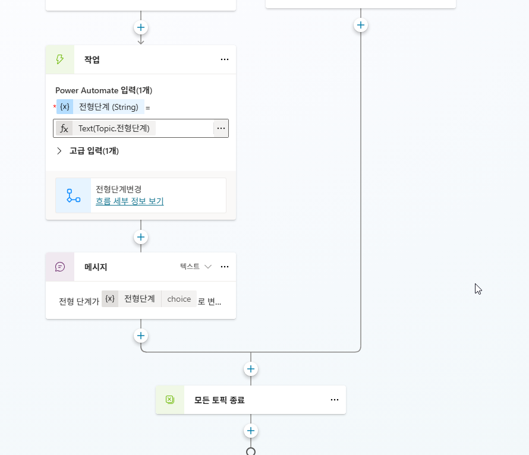

62. **저장** 후 지침을 추가합니다.

    ```
    ## 전형단계 변경 규칙
    - 전형단계 변경 요청 시 전형단계변경 토픽을 호출한다.
    - 변경 가능한 전형단계 값: 검토중, 서류합격, 불합격
    - 이 외의 값(최종합격, 면접합격 등)은 존재하지 않으므로 "지원되지 않는 전형단계입니다"라고 안내하고 토픽을 호출하지 않는다.
    - 여러 명·전원 일괄 변경은 거절하고 한 명씩 지정하게 한다.
    - 동명이인이 있으면 이메일 또는 ID로 특정하도록 먼저 되묻는다.
    ```

    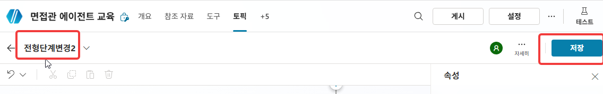


---

## 테스트 — 4가지 시나리오

63. **정상** — 승인된 지원자에게 `○○○ 서류합격 처리해줘`. 확인 카드 → [확정] → 전형단계 변경 확인.


64. **없는 이름** — 존재하지 않는 이름으로 변경 요청 → count=0 게이트 차단.


65. **미승인 지원자** — 요약 미승인 지원자 변경 요청 → ApproveStatus 게이트 차단.


66. **잘못된 전형단계** — `면접합격으로 바꿔줘` → 오케스트레이터 지침 가드가 차단하고 안내.


---

## 확인

- [ ] **세부 정보→입력**에 AI적합도·ID가 선언됐다
- [ ] GetItems 필터가 ID 있으면 ID 조회, 없으면 이름 조회로 분기한다
- [ ] 게이트 ① count=1, 게이트 ② ApproveStatus=승인됨 — 둘 다 있다
- [ ] AI적합도 미적용이면 토픽에서 차단한다
- [ ] 카드 body가 TextBlock 단일 타입이다 (FactSet 없음)
- [ ] 확정·취소 **양쪽** 끝에 **모든 토픽 종료**가 있다
- [ ] 흐름 입력이 **ID(숫자)·전형단계(텍스트)** 두 개다

{: .important }
**읽기는 커넥터+지침, 상태 변경은 흐름, 사람 확인은 토픽.** 같은 "사람 끼워 넣기"도 비동기(Lab 5)와 대화형(지금)으로, 같은 확인도 텍스트와 카드로 갈립니다. 그 경계를 손으로 그어 본 것 — 이 과정이 남기는 핵심입니다.
