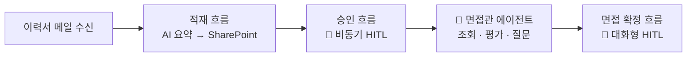

# HR 채용 자동화 Lab 🤝

**"AI에게 일을 맡기되, 결정은 사람이 내립니다."**

이력서가 메일로 도착하는 순간부터 면접 확정까지, 사람과 AI가 역할을 나눠 갖는 HR 채용 자동화를 **직접 만들어 봅니다.** 보고, 따라 하고, 붙여넣으면 완성됩니다.

---

## 하루의 흐름

오전에는 **에이전트를 만들고 부려 봅니다.** 오후에는 그 에이전트가 다루던 데이터가 **어떻게 흘러 들어오는지**, 사람이 어디서 끊는지를 흐름으로 직접 짓습니다.

---

## 과정 구성 

각 랩은 **타이머**로 페이스를 맞추며 진행합니다.

| 파트 | 랩 |
|---|---|
| **1부. 에이전트** | [Lab 1. 환경 초기화](./docs/part1/lab1.html) |
|  | [Lab 2. 에이전트 구성](./docs/part1/lab2.html) |
|  | [Lab 3. 커넥터 구성](./docs/part1/lab3.html) |
| **2부. 흐름** | [Lab 4. 적재 흐름](./docs/part2/lab4.html) |
|  | [Lab 5. 승인 흐름](./docs/part2/lab5.html) |
|  | [Lab 6. 면접 확정 — 흐름](./docs/part2/lab6.html) |
|  | [Lab 7. 면접 확정 — 토픽](./docs/part2/lab7.html) |

---

## 이 과정의 두 가지 질문

**1. 사람은 어디에 개입하는가 — HITL 두 패턴**
비동기(승인 흐름, Lab 5)와 대화형(면접 확정, Lab 7), 두 패턴을 모두 직접 만들어 적재적소를 익힙니다.

**2. 커넥터인가, 흐름인가 — 경계 판단**
조회·추론은 커넥터+지침으로 충분해지고, 흐름은 **상태를 바꾸는 트랜잭션**에 집중됩니다. Lab 3에서 "흐름 없이 어디까지"를 보고, Lab 6에서 "그래도 흐름이어야 하는 이유"를 직접 체험합니다.

> **핵심 가이드**
> 외우지 마세요. "상태를 바꾸는가?"라는 한 가지 질문이 이 과정 전체를 관통합니다.

---

{: .note }
이 과정의 지원자 데이터(이름·이메일·이력서)는 모두 AI가 생성한 **가상 인물**의 데이터입니다. 실제 개인 정보를 시스템에 업로드하지 마세요.

[Part 1 시작하기 →](./docs/part1/index.html){: .btn .btn-purple }
